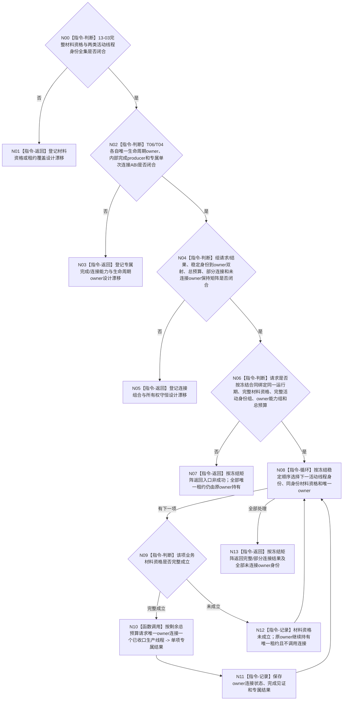

# BIZ-L3-001-13-04 连接已具备收口资格的生产线程目标函数流程图 v0.3

更新时间：2026-08-28

## 依据

```text
0050、6340 v0.6、8100 v0.7、8110 v0.3、8120 v0.10；BIZ-L2-001-13 v0.3；
BIZ-L3-001-13-01—03 v0.2；当前已发布外设启动/收口与任务工作线程代码。
```

## 身份与边界

正式目标治理图。本叶只在13-03业务材料资格完整成立之后处理物理线程资源：按冻结的完整活动组逐项等待线程入口真实完成，再调用该线程类别唯一生命周期owner的单次连接能力。材料资格、线程完成和连接资源三者分账，任一项不能替代另外两项。

旧v0.1假定存在一个统一`在途生产线程租约组`variant、两类内部完成读取能力、逐线程预算组、部分连接结果和未连接租约返还。8110只说明线程生命周期投影不裁决业务事实；8120的唯一租约、完成后join和禁止detach只针对已冻结的自我线程启动候选，不能扩张为T06/T04共同ABI。现行规范没有要求T06/T04把不可移动对象改造成统一右值租约。HEAD的T04对象不可移动并在`收口等待()`中无时限join，T06收口为空壳；旧统一variant和右值函数合同没有实现或正式设计依据。

连接组必须先冻结两类专属生命周期owner与完成/连接合同；组合层只保存规范有序的稳定身份和owner能力绑定，不建立第二资源owner，也不强制把异构对象塞入variant。未知类别不能依靠default分支丢弃；等待预算耗尽、专属能力缺失或内部矛盾时，原owner必须继续持有未连接租约及其全部借用依赖。本图当前只能保留这一所有权骨架。

## 函数合同

```text
根函数候选：连接已具备收口资格的生产线程
归属模块 / 文件 / 目标分解深度：程序停止线程资源连接 / 物理文件待两类生命周期owner与连接合同裁决 / BIZ-L3
现有或待新增：HEAD无T06生命周期owner/连接；T04只有不可移动对象内无时限join
完整签名：未冻结；旧v0.1的统一租约variant、连接请求/结果不构成ABI
参数：未冻结；必须绑定13-03完整材料资格、完整T06/T04活动身份组、每类唯一生命周期owner的完成读取/单次连接能力和一个父级总预算
返回结果：未冻结；必须逐项保存已连接/未连接状态、原专属结果和已成立见证；未连接时原owner继续持有唯一租约，不得以裸bool压缩部分连接
被调函数流程图：BIZ-L4-001-13-04-01 v0.3为设计门禁
父图：BIZ-L2-001-13 v0.3
```

## 设计门禁与目标骨架



## 节点合同

| 节点 | 当前可确认合同 | 仍待冻结 | 验证边界 |
| --- | --- | --- | --- |
| N00/N01 | 材料资格由13-03裁决；连接函数不得重读来源材料自行改判 | 13-03结果ABI、完整活动身份覆盖及身份双射 | 错代、漏/多/重资格和合法0项 |
| N02/N03 | 8110投影不能替代内部完成；每个物理线程所有权必须唯一，但唯一性不要求跨owner移动对象 | T06/T04生命周期owner、完成生产点/读取、单次连接和异常结果 | 未进入、完成晚到、异常退出、双join和专属能力缺失 |
| N04/N05 | 组预算必须是一个单调总预算；部分连接后原owner必须锁存已连接且不能再次join | owner能力准入、预算分配、结果状态、未连接owner及依赖寿命 | 首项耗尽预算、未知类别、连接后异常、部分成功 |
| N06—N13 | 所有可知入口错误在调用owner前拒绝；无材料资格项不得调用连接 | 父级请求/结果和所有权布局 | 0/N、资格不足、预算耗尽、内部矛盾均零detach、零租约遗失 |

## 当前已发布代码对应（`28125acb`；相关源码自`b53e0b76`后未变）

- T06只有`启动外设线程组()`恒true和空`收口并连接外设线程组()`，没有控制域租约、完成见证或连接能力。
- `任务工作线程`不可移动并直接持有`std::thread`；`收口等待()`无内部完成读取、无预算地join并改写本地状态，没有owner范围的结构化连接结果或未连接状态读回。
- `任务结果生产运行包`内嵌单个工作线程对象，没有完整池租约、逐项资格或部分连接结果。
- 8110生命周期消息只是控制面板只读投影，不是本目标完成见证或资源所有权。

## 具名偏差

1. `DRIFT-BIZ-T06-ACTIVE-CONTROL-DOMAIN-LEASE-GROUP-COMPLETE-ENUMERATION-UNFROZEN`
2. `DRIFT-BIZ-T04-ACTIVE-WORKER-LEASE-GROUP-COMPLETE-ENUMERATION-UNFROZEN`
3. `DRIFT-BIZ-T01-PRODUCTION-THREAD-MATERIAL-QUALIFICATION-ABI-COVERAGE-CURRENTNESS-AND-NON-SUCCESS-MATRIX-UNFROZEN`
4. `DRIFT-BIZ-T06-T04-PRODUCTION-THREAD-LIFECYCLE-OWNER-AND-CONNECTION-ABI-UNFROZEN`
5. `DRIFT-BIZ-T06-T04-INTERNAL-COMPLETION-WITNESS-PRODUCER-READBACK-AND-TERMINAL-MATRIX-UNFROZEN`
6. `DRIFT-BIZ-T01-PRODUCTION-THREAD-CONNECTION-TOTAL-BUDGET-PARTIAL-RESULT-AND-UNCONNECTED-LEASE-RETURN-MATRIX-UNFROZEN`

## v0.2校正记录

- 撤销旧v0.1的统一租约variant、具体签名、逐线程预算组、完整状态与部分连接矩阵。
- 固定材料资格先于线程完成，线程完成先于单次连接；13-03只给材料资格，13-04负责完成等待与资源连接。
- 保留一个父级总预算和未连接租约守恒方向；两类专属租约/连接合同未闭合前不得施工通用组合。

## v0.3校正记录

- 撤销统一variant、唯一移动租约和右值连接作为必选目标；它们只是某些已实现支持线程的专属实现形态，不是T06/T04共同业务语义。
- 固定组合层只按稳定身份绑定各自唯一生命周期owner；完成等待和单次连接留在专属owner，未连接时原owner继续持有租约。
