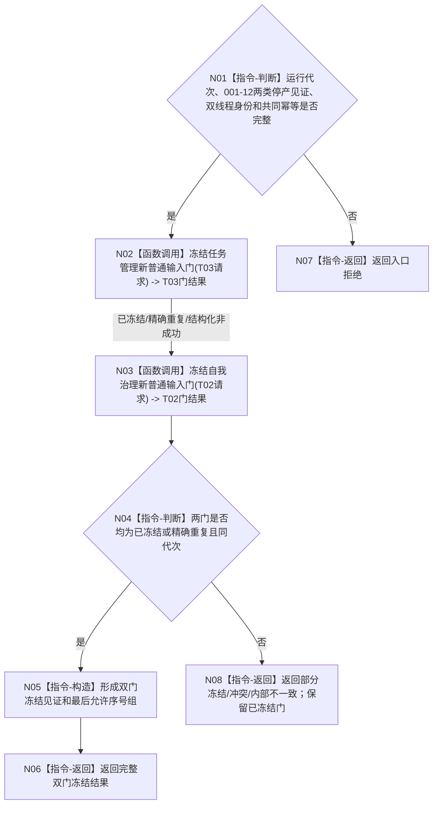

# BIZ-L3-001-14-01 冻结任务管理与自我治理新普通输入门目标函数流程图 v0.1

更新时间：2026-08-27

## 依据

```text
0050、8100、8110；BIZ-L2-001-14 v0.2、BIZ-L2-001-12、BIZ-L1-T02 v0.6、BIZ-L1-T03 v0.5
```

## 身份与边界

正式目标函数设计图。在共同排空前分别冻结 T03 任务管理和 T02 自我治理的新普通输入生产门；停止类消息和已接受材料的完成处理不属于“新普通输入”，不得被误删。两门冻结不是业务原子事务，但必须以同一运行代次和共同幂等身份收敛；部分冻结只形成结构化非成功，不允许重新开放已冻结门。

## 函数合同

```text
根函数：冻结任务管理与自我治理新普通输入门
归属模块 / 文件 / 目标分解深度：分阶段停止协调 / 海中鱼巣/启动.分阶段停止.ixx / BIZ-L3
现有或待新增：待新增
完整签名：治理双输入门冻结结果 冻结任务管理与自我治理新普通输入门(const 治理双输入门冻结请求& 请求) noexcept
参数：请求为只读借用；含运行代次、001-12的T02新D意图门见证与T03筹办/执行派发边界见证、T03/T02稳定线程身份、共同停止阶段、共同幂等身份
返回结果：不可变值式结果；含两门逐项冻结状态、最后允许普通输入序号、冻结见证、部分冻结和结构化非成功
被调函数流程图：BIZ-L4-001-14-01-01 冻结任务管理新普通输入门；BIZ-L4-001-14-01-02 冻结自我治理新普通输入门
父图：BIZ-L2-001-14 v0.2
```

## 流程图



## 节点合同

| 节点 | 类型 | 输入 | 输出 | 事实读写 | 验证 |
| --- | --- | --- | --- | --- | --- |
| N01 | 判断 | 共同冻结请求 | 准入 | 无 | 错代、坏T02意图门/T03派发边界见证、身份缺失 |
| N02/N03 | 函数调用 | 同代次逐线程请求 | 两门逐项结果 | 只改对应线程普通输入门 | 首次、精确重复、单侧失败、并发普通输入 |
| N04—N08 | 判断/构造/返回 | 逐项结果 | 完整或部分冻结结果 | 不回开已冻结门 | 双门同代、最后序号守恒、失败重试 |

## 关键边界

- 001-12已经禁止T02产生新的D承接意图并禁止T03派发新的筹办/执行工作包；本函数不重复写这两类门，而是冻结T03/T02更广的普通输入边界，为共同排空建立最后允许输入序号。停机前已接受的D意图、self后继决议和轮次结算定位继续处理。
- T02 停止接收新普通治理输入后，仍必须接收或处理停机前已接受的任务轮次结算定位和停止类消息。
- 单侧已冻结而另一侧失败时禁止补偿性解冻；调用方只能按同键重试或返回部分冻结和原线程租约，不得为门或业务材料新建通用接管 owner。
