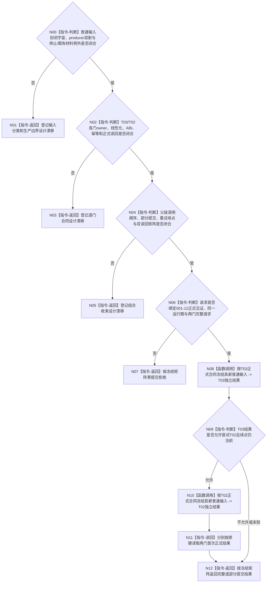

# BIZ-L3-001-14-01 冻结任务管理与自我治理新普通输入门目标函数流程图 v0.2

更新时间：2026-08-28

## 依据

```text
0050、8100 v0.7、8110 v0.3；BIZ-L2-001-14 v0.3、BIZ-L2-001-12 v0.2；
BIZ-L1-T02 v0.6、BIZ-L1-T03 v0.5；发布源码相关线程与邮箱代码。
```

## 身份与边界

正式目标治理图。本叶目标是在共同排空前分别关闭T03与T02的新普通输入，同时继续允许停止类输入和冻结边界内已经接受材料所必需的完成交付。它不消费业务正文，也不把队列空、线程停止位或8110生命周期投影升级为输入门见证。

旧v0.1直接冻结了共同请求/结果、共同幂等身份、两门顺序、最后允许输入序号和“部分冻结不回开”矩阵。现行规范没有给出普通输入封闭类型宇宙、全部producer、边界内材料例外、两门各自owner与线性化点；001-12也尚未形成可消费的两类正式停产见证。两门不是同一owner原子事务，后继即使采用协调键，也必须分别拥有幂等账和独立读回，再由父级收束部分提交。

## 函数合同

```text
根函数候选：冻结任务管理与自我治理新普通输入门
归属模块 / 文件 / 目标分解深度：程序停止协调 / 物理文件待两门owner和父级停止阶段裁决 / BIZ-L3
现有或待新增：发布源码无本组合根
完整签名：未冻结；旧治理双输入门冻结请求/结果不构成ABI
参数：未冻结；必须绑定001-12正式读回结果、T03/T02各自运行期与输入门请求、父级停止阶段和协调续点
返回结果：未冻结；必须保存两门独立状态/正式读回、零提交、单侧提交、冲突、已可能提交和可重试续点
被调函数流程图：BIZ-L4-001-14-01-01 v0.2、BIZ-L4-001-14-01-02 v0.2均为设计门禁
父图：BIZ-L2-001-14 v0.3
```

## 设计门禁与目标骨架



## 节点合同

| 节点 | 当前可确认合同 | 仍待冻结 | 验证边界 |
| --- | --- | --- | --- |
| N00/N01 | 类型、producer和例外必须显式封闭；“不是停止消息”不足以定义普通输入 | 两线程输入全集、入口双射、边界和例外公式 | 未知类型、晚到边界内交付、停止与普通并发 |
| N02/N03 | 每个门由自己的控制域线性化和读回；共同键不产生跨owner原子性 | 两门请求/结果/状态/版本/幂等/读回 | 首次、精确重复、同键异义、错代、提交后读回失败 |
| N04/N05 | 单侧已提交不能靠解冻补偿；父级须记录并按原键收束 | 调用顺序、可进入下一步公式、续点和部分提交矩阵 | T03先成、T02先成、第二门失败、重试漂移 |
| N06—N12 | 可知入口错误须在首个提交前拒绝；结果保留各门原始状态 | 001-12见证形状、父级停止阶段和最终成功公式 | 零提交、单侧、双侧、已可能提交及双读回 |

## 当前已发布代码对应（`0f4fa4b4`；相关源码自`d6ed3380`后未变）

- T03只有局部强类型执行请求停止锁存；结果回执、重筹办意图和旧消息队列各有独立准入路径，没有统一普通输入门。
- T02已有治理邮箱停止与批次冻结能力，但没有独立的“停止接收新普通治理输入而继续接受指定例外”合同。
- 发布源码没有本组合函数、跨两控制域事务、协调续点或双门正式读回。

## 具名偏差

1. `DRIFT-BIZ-T03-T02-ORDINARY-INPUT-CLOSED-UNIVERSE-PRODUCERS-AND-STOP-EXCEPTIONS-UNFROZEN`
2. `DRIFT-BIZ-T03-ORDINARY-INPUT-STOP-LINEARIZATION-OWNER-ABI-IDEMPOTENCY-AND-READBACK-MATRIX-UNFROZEN`
3. `DRIFT-BIZ-T02-ORDINARY-GOVERNANCE-INPUT-STOP-LINEARIZATION-OWNER-ABI-IDEMPOTENCY-AND-READBACK-MATRIX-UNFROZEN`
4. `DRIFT-BIZ-T03-T02-DUAL-INPUT-GATE-PARTIAL-COMMIT-RETRY-AND-READBACK-MATRIX-UNFROZEN`

## v0.2校正记录

- 撤销共同幂等、具体签名、最后允许序号和完整双门矩阵已经冻结的旧声明。
- 固定两门分别线性化、分别读回，父级只组合结果而不伪造跨owner原子性。
- 保留停止类输入和边界内既有材料的例外方向；类型宇宙与producer未闭合前不得施工。
