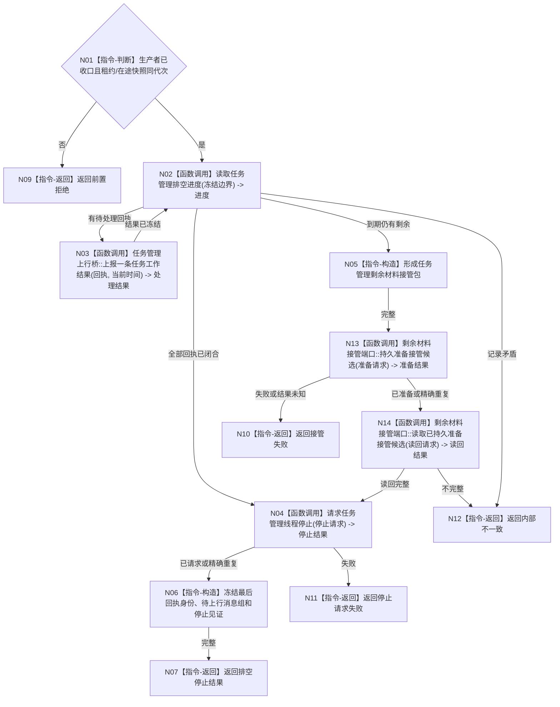

# BIZ-L3-001-14-01 排空任务工作回执并停止任务管理线程目标函数流程图 v0.1

更新时间：2026-08-03

## 依据

```text
8100、8110；BIZ-L2-001-14；BIZ-L3-001-12—13
```

## 身份与边界

正式目标函数设计图。任务管理线程继续消费冻结边界内回执并执行合法独立回读，直到全部闭合或形成可恢复剩余。

## 函数合同

```text
根函数：排空任务工作回执并停止任务管理线程
归属模块 / 文件 / 层级：分阶段停止协调 / 海中鱼巣/启动.分阶段停止.ixx / L3
现有或待新增：待新增
完整签名：任务管理排空停止结果 排空任务工作回执并停止任务管理线程(const 任务管理排空停止请求& 请求)
参数：请求为只读借用；含运行代次、任务管理租约、生产者收口结果、冻结在途快照、排空策略、剩余消息接管端口和截止时限；租约覆盖调用
返回结果：值式结果；含已排空并请求停止、合法剩余已持久准备、排空超时、线程故障、接管失败或内部不一致，以及最后处理回执身份、待上行消息组和停止见证
被调函数流程图：BIZ-L4-001-14-01-01 读取任务管理排空进度；复用BIZ-L2-004-08 任务管理上行桥::上报一条任务工作结果；BIZ-L4-001-13-03-01—02 持久准备/读回剩余材料；BIZ-L4-001-14-01-02 请求任务管理线程停止
父图：BIZ-L2-001-14
```

## 流程图



## 节点合同

| 节点 | 类型 | 输入 | 输出 | 事实读写 | 验证 |
| --- | --- | --- | --- | --- | --- |
| N01—N03 | 判断 / 调用 | 排空请求 | 进度和单回执结果 | 可经正式服务提交任务结果；不新派发 | 重复回执、错代、处理失败 |
| N04—N06/N13—N14 | 调用 / 构造 | 租约和剩余组 | 停止、持久接管、上行组 | 只改线程停止状态和恢复候选 | 空/非空剩余、结果未知 |
| N07—N12 | 返回 | 排空结论 | 结构化结果 | 不伪造任务完成 | 身份守恒 |

## 关键边界

排空仍逐条服从独立回读与任务状态合同；不得因为停机把尚未验证的工作回执直接解释为成功。
