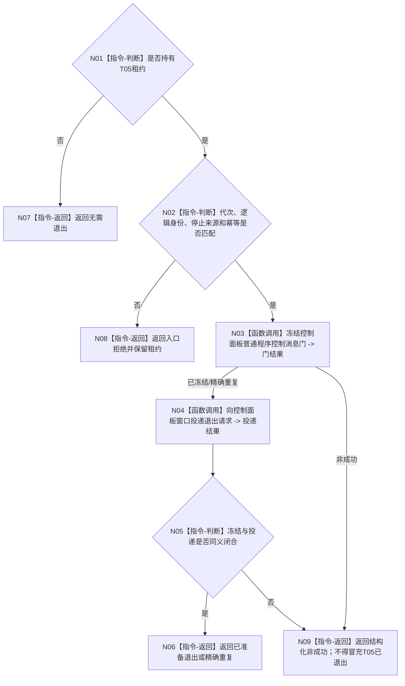

# BIZ-L3-001-14-02 冻结控制面板普通输入并请求窗口退出目标函数流程图 v0.1

更新时间：2026-08-26

## 依据

```text
0050、8110、8120；BIZ-L2-001-14 v0.2、BIZ-L1-T05
```

## 身份与边界

正式目标函数设计图。可选 T05 存在时先冻结新的普通程序控制消息，再向其窗口/消息循环投递退出请求；T05 缺席是合法“无需退出”。控制面板只读投影、窗口消息和线程生命周期不得裁决 T03/T02 的业务排空。

## 函数合同

```text
根函数：冻结控制面板普通输入并请求窗口退出
归属模块 / 文件 / 目标分解深度：分阶段停止协调 / 海中鱼巣/启动.分阶段停止.ixx / BIZ-L3
现有或待新增：待新增
完整签名：控制面板退出准备结果 冻结控制面板普通输入并请求窗口退出(const 可选控制面板线程租约& 线程租约, const 控制面板退出准备请求& 请求) noexcept
参数：可选租约为调用期只读借用；请求含运行代次、控制面板逻辑身份、停止来源、停止阶段和幂等身份
返回结果：不可变值式结果；含无需退出、已冻结并已投递、精确重复、窗口不可用、错代、身份冲突或内部错误，以及退出请求见证
被调函数流程图：BIZ-L4-001-14-02-01 冻结控制面板普通程序控制消息门；BIZ-L4-001-14-02-02 向控制面板窗口投递退出请求
父图：BIZ-L2-001-14 v0.2
```

## 流程图



## 节点合同

| 节点 | 类型 | 输入 | 输出 | 事实读写 | 验证 |
| --- | --- | --- | --- | --- | --- |
| N01/N02 | 判断 | 可选租约、退出请求 | 准入 | 无 | 无窗口、错代、错身份 |
| N03 | 函数调用 | 控制消息门请求 | 门冻结结果 | 只改 T05 普通输入门 | 同键重放、并发窗口消息 |
| N04/N05 | 函数调用/判断 | 停止来源、窗口租约 | 退出投递见证 | 只改窗口生命周期控制 | 窗口销毁竞态、投递失败 |
| N06—N09 | 返回 | 逐项结果 | 结构化退出准备结果 | 不写业务事实 | 无窗口与失败分账 |

## 关键边界

窗口关闭请求不是线程完成见证；T05 只有在 BIZ-L3-001-14-04 取得完成见证并连接租约后才算资源收口。
