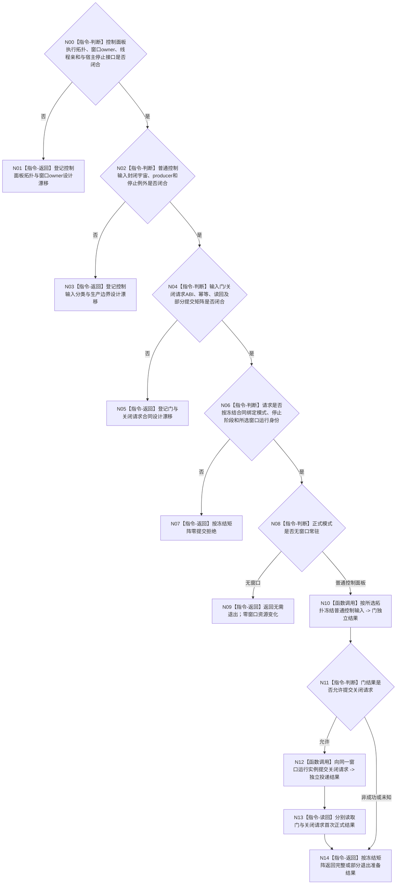

# BIZ-L3-001-14-02 冻结控制面板普通输入并请求窗口退出目标函数流程图 v0.2

更新时间：2026-08-28

## 依据

```text
0050、8100 v0.7、8110 v0.3、8120 v0.10；BIZ-L2-001-14 v0.2、BIZ-L2-001-09 v0.2；
BIZ-L1-T05 v0.5；HEAD程序运行宿主与启动代码。
```

## 身份与边界

正式目标治理图。无窗口常驻模式不创建窗口，本阶段因此无需关闭窗口。普通控制面板模式进入系统停止后，应停止窗口宿主接受新的普通控制输入，再向当前窗口循环提交唯一关闭请求；关闭请求已接受、消息循环已终止、独立物理线程已完成和线程资源已连接必须分账。

旧v0.1固定存在可选T05线程租约，并提前冻结了控制消息门、窗口投递、停止来源、共同幂等和完整结果。现行8120与BIZ-L1-T05尚未裁决窗口运行在T01主宿主还是独立T05线程，BIZ-L2-001-09也把执行拓扑、窗口owner和线程亲和登记为设计漂移。主宿主方案没有T05租约，独立线程方案才可能存在租约；在拓扑闭合前，本叶不能以“租约缺席=无窗口”判断模式，也不能决定门和关闭请求的物理控制域。

HEAD没有真实窗口、消息循环或程序控制桥。正式材料也未冻结普通控制输入的封闭类型/producer/停止例外，以及窗口关闭请求的owner、幂等、投递后读回和平台失败矩阵。本图只保留模式分支与顺序骨架。

## 函数合同

```text
根函数候选：冻结控制面板普通输入并请求窗口退出
归属模块 / 文件 / 目标分解深度：程序运行宿主停止协调 / 物理文件待控制面板拓扑与窗口owner裁决 / BIZ-L3
现有或待新增：HEAD无本函数、窗口和消息循环
完整签名：未冻结；旧可选控制面板线程租约、退出准备请求/结果不构成ABI
参数：未冻结；必须绑定正式启动模式、宿主停止阶段、所选窗口拓扑、窗口运行身份及两个子结果原键；独立T05方案才携带唯一租约
返回结果：未冻结；必须区分无窗口无需退出、零提交拒绝、门已提交但关闭请求未提交、关闭请求已接受/精确重复、已可能提交、窗口已经终止及正式读回失败
被调函数流程图：BIZ-L4-001-14-02-01 v0.2、BIZ-L4-001-14-02-02 v0.2均为设计门禁
父图：BIZ-L2-001-14 v0.2
```

## 设计门禁与目标骨架



## 节点合同

| 节点 | 当前可确认合同 | 仍待冻结 | 验证边界 |
| --- | --- | --- | --- |
| N00/N01 | 先裁决主宿主/独立T05；租约存在与否不能反推模式或窗口存在 | 拓扑、窗口owner、线程亲和、运行身份与停止接口 | 主宿主、独立线程、窗口未建立、已销毁和拓扑冲突 |
| N02/N03 | 只冻结新的普通控制输入；宿主停止与边界内窗口生命周期输入须显式例外 | 类型宇宙、producer双射、例外和接受边界 | 刷新、用户停止、宿主停止、关闭/销毁事件与未知输入 |
| N04/N05 | 门与关闭请求分别幂等、分别读回；请求已投递不等于循环终止 | 两叶ABI、状态、平台适配、部分提交、重试和读回矩阵 | 门成功后投递失败、投递未知、窗口竞态和重复停止 |
| N06—N14 | 无窗口分支零UI变化；普通模式按所选拓扑操作同一窗口运行实例 | 父请求/结果、模式读回、停止阶段和最终成功公式 | 错模式、错实例、零提交、部分提交与正式双读回 |

## 当前代码对应（HEAD `74bbcfec`）

- `按模式启动控制面板线程(启动模式)`在无窗口模式返回true，在普通模式也只比较枚举并返回true；没有窗口、线程或租约。
- 普通控制面板和无窗口当前都进入`运行无窗口宿主`；HEAD没有窗口消息循环、程序控制消息桥或本目标停止入口。
- 8110生命周期投影支持控制面板类别，但只作观察，不能证明窗口运行身份、关闭请求或线程完成。

## 具名偏差

1. `DRIFT-BIZ-CONTROL-PANEL-EXECUTION-TOPOLOGY-WINDOW-OWNER-AND-THREAD-AFFINITY-UNFROZEN`
2. `DRIFT-BIZ-T05-ORDINARY-CONTROL-INPUT-CLOSED-UNIVERSE-PRODUCERS-AND-STOP-EXCEPTIONS-UNFROZEN`
3. `DRIFT-BIZ-CONTROL-PANEL-ORDINARY-INPUT-GATE-OWNER-ABI-IDEMPOTENCY-AND-READBACK-MATRIX-UNFROZEN`
4. `DRIFT-BIZ-HOST-STOP-TO-WINDOW-CLOSE-REQUEST-ABI-IDEMPOTENCY-DELIVERY-AND-TERMINAL-MATRIX-UNFROZEN`
5. `DRIFT-BIZ-CONTROL-PANEL-EXIT-PREPARATION-PARTIAL-COMMIT-RETRY-AND-READBACK-MATRIX-UNFROZEN`

## v0.2校正记录

- 撤销“可选T05租约即模式分支”、具体签名、共同幂等和完整退出准备矩阵。
- 把控制面板拓扑与窗口owner置于门和关闭请求之前；主宿主方案不补造T05租约或线程见证。
- 保留无窗口零变化、普通模式先停普通输入再请求关闭，以及投递/终止/完成/连接严格分账。
