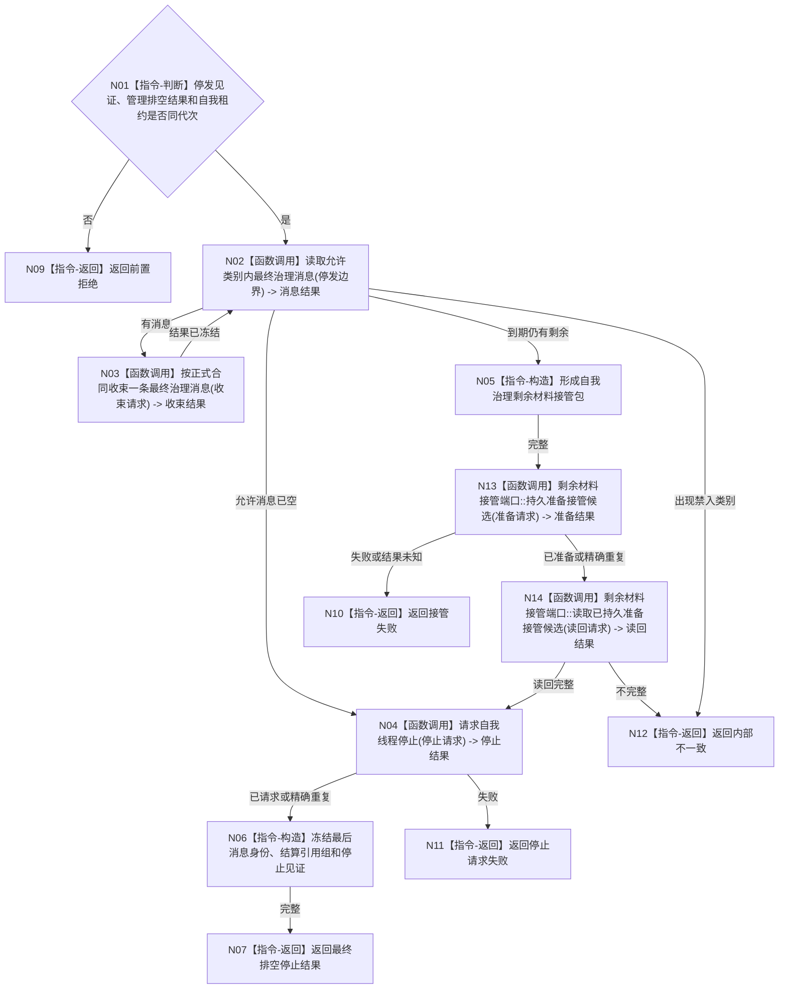

# BIZ-L3-001-14-02 排空最终治理消息与已允许结算并停止自我线程目标函数流程图 v0.1

更新时间：2026-08-03

## 依据

```text
0050、8100、8110；BIZ-L2-001-14；BIZ-L3-001-11；BIZ-L3-001-14-01
```

## 身份与边界

正式目标函数设计图。只处理停发见证允许的最终治理消息和已授权结算，不开启新治理批次或新任务意图。

## 函数合同

```text
根函数：排空最终治理消息与已允许结算并停止自我线程
归属模块 / 文件 / 层级：分阶段停止协调 / 海中鱼巣/启动.分阶段停止.ixx / L3
现有或待新增：待新增
完整签名：自我最终排空停止结果 排空最终治理消息与已允许结算并停止自我线程(const 自我最终排空停止请求& 请求)
参数：请求为只读借用；含运行代次、自我线程租约、停发见证、任务管理排空结果、允许类别、排空策略、接管端口和截止时限；租约覆盖调用
返回结果：值式结果；含已排空并请求停止、合法剩余已持久准备、超时、线程故障、接管失败或内部不一致，以及最后治理消息身份、已完成结算引用组和停止见证
被调函数流程图：BIZ-L4-001-14-02-01 读取允许类别内最终治理消息；BIZ-L4-001-14-02-02 按正式合同收束一条最终治理消息；BIZ-L4-001-13-03-01—02 持久准备/读回剩余材料；BIZ-L4-001-14-02-03 请求自我线程停止
父图：BIZ-L2-001-14
```

## 流程图



## 节点合同

| 节点 | 类型 | 输入 | 输出 | 事实读写 | 验证 |
| --- | --- | --- | --- | --- | --- |
| N01—N03 | 判断 / 调用 | 最终排空请求 | 消息和收束结果 | 仅允许既有结果/结算正式提交 | 新意图禁入、重复消息 |
| N04—N06/N13—N14 | 调用 / 构造 | 租约和剩余组 | 停止、持久接管、结算引用 | 只改线程停止状态和恢复候选 | 超时、结果未知 |
| N07—N12 | 返回 | 排空结论 | 结构化结果 | 不新增需求或任务 | 类别与身份守恒 |

## 关键边界

停机不免除结算准入；没有正式任务/需求结论的消息不能借“最终排空”形成服务结算。
