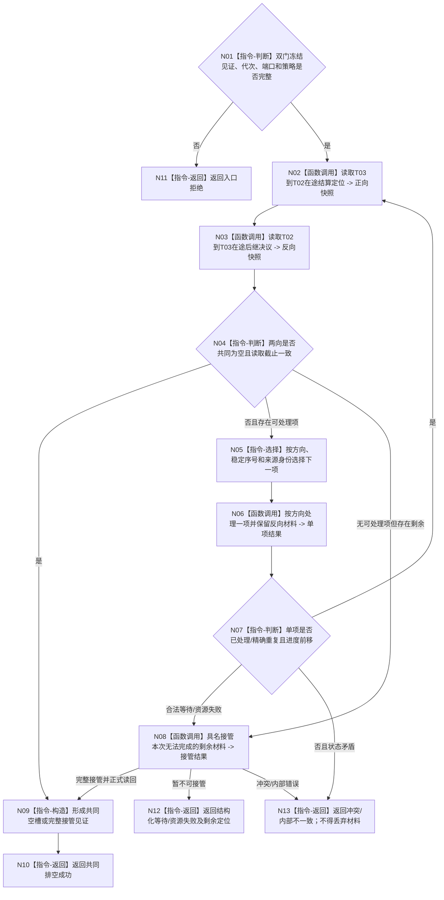

# BIZ-L3-001-14-03 共同排空任务管理与自我治理双向材料目标函数流程图 v0.1

更新时间：2026-08-26

## 依据

```text
0050、8100 v0.8、8110；BIZ-L2-001-14 v0.2、BIZ-L3-001-14-01
```

## 身份与边界

正式目标函数设计图。在 T03/T02 新普通输入门均已冻结后，共同读取并处理 `T03 -> T02` 任务轮次结算定位与 `T02 -> T03` self 后继决议。每处理一项都必须重新读取两向进度，因为合法处理可能形成反向材料；只有两向已接受队列和处理中槽同时为空，或剩余材料均取得具名接管读回，才成功返回。

## 函数合同

```text
根函数：共同排空任务管理与自我治理双向材料
归属模块 / 文件 / 目标分解深度：分阶段停止协调 / 海中鱼巣/启动.分阶段停止.ixx / BIZ-L3
现有或待新增：待新增
完整签名：治理双向材料排空结果 共同排空任务管理与自我治理双向材料(const 治理双向材料排空请求& 请求) noexcept
参数：请求为只读借用；含运行代次、双门冻结见证、双向端口只读能力、停止策略、接管端口、幂等身份和有界进度预算
返回结果：不可变值式结果；含两向逐项处理见证、共同空槽见证、可选接管读回、等待/资源失败/冲突/内部不一致和剩余材料定位
被调函数流程图：BIZ-L4-001-14-03-01 读取任务管理到自我的在途结算定位；BIZ-L4-001-14-03-02 读取自我到任务管理的在途后继决议；BIZ-L4-001-14-03-03 按方向处理一项治理材料并保留反向材料；BIZ-L4-001-14-03-04 具名接管本次无法完成的治理材料
父图：BIZ-L2-001-14 v0.2
```

## 流程图



## 节点合同

| 节点 | 类型 | 输入 | 输出 | 事实读写 | 验证 |
| --- | --- | --- | --- | --- | --- |
| N01—N04 | 判断/读取 | 双门见证、双向端口 | 同截止双向快照 | 只读已接受队列和处理中槽 | 一向空、两向空、错代、读取漂移 |
| N05—N07 | 选择/处理 | 规范化下一项 | 单项处理和反向材料见证 | 只允许对应 owner 完成已接受提交 | 交替形成、同项重试、无进度循环 |
| N08/N09 | 接管/构造 | 剩余材料定位 | 接管读回或共同空槽见证 | 只写具名接管 owner | 部分接管、读回失败、重复接管 |
| N10—N13 | 返回 | 全部见证 | 结构化结果 | 不补造已消费/已接管 | 永久 provider 失败、材料守恒 |

## 关键边界

- 任务轮次结算定位不是 self 后继决议；两类材料保持强类型分账，只在共同排空协调器中并列调度。
- “继续”后继决议在普通输入门冻结后不得开启新任务轮次；只能完成停机允许的既有收束，或进入具名接管。
- 有界进度预算耗尽不是合法空槽证明；必须返回结构化等待或接管结果，禁止清空队列。
