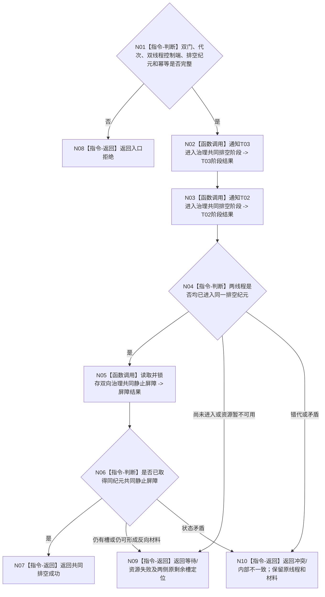

# BIZ-L3-001-14-03 共同排空任务管理与自我治理双向材料目标函数流程图 v0.1

更新时间：2026-08-27

## 依据

```text
0050、8100、8110；BIZ-L2-001-14 v0.2、BIZ-L3-001-14-01、BIZ-L1-T02 v0.6、BIZ-L1-T03 v0.5
```

## 身份与边界

正式目标函数设计图。双门完整冻结后，协调器只通知 T03/T02 进入同一个共同排空纪元，并观察两个根循环自己完成已经接受的材料。协调器不读取结算或后继正文，不选择下一业务项，不调用领域 provider，也不建立剩余材料接管 owner。

共同排空覆盖的不只是两条反向消息队列，而是两个根循环的全部已接受输入、私有处理槽和待发布反向材料。成功必须锁存一个线性化共同静止屏障；先后两个普通空快照、队列长度为零或线程生命周期投影都不足以证明成功。

## 函数合同

```text
根函数：共同排空任务管理与自我治理双向材料
归属模块 / 文件 / 目标分解深度：分阶段停止协调 / 海中鱼巣/启动.分阶段停止.ixx / BIZ-L3
现有或待新增：待新增
完整签名：治理双向材料排空结果 共同排空任务管理与自我治理双向材料(const 治理双向材料排空请求& 请求) noexcept
参数：请求为只读借用；含运行代次、双门冻结见证、T03/T02线程控制端、共同排空纪元、通知幂等身份和诊断观察截止
返回结果：不可变值式结果；含两线程排空阶段见证、各自剩余槽定位、共同静止屏障，或结构化等待、错代、冲突、资源失败和内部不一致
被调函数流程图：BIZ-L4-001-14-03-01 通知任务管理线程进入治理共同排空阶段；BIZ-L4-001-14-03-02 通知自我线程进入治理共同排空阶段；BIZ-L4-001-14-03-03 读取并锁存双向治理共同静止屏障
父图：BIZ-L2-001-14 v0.2
```

## 流程图



## 节点合同

| 节点 | 类型 | 输入 | 输出 | 事实读写 | 验证 |
| --- | --- | --- | --- | --- | --- |
| N01 | 判断 | 双门见证、线程控制端、排空纪元 | 准入 | 无 | 错代、坏见证、身份缺失 |
| N02/N03 | 函数调用 | 同一排空纪元 | 逐线程阶段见证 | 只改各自线程控制态；业务仍由根循环处理 | 单侧通知、同键重放、并发最后输入 |
| N04—N06 | 判断/函数调用 | 两线程阶段和控制域进度 | 可选共同静止屏障 | 只读取并锁存进程内控制态 | 一侧空一侧处理中、待发布反向材料、最后发布竞态 |
| N07—N10 | 返回 | 屏障或剩余槽定位 | 结构化结果 | 不移动业务材料、不创建接管事实 | 永久provider失败、观察截止、原槽守恒 |

## 共同静止判据

- T03 已完成冻结边界内全部已接受管理输入，且主阶段治理槽、工作结果定位槽、未完成工作槽和待提交 self 材料均为空。
- T02 已完成冻结边界内完整邮箱批次，且私有处理槽、已接受结算定位和待下行任务管理材料均为空。
- 两个线程都已到达同一共同排空纪元，并在锁存期间禁止新的普通输入；任何仍运行的处理步骤都必须可见为非空/活跃槽。
- 两个方向的待发布与已发布未消费材料同时为空，且两侧发布代数在稳定锁序读取前后不变，因此屏障锁存后不再产生新的反向材料。
- 判据只证明当前进程线程协调静止，不证明任务、需求或世界事实完成，也不取得持久化、恢复或跨进程语义。

## 关键边界

- T03/T02 各自拥有业务处理顺序和正式 provider 调用；T01 不得复制完整性算法、按方向挑选材料或在启动模块执行结算/后继决议。
- 诊断观察截止只控制本次函数返回，不能清槽、跳过处理、强制停止、建立接管包或把等待改写成成功。
- 永久 provider 失败时保持对应具名 DRIFT、原私有槽和线程租约；本图不授权第二业务 owner。
