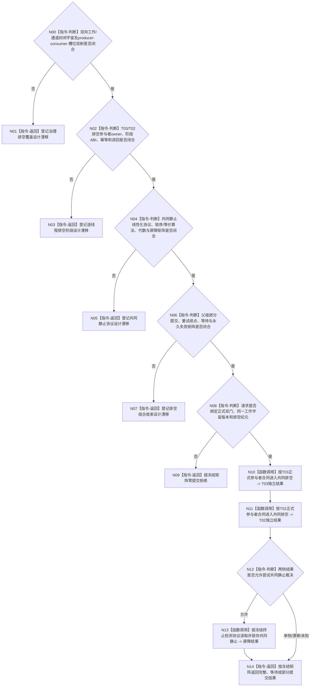

# BIZ-L3-001-14-03 共同排空任务管理与自我治理双向材料目标函数流程图 v0.2

更新时间：2026-08-28

## 依据

```text
0050、8100 v0.7、8110 v0.3；BIZ-L2-001-14 v0.2、BIZ-L3-001-14-01 v0.2；
BIZ-L1-T02 v0.6、BIZ-L1-T03 v0.5；HEAD任务管理与自我治理根循环代码。
```

## 身份与边界

正式目标治理图。两个普通输入门正式成立后，T03/T02仍须在各自根循环完成冻结边界内已经接受的工作，以及这些工作合法产生的反向交付。T01只协调排空控制，不读取业务正文、不调用领域provider、不代替任一根循环选择或完成业务项。

成功需要证明一个封闭双向工作系统已经终止：全部允许的工作类型、producer、consumer、入口、私有槽、待发布项、已发布未消费项和在途所有权都已穷尽；两侧在同一排空纪元停止产生新工作，并由正式线性化协议证明同时局部静止。先后两个空快照、队列长度为零、线程等待、生命周期投影或普通停止bool都不充分。

旧v0.1提前冻结了共同排空纪元、两侧阶段见证、剩余槽定位、固定锁序、生产代数和共同屏障。HEAD的T03工作分布在多个锁与槽，T02处理槽为线程私有；正式规范没有给出完整工作/通道宇宙、跨域锁序或等价终止检测协议、参与者owner、代数含义、幂等与屏障读回。当前只能保留目标骨架。

## 函数合同

```text
根函数候选：共同排空任务管理与自我治理双向材料
归属模块 / 文件 / 目标分解深度：治理线程停止协调 / 物理文件待排空参与者与静止协议owner裁决 / BIZ-L3
现有或待新增：HEAD无本函数、两侧排空参与者或共同静止协议
完整签名：未冻结；旧治理双向材料排空请求/结果不构成ABI
参数：未冻结；必须绑定两侧正式输入门读回、001-12边界、封闭工作/通道版本、两侧参与者、共同排空纪元和父级停止阶段
返回结果：未冻结；必须保存两侧阶段/读回、尚未静止的非业务定位、共同屏障首次结果、精确重复、部分提交、漂移、资源/内部错误与已可能提交
被调函数流程图：BIZ-L4-001-14-03-01—03 v0.2均为设计门禁
父图：BIZ-L2-001-14 v0.2
```

## 设计门禁与目标骨架



## 节点合同

| 节点 | 当前可确认合同 | 仍待冻结 | 验证边界 |
| --- | --- | --- | --- |
| N00/N01 | 覆盖必须穷尽门前已接受工作及其合法衍生交付，不只统计两条队列 | 工作类型、入口、producer/consumer、槽、通道、在途所有权和版本 | 漏/多/重类型、最后反向发布、已发布未消费和私有重试槽 |
| N02/N03 | 各根循环只处理自己的业务正文；外部只改变排空控制阶段 | 两参与者owner、阶段请求/结果、进入/读回、唤醒和恢复 | 首次、重复、单侧进入、错代、入口后线程故障 |
| N04/N05 | 同时静止须由正式线性化终止检测证明；固定锁序只是候选 | 锁集合/顺序或等价令牌/确认算法、生产代数、屏障owner与读回 | 假空、最后发送、循环依赖、屏障异义和提交后读回失败 |
| N06/N07 | 等待不丢槽；永久provider失败不得假成功或转交第二业务owner | 部分提交、观察预算、重试续点、资源/内部和永久失败矩阵 | 无限等待、资源暂失、永久失败、线程租约与材料守恒 |
| N08—N14 | 可知错误在首提交前拒绝；屏障只属进程控制，不是业务事实 | 父请求/结果、工作宇宙版本、停止阶段和成功公式 | 0/N、部分提交、尚未静止、漂移和完整读回 |

## 当前代码对应（HEAD `7883bf24`）

- T03结果上行、重筹办和强类型执行请求分布在不同锁、队列与私有槽；没有统一排空参与者或生产代数。
- T02有邮箱批次和线程私有处理槽，但没有排空纪元、对外控制快照或待下行材料全集读取。
- HEAD没有封闭双向通道登记、共同锁序/终止检测算法、屏障owner、幂等账或正式读回。

## 具名偏差

1. `DRIFT-BIZ-T03-T02-GOVERNANCE-DRAIN-CLOSED-WORK-UNIVERSE-CHANNELS-SLOTS-AND-PRODUCER-CONSUMER-BIJECTION-UNFROZEN`
2. `DRIFT-BIZ-T03-GOVERNANCE-DRAIN-STAGE-OWNER-ABI-IDEMPOTENCY-AND-READBACK-MATRIX-UNFROZEN`
3. `DRIFT-BIZ-T02-GOVERNANCE-DRAIN-STAGE-OWNER-ABI-IDEMPOTENCY-AND-READBACK-MATRIX-UNFROZEN`
4. `DRIFT-BIZ-T03-T02-COMMON-QUIESCENCE-LINEARIZATION-PROTOCOL-LOCK-ORDER-GENERATION-AND-BARRIER-READBACK-MATRIX-UNFROZEN`
5. `DRIFT-BIZ-T03-T02-GOVERNANCE-DRAIN-PARTIAL-COMMIT-RETRY-WAIT-AND-TERMINAL-MATRIX-UNFROZEN`

## v0.2校正记录

- 撤销具体签名、共同纪元字段、阶段见证、剩余槽定位、固定锁序、生产代数和屏障结果已经冻结的旧声明。
- 把“同时为空”提升为封闭工作系统的正式终止检测；所有工作、producer、consumer、槽和通道必须先穷尽。
- 保留两侧根循环自行完成业务、T01只协调、尚未静止不移交材料、永久失败不伪造完成的边界。
