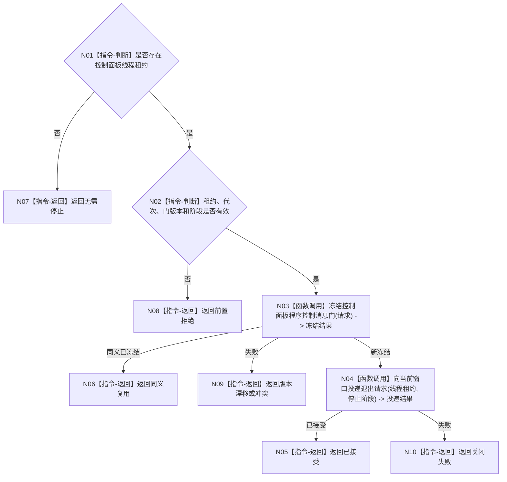

# BIZ-L3-001-14-03 请求控制面板退出并停止接收程序控制消息目标函数流程图 v0.1

更新时间：2026-08-03

## 依据

```text
8110、8120；BIZ-L2-001-14；BIZ-L1-T05
```

## 身份与边界

正式目标函数设计图。无窗口模式返回无需停止；有窗口时先关闭新程序控制消息，再请求当前窗口消息循环退出。

## 函数合同

```text
根函数：请求控制面板退出并停止接收程序控制消息
归属模块 / 文件 / 层级：分阶段停止协调 / 海中鱼巣/启动.分阶段停止.ixx / L3
现有或待新增：待新增
完整签名：控制面板退出请求结果 请求控制面板退出并停止接收程序控制消息(const 控制面板退出请求& 请求)
参数：请求为只读借用；含运行代次、可空控制面板线程租约、控制消息门版本、停止阶段身份和幂等身份
返回结果：值式结果；含无需停止、已接受、同义复用、版本漂移、关闭失败、错代或内部不一致
被调函数流程图：BIZ-L4-001-14-03-01 冻结控制面板程序控制消息门；BIZ-L4-001-14-03-02 向当前窗口投递退出请求
父图：BIZ-L2-001-14
```

## 流程图



## 节点合同

| 节点 | 类型 | 输入 | 输出 | 事实读写 | 验证 |
| --- | --- | --- | --- | --- | --- |
| N01—N03 | 判断 / 调用 | 退出请求 | 无需停止或门冻结结果 | 只改控制消息门 | 无窗口、错代、重复 |
| N04 | 函数调用 | 当前窗口租约 | 退出投递结果 | 只操作UI载体 | 窗口已关闭、投递失败 |
| N05—N10 | 返回 | 退出结论 | 结构化结果 | 不写业务事实 | 分支互斥 |

## 关键边界

控制面板退出请求不等于程序停止完成；窗口状态和显示内容不得反向裁决业务收口结果。
