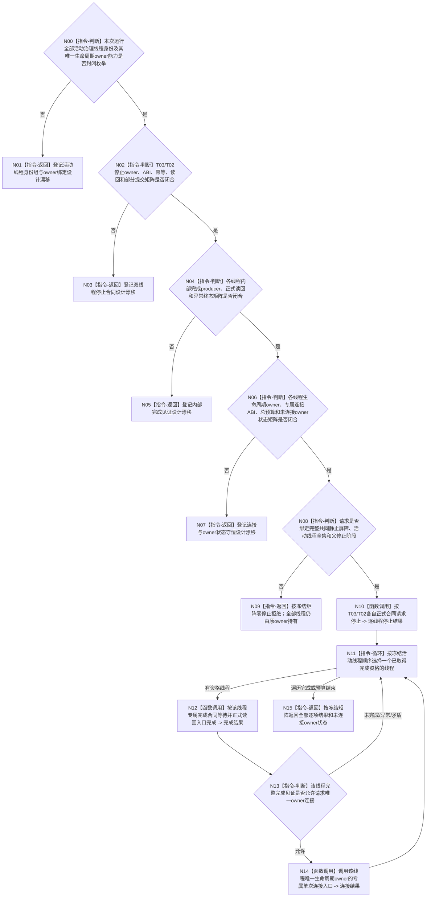

# BIZ-L3-001-14-04 请求治理线程完成并连接活动线程组目标函数流程图 v0.3

更新时间：2026-08-28

## 依据

```text
0050、8100 v0.7、8110 v0.3、8120 v0.10；BIZ-L2-001-14 v0.3、BIZ-L3-001-14-02—03 v0.2；
BIZ-L1-T01 v0.5、BIZ-L1-T02 v0.6、BIZ-L1-T03 v0.5；发布源码线程对象、入口与运行包收口代码。
```

## 身份与边界

正式目标治理图。T03/T02只有在正式共同静止屏障完整且分别取得自身停止资格后，才可进入停止、内部完成和物理连接。停止请求已接受、8110投影为“已退出”、`joinable()`、对象析构或`join()`返回都不能互相替代；业务静止、线程入口真实完成和物理资源回收必须分账。

旧v0.1提前冻结了`治理线程租约组`、T03/T02/可选T05 variant、逐线程完成序号、诊断截止、右值连接ABI和未连接租约返还矩阵。发布源码中T03由运行包内嵌对象直接同步`join()`，T02对象不可移动且只在启动失败回收路径等待私有`已完成_`；两者均没有生产收口所需的强类型内部完成读回或专属结构化连接入口。控制面板执行拓扑仍未裁决，发布源码没有T05线程。现行规范也没有要求三类线程共享variant或跨owner移动对象。

本图只保留目标顺序：共同静止后分别请求停止，等待各线程真实入口完成，完成见证成立后才调用对应唯一生命周期owner执行单次连接。实际owner能力、总预算、部分连接和故障后owner状态必须由后继正式设计冻结；唯一性不要求跨owner移动线程对象。

## 函数合同

```text
根函数候选：请求治理线程完成并连接活动线程组
归属模块 / 文件 / 目标分解深度：程序停止协调 / 物理文件待活动线程生命周期owner与停止阶段裁决 / BIZ-L3
现有或待新增：发布源码无本根、完整活动治理线程身份组或生产收口完成/连接组合器
完整签名：未冻结；旧治理线程租约组、完成连接请求/结果不构成ABI
参数：未冻结；必须绑定正式共同静止屏障、活动线程身份全集及唯一owner能力组、T03/T02专属停止合同、可选T05正式拓扑、父停止阶段和连接总预算
返回结果：未冻结；必须守恒逐线程停止/完成/连接结果、owner连接状态、部分提交/部分连接、资源/内部错误与已可能连接
被调函数流程图：BIZ-L4-001-14-04-01—02 v0.2、BIZ-L4-001-14-04-03 v0.3均为设计门禁
父图：BIZ-L2-001-14 v0.3
```

## 设计门禁与目标骨架



## 节点合同

| 节点 | 当前可确认合同 | 仍待冻结 | 验证边界 |
| --- | --- | --- | --- |
| N00/N01 | 只枚举本次运行真实创建且仍由唯一owner持有的线程；主宿主控制面板方案不得补造T05线程 | 活动线程登记、生命周期owner、类型闭包、未启动/已回收身份和owner状态 | 0/N、漏/多/重身份、未启动线程、析构隐式连接 |
| N02/N03 | T03/T02只在共同静止后分别停止；两侧不是一个原子事务 | 两停止owner、请求/结果、线性化、幂等、正式读回、单侧提交和重试续点 | T03先成、T02先成、同键异义、提交后读回失败 |
| N04/N05 | 完成见证必须来自线程入口真实结束并保存其退出结果；8110只作诊断投影 | 各线程producer、完成身份/序号、异常分类、等待语义和正式读回 | 正常/异常退出、投影先到/迟到、永久未完成和结果丢失 |
| N06/N07 | 只有完整完成见证可授权连接；连接只回收物理资源，不裁决业务；唯一owner可原位持有对象 | 生命周期owner、专属连接入口、异常安全、总预算、部分结果与失败保持 | 0/N、部分连接、连接异常、预算耗尽和全部owner状态守恒 |
| N08—N15 | 所有可知错误在首个不可逆停止/owner连接调用前拒绝；已发生侧不补偿回开 | 父请求/结果、稳定处理顺序、成功公式和已可能连接收束 | 错代、错阶段、部分停止、部分完成、部分连接、资源/内部错误 |

## 当前已发布代码对应（`0f4fa4b4`；相关源码自`f4f9c2d6`后未变）

- `任务管理线程::请求停止并发送停止消息()`和`收口等待()`存在，但后者直接无时限`join()`；`线程可收口()`只检查`!joinable()`，没有线程入口内部完成见证或正式读回。
- `自我线程`有私有`已完成_`，但生产治理入口返回后退出结果被丢弃；完成等待只用于启动失败候选回收，对象明确不可移动，没有生产收口所需的owner范围结构化连接ABI。
- `任务结果生产运行包`内嵌T03/T04对象并直接同步收口，T02只以裸借用指针出现；发布源码没有覆盖T03/T02的活动线程身份/owner能力组、连接总预算、部分连接或未连接owner状态结果。
- 普通控制面板目前只有启动空壳，主宿主/独立T05拓扑、窗口owner和线程亲和仍未冻结，不能加入现成三类variant。

## 具名偏差

1. `DRIFT-BIZ-T03-T02-ACTIVE-GOVERNANCE-THREAD-IDENTITY-AND-LIFECYCLE-OWNER-BINDING-COMPLETE-ENUMERATION-UNFROZEN`
2. `DRIFT-BIZ-T03-T02-STOP-REQUEST-OWNER-ABI-IDEMPOTENCY-READBACK-AND-PARTIAL-COMMIT-MATRIX-UNFROZEN`
3. `DRIFT-BIZ-T03-T02-INTERNAL-COMPLETION-WITNESS-PRODUCER-READBACK-AND-TERMINAL-MATRIX-UNFROZEN`
4. `DRIFT-BIZ-T03-T02-GOVERNANCE-THREAD-LIFECYCLE-OWNER-AND-CONNECTION-ABI-UNFROZEN`
5. `DRIFT-BIZ-T01-GOVERNANCE-THREAD-CONNECTION-TOTAL-BUDGET-PARTIAL-RESULT-AND-UNCONNECTED-OWNER-STATE-MATRIX-UNFROZEN`
6. `DRIFT-BIZ-CONTROL-PANEL-EXECUTION-TOPOLOGY-WINDOW-OWNER-AND-THREAD-AFFINITY-UNFROZEN`

## v0.2校正记录

- 撤销治理线程租约组、T03/T02/T05 variant、逐线程完成序号、诊断截止、右值连接签名和未连接租约返还已经冻结的旧声明。
- 分离共同静止资格、停止请求、线程入口真实完成和物理连接；`join()`、`joinable()`与8110投影均不能跨层替代。
- T05只有在正式选择独立线程拓扑后才进入活动线程组；主宿主方案不产生T05租约、完成见证或连接动作。

## v0.3校正记录

- 撤销T03/T02/条件性T05统一variant、唯一移动租约和右值连接作为共同前提；它们没有正式共同ABI依据。
- 组合层改为规范有序活动线程身份与唯一生命周期owner能力绑定；完成后请求原owner单次连接，未连接时原owner继续持有对象和依赖。
