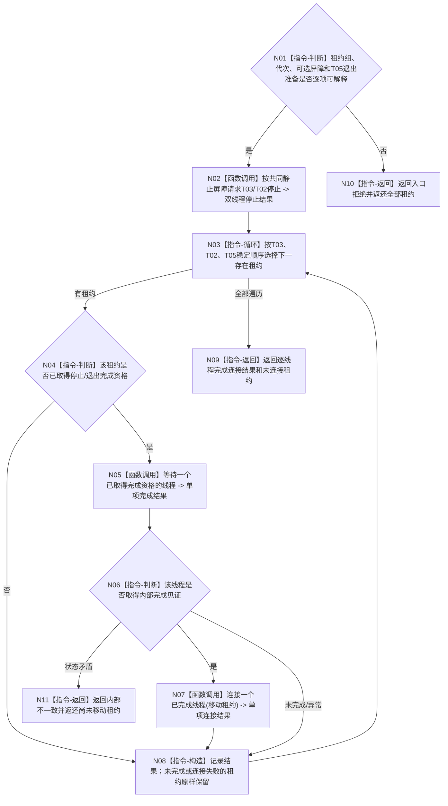

# BIZ-L3-001-14-04 请求治理线程完成并连接租约组目标函数流程图 v0.1

更新时间：2026-08-27

## 依据

```text
0050、8100、8110、8120；BIZ-L2-001-14 v0.2、BIZ-L3-001-14-02—03
```

## 身份与边界

正式目标函数设计图。只有取得共同静止屏障时才请求 T03/T02 停止；屏障缺失时两条治理线程租约原样保留。可选 T05 只依赖自己的退出准备和完成见证，即使 T03/T02 因永久业务槽故障不能停止，已经完成的 T05 仍可独立连接。每个线程取得自己的内部完成见证后即可逐项连接，不要求其它线程先完成。

## 函数合同

```text
根函数：请求治理线程完成并连接租约组
归属模块 / 文件 / 目标分解深度：分阶段停止协调 / 海中鱼巣/启动.分阶段停止.ixx / BIZ-L3
现有或待新增：待新增
完整签名：治理线程完成连接结果 请求治理线程完成并连接租约组(治理线程租约组&& 线程租约组, const 治理线程完成连接请求& 请求) noexcept
参数：移动租约组唯一拥有T03、T02和可选T05；请求含运行代次、可选共同静止屏障、T05退出准备结果、停止身份组和诊断等待截止
返回结果：移动值式结果；含逐线程停止、完成、连接、无需连接、未取得停止资格、异常退出、连接失败和全部未连接租约
被调函数流程图：BIZ-L4-001-14-04-01 按共同静止屏障请求任务管理与自我线程停止；BIZ-L4-001-14-04-02 等待一个已取得完成资格的治理或控制面板线程；BIZ-L4-001-14-04-03 连接一个已完成治理或控制面板线程
父图：BIZ-L2-001-14 v0.2
```

## 流程图



## 节点合同

| 节点 | 类型 | 输入 | 输出 | 事实读写 | 验证 |
| --- | --- | --- | --- | --- | --- |
| N01/N02 | 判断/停止 | 可选共同静止屏障、T03/T02租约 | 双线程停止结果或无资格 | 只改线程生命周期控制 | 无屏障拒绝治理停止、同键重放、单侧请求 |
| N03—N06 | 循环/判断/等待 | 三类强类型租约和逐项资格 | 单线程内部完成结果 | 只读线程内部完成态 | T05独立完成、T03/T02未静止、诊断截止 |
| N07/N08 | 连接/构造 | 已完成租约 | 单项连接或原租约 | 只释放物理线程资源 | 部分连接、连接异常、租约守恒 |
| N09—N11 | 返回 | 逐项结果 | 移动值式总结果 | 不以join裁决业务 | 未连接租约完整返还 |

## 关键边界

- T03/T02 没有共同静止屏障时不得收到停止请求，更不得 join；它们继续保留原槽和租约。
- T05 不产生治理反向材料，不需要共同静止屏障。其退出准备完整、内部完成见证成立后即可独立连接。
- 诊断截止只使当前等待返回“未完成”，不授权 detach、强杀、析构 joinable 租约或伪造完成。
