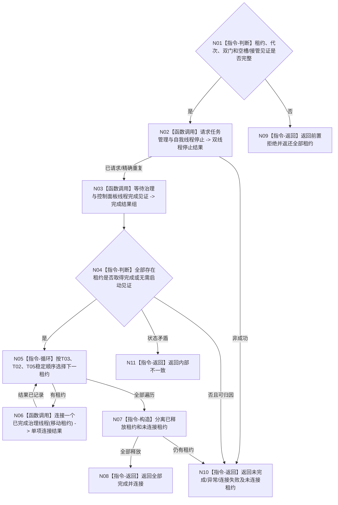

# BIZ-L3-001-14-04 请求治理线程完成并连接租约组目标函数流程图 v0.1

更新时间：2026-08-26

## 依据

```text
0050、8100 v0.8、8110、8120；BIZ-L2-001-14 v0.2、BIZ-L3-001-14-01—03
```

## 身份与边界

正式目标函数设计图。只在双向材料共同空槽或完整接管已经正式读回后，请求 T03/T02 停止，等待 T03、T02 和可选 T05 的内部完成见证，再按稳定顺序移动并连接租约。停止消息、8110 投影或 join 返回均不能替代业务排空见证。

## 函数合同

```text
根函数：请求治理线程完成并连接租约组
归属模块 / 文件 / 目标分解深度：分阶段停止协调 / 海中鱼巣/启动.分阶段停止.ixx / BIZ-L3
现有或待新增：待新增
完整签名：治理线程完成连接结果 请求治理线程完成并连接租约组(治理线程租约组&& 线程租约组, const 治理线程完成连接请求& 请求) noexcept
参数：移动租约组唯一拥有 T03、T02 和可选 T05；请求含运行代次、双门冻结见证、共同空槽/接管见证、T05退出准备结果、停止身份组和等待策略
返回结果：移动值式结果；含逐线程停止、完成、连接、无需连接、异常退出、未完成、连接失败和全部未连接租约
被调函数流程图：BIZ-L4-001-14-04-01 请求任务管理与自我线程停止；BIZ-L4-001-14-04-02 等待治理与控制面板线程完成见证；BIZ-L4-001-14-04-03 连接一个已完成治理线程
父图：BIZ-L2-001-14 v0.2
```

## 流程图



## 节点合同

| 节点 | 类型 | 输入 | 输出 | 事实读写 | 验证 |
| --- | --- | --- | --- | --- | --- |
| N01/N02 | 判断/停止 | 空槽或接管见证、租约 | 双线程停止见证 | 只改线程生命周期控制 | 无排空见证拒绝、精确重复 |
| N03/N04 | 等待/判断 | T03/T02/T05租约 | 内部完成见证组 | 只读线程内部完成态 | 窗口缺席、异常退出、诊断时限 |
| N05—N07 | 循环/连接/构造 | 已完成租约 | 连接结果和租约集合 | 不写业务事实 | 稳定顺序、连接异常、租约守恒 |
| N08—N11 | 返回 | 全部结果 | 移动值式收口结果 | 不以 join 裁决业务 | 未连接租约必须返还 |

## 关键边界

任何线程未取得完成见证时都不得对其调用 join；诊断时限到只能返回仍持有租约的结构化非成功，不得 detach、销毁或伪造连接完成。
