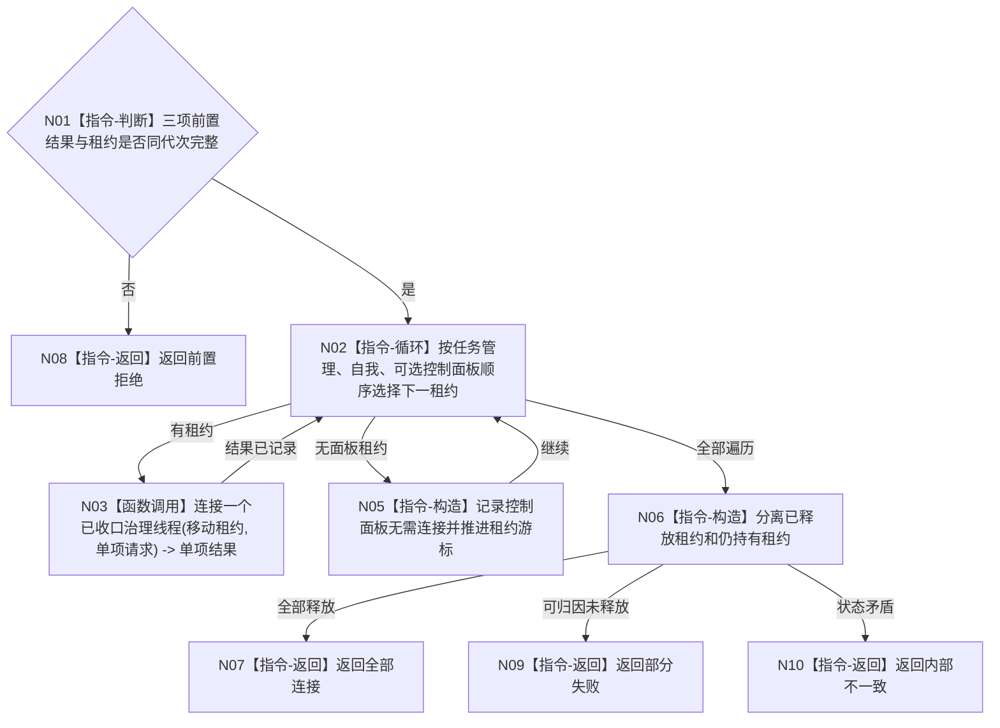

# BIZ-L3-001-14-04 连接任务管理自我和可选控制面板线程目标函数流程图 v0.1

更新时间：2026-08-03

## 依据

```text
8100、8110、8120；BIZ-L2-001-14；BIZ-L3-001-14-01—03
```

## 身份与边界

正式目标函数设计图。按任务管理、自我、可选控制面板顺序连接已收口线程，并显式保留未释放租约。

## 函数合同

```text
根函数：连接任务管理自我和可选控制面板线程
归属模块 / 文件 / 层级：分阶段停止协调 / 海中鱼巣/启动.分阶段停止.ixx / L3
现有或待新增：待新增
完整签名：治理线程连接结果 连接任务管理自我和可选控制面板线程(治理线程租约组&& 线程租约组, const 治理线程连接请求& 请求) noexcept
参数：线程租约组为任务管理、自我和可选控制面板线程的唯一移动所有权；请求为只读借用，含运行代次、任务管理排空结果、自我排空结果、控制面板退出结果和连接时限
返回结果：移动值式逐线程结果；含全部连接、部分失败、超时、错代或内部不一致，以及已释放/仍持有租约集合
被调函数流程图：BIZ-L4-001-14-04-01 连接一个已收口治理线程
父图：BIZ-L2-001-14
```

## 流程图



## 节点合同

| 节点 | 类型 | 输入 | 输出 | 事实读写 | 验证 |
| --- | --- | --- | --- | --- | --- |
| N01 | 判断 | 连接请求 | 准入 | 无 | 缺前置、错代 |
| N02—N06 | 循环 / 调用 / 构造 | 线程租约 | 连接结果和租约集合 | 只改线程生命周期 | 无窗口、超时、异常退出 |
| N07—N10 | 返回 | 汇总结论 | 结构化结果 | 不裁决业务结果 | 租约守恒 |

## 关键边界

连接顺序保护上行先于消费者退出；任何连接成功都不能替代对应排空结果或业务读回证据。
