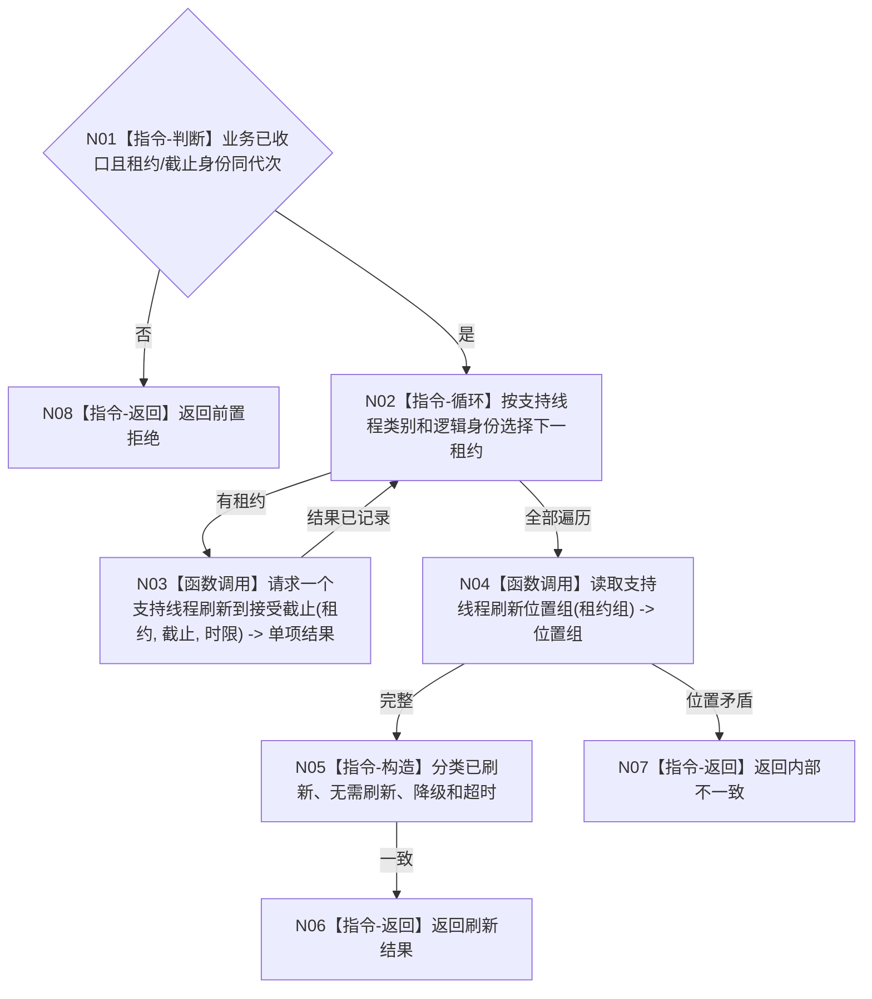

# BIZ-L3-001-15-01 请求支持线程刷新当前已接受材料目标函数流程图 v0.1

更新时间：2026-08-03

## 依据

```text
0050、8110、8120；BIZ-L2-001-15；BIZ-L3-001-14
```

## 身份与边界

正式目标函数设计图。只刷新业务收口前已被支持旁路接受的日志、统计和持久证据材料；失败形成降级，不改写业务结论。

## 函数合同

```text
根函数：请求支持线程刷新当前已接受材料
归属模块 / 文件 / 层级：分阶段停止协调 / 海中鱼巣/启动.分阶段停止.ixx / L3
现有或待新增：待新增；组合现有支持线程队列和停止能力
完整签名：支持线程刷新结果 请求支持线程刷新当前已接受材料(const 支持线程租约组& 线程租约组, const 支持线程刷新请求& 请求)
参数：线程租约组为调用期只读借用且所有权仍由L2持有；请求为只读借用，含运行代次、业务收口见证、各队列接受截止身份、刷新时限和幂等身份
返回结果：值式逐线程结果；含已刷新、无需刷新、降级、超时、错代或内部不一致，以及最后已刷新身份组
被调函数流程图：BIZ-L4-001-15-01-01 请求一个支持线程刷新到接受截止；BIZ-L4-001-15-01-02 读取支持线程刷新位置组
父图：BIZ-L2-001-15
```

## 流程图



## 节点合同

| 节点 | 类型 | 输入 | 输出 | 事实读写 | 验证 |
| --- | --- | --- | --- | --- | --- |
| N01—N03 | 判断 / 循环 / 调用 | 刷新请求 | 逐线程刷新结果 | 只处理已接受旁路材料 | 无线程、阻塞、端口不可用 |
| N04—N05 | 调用 / 构造 | 租约组 | 刷新位置和分类 | 只读支持位置 | 迟到材料、位置倒退 |
| N06—N08 | 返回 | 刷新结论 | 结构化结果 | 不改业务事实 | 分类守恒 |

## 关键边界

刷新成功只证明支持旁路处理位置；SQL、日志或缓存结果均不能替代内存已发布事实和业务收口证据。
