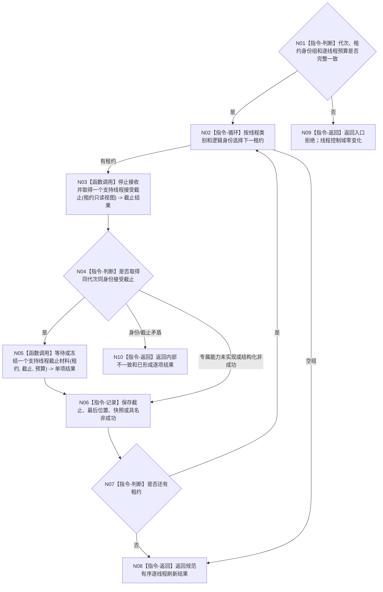

# BIZ-L3-001-15-01 请求支持线程刷新当前已接受材料目标函数流程图 v0.2

更新时间：2026-08-27

## 依据

```text
0050、4060、8110 v0.3、8120、日志系统规范；
20260815 EVENT-LOG-THREAD-PRODUCTION-START；BIZ-L2-001-15 v0.2
```

## 身份与边界

正式目标函数设计图。逐支持线程先线性化关闭新旁路提交并取得本线程接受截止，再等待处理位置到达该截止；超时或故障时只调用该强类型租约允许的同截止冻结 / 快照能力。该步骤不建立跨线程统一刷新位置，也不把日志、缓存或持久证据位置变成业务事实。

## 函数合同

```text
根函数：请求支持线程刷新当前已接受材料
归属模块 / 文件 / 目标分解深度：分阶段停止协调 / 海中鱼巣/启动.分阶段停止.ixx / BIZ-L3
现有或待新增：待新增；EVENT 四项租约能力已实现但零生产调用，CACHE 与持久证据专属截止能力未实现
完整签名：支持线程刷新结果 请求支持线程刷新当前已接受材料(const 支持线程租约组& 线程租约组, const 支持线程刷新请求& 请求) noexcept
参数：租约组为调用期只读借用；请求含运行代次、规范有序线程身份组和逐线程非零单调等待预算
返回结果：不可变值式逐线程结果；含已到达、无需等待、同截止快照已冻结、等待超时、入口故障、能力未实现、资源失败或内部不一致，以及截止、最后位置和可选未取出材料摘要
被调函数流程图：BIZ-L4-001-15-01-01 停止接收并取得一个支持线程接受截止；BIZ-L4-001-15-01-02 等待或冻结一个支持线程截止材料
父图：BIZ-L2-001-15 v0.2
```

## 流程图



## 节点合同

| 节点 | 类型 | 输入 | 输出 | 事实读写 | 验证 |
| --- | --- | --- | --- | --- | --- |
| N01/N02 | 判断 / 循环 | 租约组和刷新请求 | 单项遍历身份 | 无 | 0/N、重复身份、错代、未知 variant |
| N03/N04 | 函数调用 / 判断 | 强类型租约 | 永久接受截止 | 只关闭本支持线程新提交 | 并发提交线性化、精确重复、能力未实现 |
| N05/N06 | 函数调用 / 记录 | 截止和预算 | 完成位置或同截止冻结材料 | 只改本线程私有控制域 | 已到达、零截止、超时、故障、资源失败 |
| N07—N10 | 判断 / 返回 | 逐项结果 | 规范有序结果组 | 不改业务事实 | 逐项覆盖和结果守恒 |

## 关键边界

- EVENT 的正式顺序固定为 `停止接收并取得截止 -> 等待完成到截止 -> 超时/故障时冻结并读取同截止未取出快照`；不得恢复旧“登记通用刷新目标”的虚构控制域。
- 同截止快照只证明未取出项已经冻结并值式读出，不证明后继 owner 已接收，也不证明正常支持收口；资格由 BIZ-L3-001-15-02 独立裁决。
- CACHE / 持久证据线程没有专属 ABI 时返回 `能力未实现 / 材料不足` 并保持租约，不得把 EVENT 字段或裸队列位置强行套用为统一合同。
