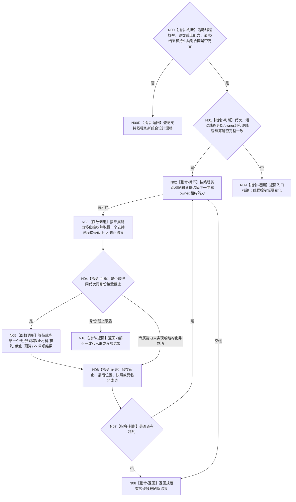

# BIZ-L3-001-15-01 请求支持线程刷新当前已接受材料目标函数流程图 v0.3

更新时间：2026-08-28

## 依据

```text
0050、4060、8110 v0.3、8120、日志系统规范；
20260815 SUPPORT/EVENT/CACHE详细设计；BIZ-L2-001-15 v0.3
```

## 身份与边界

正式目标治理图。逐支持线程先线性化关闭新旁路提交并取得本线程接受截止，再等待处理位置到达该截止；超时或故障时只调用该类别专属owner/租约允许的同截止冻结、快照或确定丢弃能力。该步骤不建立跨线程统一刷新位置，也不把日志、缓存或持久证据位置变成业务事实。

EVENT和CACHE各有不同的专属DTO与能力，持久证据类别尚无合同。旧 `支持线程租约组` const借用和统一逐项结果没有正式共同ABI；本图只能冻结遍历与分账骨架。

## 函数合同

```text
根函数候选：请求支持线程刷新当前已接受材料
归属模块 / 文件 / 目标分解深度：分阶段停止协调 / 海中鱼巣/启动.分阶段停止.ixx / BIZ-L3
现有或待新增：待新增；EVENT 四项租约能力已实现但零生产调用，CACHE 与持久证据专属截止能力未实现
完整签名：未冻结；旧 `const 支持线程租约组&` 与统一刷新请求/结果不构成ABI
参数：未冻结；必须绑定规范有序活动线程身份与逐类owner/租约能力、运行代次和逐线程非零单调等待预算
返回结果：未冻结；必须逐项保存已到达、无需等待、同截止材料已冻结/确定丢弃、等待超时、入口故障、能力未实现、资源失败或内部不一致，以及截止和最后位置
被调函数流程图：BIZ-L4-001-15-01-01—02 v0.3均为设计门禁
父图：BIZ-L2-001-15 v0.3
```

## 流程图



## 节点合同

| 节点 | 类型 | 输入 | 输出 | 事实读写 | 验证 |
| --- | --- | --- | --- | --- | --- |
| N00/N00R | 判断 / 返回 | 当前逐类正式合同 | 设计闭合资格或具名漂移 | 无 | EVENT/CACHE差异、持久类别缺失、组ABI缺失 |
| N01/N02 | 判断 / 循环 | 活动身份/owner组和刷新请求 | 单项遍历身份 | 无 | 0/N、重复身份、错代、未知类别 |
| N03/N04 | 函数调用 / 判断 | 强类型专属能力 | 永久接受截止 | 只关闭本支持线程新提交 | 并发提交线性化、精确重复、能力未实现 |
| N05/N06 | 函数调用 / 记录 | 截止和预算 | 完成位置或同截止冻结材料 | 只改本线程私有控制域 | 已到达、零截止、超时、故障、资源失败 |
| N07—N10 | 判断 / 返回 | 逐项结果 | 规范有序结果组 | 不改业务事实 | 逐项覆盖和结果守恒 |

## 关键边界

- EVENT 的正式顺序固定为 `停止接收并取得截止 -> 等待完成到截止 -> 超时/故障时冻结并读取同截止未取出快照`；不得恢复旧“登记通用刷新目标”的虚构控制域。
- 同截止快照只证明未取出项已经冻结并值式读出，不证明后继 owner 已接收，也不证明正常支持收口；资格由 BIZ-L3-001-15-02 独立裁决。
- CACHE 专属 ABI 已由详细设计冻结但生产代码尚不存在；持久证据支持线程专属 ABI 尚未冻结。两者均不得把 EVENT 字段或裸队列位置强行套用为统一合同；组合层只能在对应类别能力真实存在后调用，否则保持原 owner / 租约并返回具名设计漂移或材料不足。

## 当前已发布代码对应（`c989510b`）

- EVENT已实现停收、等待、位置和同截止快照能力；CACHE仅有详细设计且生产文件不存在；持久证据支持线程合同不存在。
- `启动.分阶段停止.ixx`、`启动.支持线程收口.ixx`和本组合函数不存在，不能从EVENT零生产调用推导共同组ABI。

## 具名偏差

1. `DRIFT-BIZ-SUPPORT-RUNTIME-ACTIVE-SET-ENUMERATION-OWNER-AND-GROUP-ABI-UNFROZEN`
2. `DRIFT-BIZ-SUPPORT-CATEGORY-REFRESH-CAPABILITY-REQUEST-RESULT-AND-PERSISTENCE-CONTRACT-UNFROZEN`

## v0.3校正记录

- 撤销统一 `const 支持线程租约组&`、请求/结果和variant遍历已经冻结的声明。
- 保留按稳定身份调用逐类专属停收/截止能力的目标顺序；组形态和持久类别闭合前不可施工。
