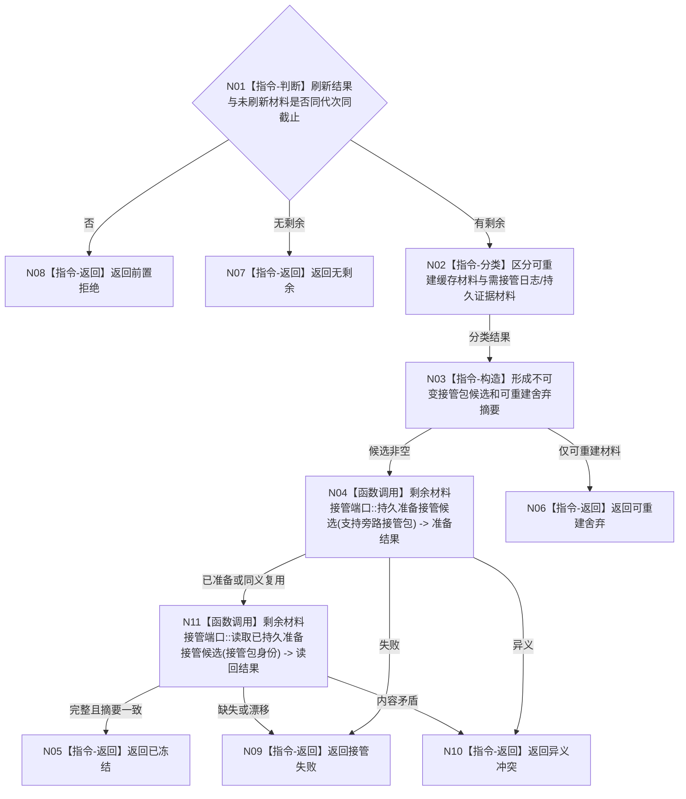

# BIZ-L3-001-15-02 冻结未刷新旁路材料目标函数流程图 v0.1

更新时间：2026-08-03

## 依据

```text
0050、8110；BIZ-L2-001-15；BIZ-L3-001-15-01
```

## 身份与边界

正式目标函数设计图。将刷新截止内未处理材料冻结为非权威接管包；缓存材料允许确定性重建，日志/持久证据保留具名降级。

## 函数合同

```text
根函数：冻结未刷新旁路材料
归属模块 / 文件 / 层级：分阶段停止协调 / 海中鱼巣/启动.分阶段停止.ixx / L3
现有或待新增：待新增
完整签名：未刷新旁路材料冻结结果 冻结未刷新旁路材料(const 未刷新旁路材料冻结请求& 请求)
参数：请求为只读借用；含运行代次、支持刷新结果、未刷新材料组、接管端口、材料版本和幂等身份；接管端口覆盖调用
返回结果：值式结果；含已冻结、无剩余、可重建舍弃、接管失败、异义冲突或内部不一致，以及接管包身份和分类摘要
被调函数流程图：复用BIZ-L4-001-13-03-01 剩余材料接管端口::持久准备接管候选；复用BIZ-L4-001-13-03-02 剩余材料接管端口::读取已持久准备接管候选
父图：BIZ-L2-001-15
```

## 流程图



## 节点合同

| 节点 | 类型 | 输入 | 输出 | 事实读写 | 验证 |
| --- | --- | --- | --- | --- | --- |
| N01—N03 | 判断 / 分类 / 构造 | 冻结请求 | 接管候选与舍弃摘要 | 不写业务事实 | 分类完整、重复材料 |
| N04/N11 | 函数调用 | 候选、幂等身份和接管包身份 | 持久准备与读回见证 | 形成并读回非权威恢复候选 | 失败、同义/异义重复、结果未知 |
| N05—N10 | 返回 | 冻结结论 | 结构化结果 | 不删除权威事实 | 数量与摘要守恒 |

## 关键边界

只允许舍弃能从指定已发布代次确定性重建的缓存/统计材料；不得把未持久业务事实当作“旁路材料”舍弃。只有持久准备读回完整且摘要一致，后继才可移动支持线程租约进入停止连接。
