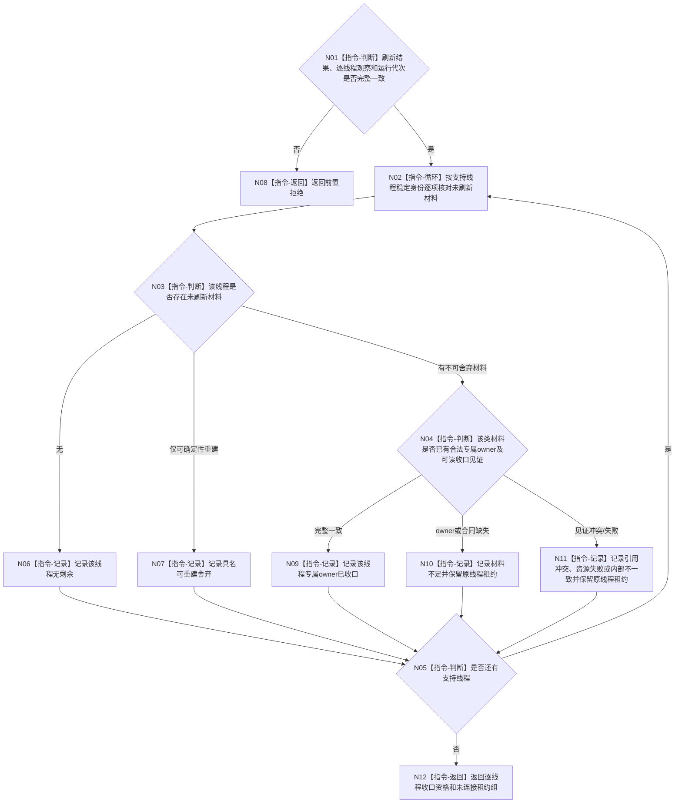

# BIZ-L3-001-15-02 核对未刷新旁路材料收口见证目标函数流程图 v0.1

更新时间：2026-08-27

## 依据

```text
0050、8110；BIZ-L2-001-15；BIZ-L3-001-15-01
```

## 身份与边界

正式目标函数设计图。逐支持线程区分可确定性重建材料与不可舍弃材料；后者只接受该支持线程合法专属 owner 的可读收口见证。不得复用 BIZ-L2-001-13 建立跨日志、缓存、持久追写和业务材料的通用接管包。

## 函数合同

```text
根函数：核对未刷新旁路材料收口见证
归属模块 / 文件 / 目标分解深度：分阶段停止协调 / 海中鱼巣/启动.分阶段停止.ixx / BIZ-L3
现有或待新增：待新增；各支持线程专属owner合同尚未逐类冻结
完整签名：未刷新旁路材料收口结果 核对未刷新旁路材料收口见证(const 未刷新旁路材料收口请求& 请求)
参数：请求为只读借用；含运行代次、支持刷新结果、逐线程未刷新材料观察和各合法专属owner只读能力；不含通用接管端口
返回结果：值式结果；逐线程含无剩余、可重建舍弃、专属owner已收口、材料不足、引用冲突、资源失败或内部不一致，以及原未连接租约资格
被调函数流程图：无；专属owner函数和逐类字段尚未冻结，不在本图临时补造
父图：BIZ-L2-001-15
```

## 流程图



## 节点合同

| 节点 | 类型 | 输入 | 输出 | 事实读写 | 验证 |
| --- | --- | --- | --- | --- | --- |
| N01—N03 | 判断 / 循环 | 刷新结果与逐线程观察 | 当前材料分类 | 只读 | 0/N线程、同代次与覆盖完整 |
| N04 | 判断 | 材料类别和专属owner见证 | 收口资格 | 只读专属owner；不建通用owner | 缺owner、冲突、资源失败 |
| N06—N12 | 记录 / 返回 | 逐项结论 | 资格组和原租约组 | 不删除来源材料 | 部分合格、顺序稳定、租约守恒 |

## 关键边界

只允许舍弃能从指定已发布代次确定性重建的缓存或统计材料。不可舍弃材料缺少专属owner、收口合同或正式读回时，本函数只能返回结构化材料不足并保留原线程租约；不得借通用接管包、日志存在或线程join伪造收口。`DRIFT-BIZ-L1-SUPPORT-STOP-WITH-OWNERLESS-MATERIAL-UNFROZEN` 继续限制对应线程的有限时连接。
