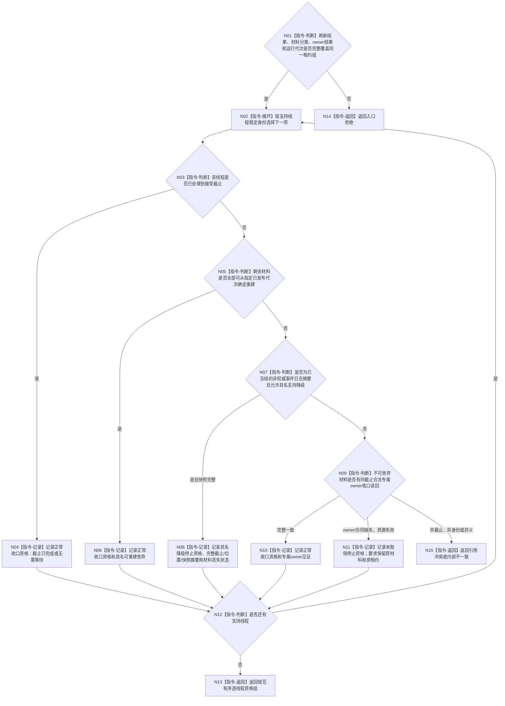

# BIZ-L3-001-15-02 核对未刷新旁路材料收口见证目标函数流程图 v0.2

更新时间：2026-08-27

## 依据

```text
0050、4060、8110 v0.3、日志系统规范；
20260815 EVENT-LOG-THREAD-PRODUCTION-START；BIZ-L2-001-15 v0.2、BIZ-L3-001-15-01 v0.2
```

## 身份与边界

正式目标函数设计图。逐支持线程把刷新结果裁决为“正常收口资格”“具名降级停止资格”或“未取得停止资格”。不可舍弃材料只接受该线程合法专属 owner 的同截止可读见证；不得复用 001-13 或其它线程材料建立通用接管包。

## 函数合同

```text
根函数：核对未刷新旁路材料收口见证
归属模块 / 文件 / 目标分解深度：分阶段停止协调 / 海中鱼巣/启动.分阶段停止.ixx / BIZ-L3
现有或待新增：待新增；逐类 owner 合同尚未全部冻结
完整签名：未刷新旁路材料收口结果 核对未刷新旁路材料收口见证(const 未刷新旁路材料收口请求& 请求) noexcept
参数：请求含运行代次、逐线程刷新结果、逐线程材料类别、可确定重建依据、事件日志具名降级材料及合法专属 owner 只读结果；不含通用接管端口
返回结果：不可变值式逐线程结果；含正常收口资格、具名降级停止资格、未取得停止资格、材料不足、引用冲突、资源失败或内部不一致，以及原租约保持要求
被调函数流程图：无；逐类合同选择和见证比较均为本函数内指令
父图：BIZ-L2-001-15 v0.2
```

## 流程图



## 节点合同

| 节点 | 类型 | 输入 | 输出 | 事实读写 | 验证 |
| --- | --- | --- | --- | --- | --- |
| N01—N03 | 判断 / 循环 | 刷新结果和逐类材料 | 当前线程分类 | 只读 | 0/N、覆盖完整、同代次同截止 |
| N04—N06 | 记录 / 判断 | 完成位置或可重建依据 | 正常收口资格 | 不删除业务事实 | 精确截止、重建来源与规则版本 |
| N07/N08 | 判断 / 记录 | EVENT 同截止冻结快照 | 具名降级停止资格 | 不把日志升级为事实 | 非静默丢失、位置/快照守恒 |
| N09—N11 | 判断 / 记录 | 不可舍弃材料与专属 owner 读回 | 正常资格或无资格 | 只读专属 owner | 缺 owner、错截止、资源失败 |
| N12—N15 | 判断 / 返回 | 逐项资格 | 规范有序资格组 | 无 | 身份与资格唯一 |

## 关键边界

- “非权威”不自动等于“可静默丢弃”。缓存 / 统计只有可确定重建时才按正常收口；EVENT 只能在同截止快照完整且明确记录支持降级、材料丢失和最终位置时取得降级停止资格。
- 发布后持久证据仍可能承担审计 / 恢复责任；其材料不可舍弃时必须有逐类专属 owner 的同截止正式读回。缺 owner 或读回失败返回无停止资格并保留原线程租约。
- 本函数只形成停止资格，不调用 stop、join 或析构；`DRIFT-BIZ-L1-SUPPORT-STOP-WITH-OWNERLESS-MATERIAL-UNFROZEN` 保留在不可舍弃且缺 owner 的精确分支。
