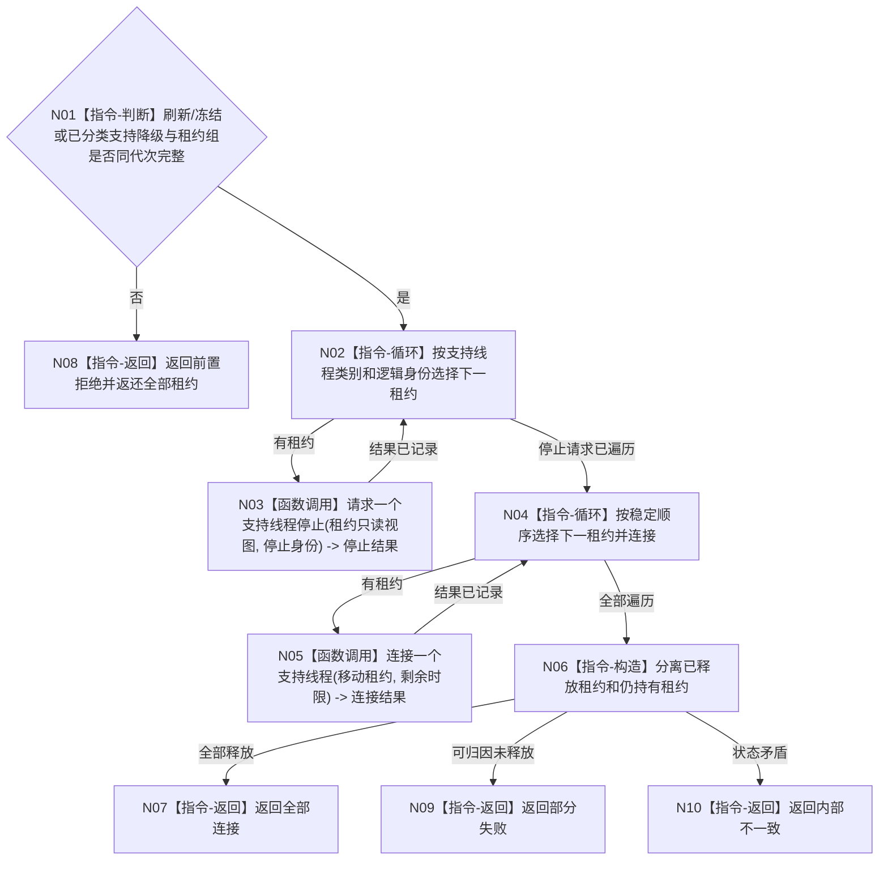

# BIZ-L3-001-15-03 请求停止并连接支持线程组目标函数流程图 v0.1

更新时间：2026-08-03

## 依据

```text
0050、8110、8120；BIZ-L2-001-15；BIZ-L3-001-15-01—02
```

## 身份与边界

正式目标函数设计图。刷新和剩余材料冻结后停止并连接事件日志、缓存统计和可选持久证据工作者。

## 函数合同

```text
根函数：请求停止并连接支持线程组
归属模块 / 文件 / 层级：分阶段停止协调 / 海中鱼巣/启动.分阶段停止.ixx / L3
现有或待新增：待新增；组合各支持线程停止和收口等待能力
完整签名：支持线程组停止连接结果 请求停止并连接支持线程组(支持线程租约组&& 线程租约组, const 支持线程组停止连接请求& 请求) noexcept
参数：线程租约组为事件日志、缓存统计和可选持久证据工作者的唯一移动所有权；请求为只读借用，含运行代次、刷新结果、剩余材料持久准备读回见证或已分类支持降级、停止身份组和连接时限
返回结果：移动值式逐线程结果；含全部连接、无需连接、部分失败、超时、错代或内部不一致，以及已释放/仍持有租约集合
被调函数流程图：BIZ-L4-001-15-03-01 请求一个支持线程停止；BIZ-L4-001-15-03-02 连接一个支持线程
父图：BIZ-L2-001-15
```

## 流程图



## 节点合同

| 节点 | 类型 | 输入 | 输出 | 事实读写 | 验证 |
| --- | --- | --- | --- | --- | --- |
| N01—N04 | 判断 / 循环 / 调用 | 停止连接请求 | 逐线程停止结果 | 只改线程生命周期 | 空组、错代、停止失败 |
| N05—N06 | 调用 / 构造 | 单线程租约 | 连接和租约集合 | 无业务写入 | 超时、异常退出 |
| N07—N10 | 返回 | 汇总结论 | 结构化结果 | 不改变业务结论 | 租约守恒 |

## 关键边界

支持线程连接失败只能形成支持收口降级或资源回收错误；不得反向改写已经成立的业务收口结果。
