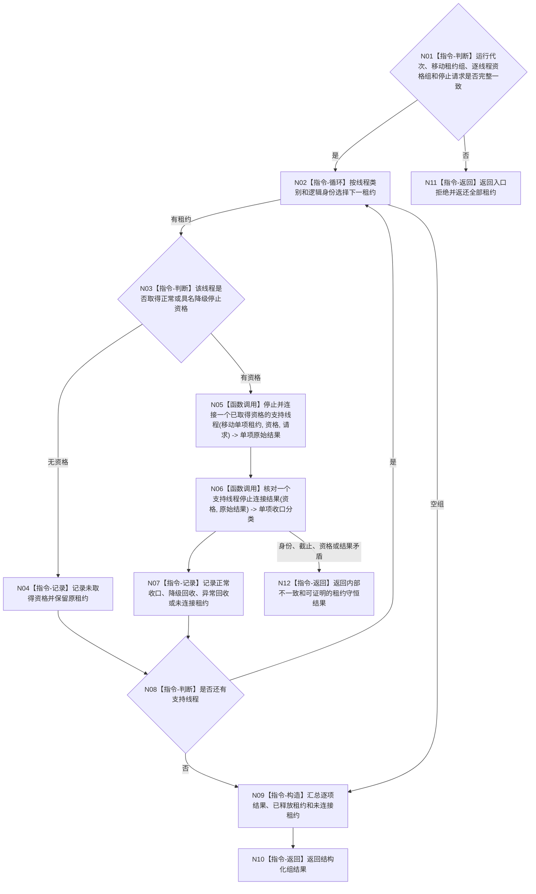

# BIZ-L3-001-15-03 请求停止并连接支持线程组目标函数流程图 v0.2

更新时间：2026-08-27

## 依据

```text
0050、8110 v0.3、8120、日志系统规范；
20260815 EVENT-LOG-THREAD-PRODUCTION-START；BIZ-L2-001-15 v0.2、BIZ-L3-001-15-01—02 v0.2
```

## 身份与边界

正式目标函数设计图。逐项移动消费已经取得正常或具名降级停止资格的强类型支持线程租约；未取得资格的线程不调用停止能力并原样保留租约。对已调用项，物理安全连接与正常支持收口分别核对，不因 stop + join 成功补造材料闭合。

## 函数合同

```text
根函数：请求停止并连接支持线程组
归属模块 / 文件 / 目标分解深度：分阶段停止协调 / 海中鱼巣/启动.分阶段停止.ixx / BIZ-L3
现有或待新增：待新增；EVENT 右值停止连接已实现，CACHE 与持久证据专属能力未实现
完整签名：支持线程组停止连接结果 请求停止并连接支持线程组(支持线程租约组&& 线程租约组, const 支持线程组停止连接请求& 请求) noexcept
参数：移动租约组唯一拥有 0..N 强类型租约；请求含运行代次、规范有序逐线程停止资格组和逐类型停止连接请求
返回结果：移动值式逐线程结果；含正常支持收口、具名降级资源回收、异常资源已回收但前置未闭合、未取得资格、能力未实现、内部不一致、全部已释放租约和全部未连接原租约
被调函数流程图：BIZ-L4-001-15-03-01 停止并连接一个已取得资格的支持线程；BIZ-L4-001-15-03-02 核对一个支持线程停止连接结果
父图：BIZ-L2-001-15 v0.2
```

## 流程图



## 节点合同

| 节点 | 类型 | 输入 | 输出 | 事实读写 | 验证 |
| --- | --- | --- | --- | --- | --- |
| N01—N04 | 判断 / 循环 / 记录 | 移动租约和资格组 | 调用准入或原租约 | 无 | 0/N、错代、重复资格、无资格零 stop |
| N05 | 函数调用 | 已取得资格的强类型租约 | 专属停止连接原始结果 | 只改线程生命周期 | EVENT 右值消费、未知 variant、能力未实现 |
| N06/N07 | 函数调用 / 记录 | 资格与原始结果 | 正常 / 降级 / 异常资源回收分类 | 无业务写入 | 前置未闭合不得计正常、最终位置守恒 |
| N08—N12 | 判断 / 构造 / 返回 | 逐项结果与租约 | 移动值式组结果 | 无 | 部分连接和租约守恒 |

## 关键边界

- EVENT 项必须调用 `事件日志线程租约::停止并连接(...) &&`；不得拆出裸 SUPPORT 租约，也不得虚构“先请求停止、后另行 join”的两个公开 EVENT 入口。
- EVENT 正常前置固定为已停收且同截止已处理完成，或同截止未取出快照已成功读取。provider 防御性返回 `前置未闭合但已安全连接` 时，分类只能是“异常资源已回收但正常收口未成立”。
- 无资格线程不得为了避免持有租约而调用右值停止连接。其不可舍弃材料、专属 owner 缺口和原租约必须一起返还。
- 析构与底层 SUPPORT 的无条件安全连接只作异常安全网；没有结构化结果的析构连接不能进入阶段 15 成功或降级结果。
