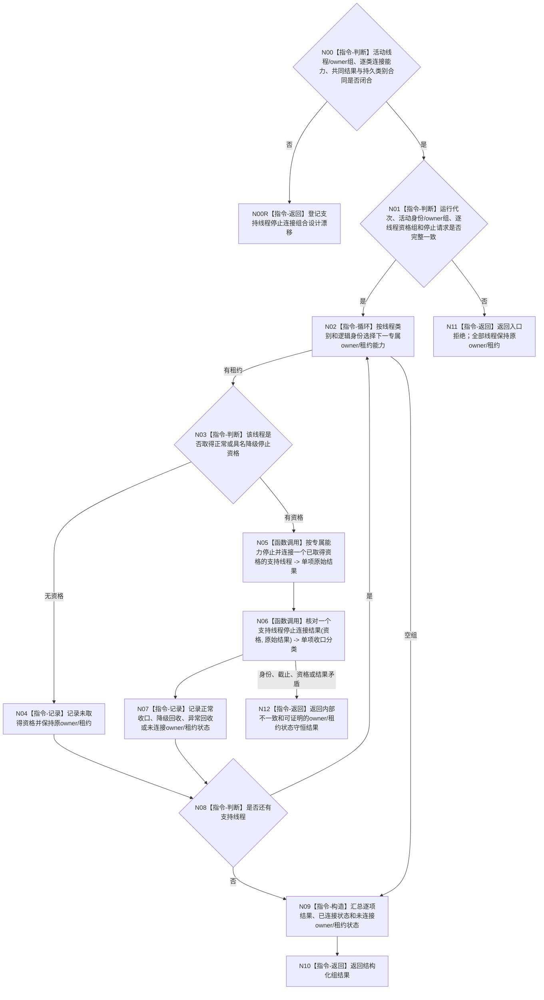

# BIZ-L3-001-15-03 请求停止并连接支持线程组目标函数流程图 v0.3

更新时间：2026-08-28

## 依据

```text
0050、8110 v0.3、8120、日志系统规范；
20260815 SUPPORT/EVENT/CACHE详细设计；BIZ-L2-001-15 v0.3、BIZ-L3-001-15-01—02 v0.3
```

## 身份与边界

正式目标治理图。逐项调用已经取得正常或具名降级停止资格的线程类别专属停止连接能力；未取得资格的线程不调用停止能力并由原owner/租约继续持有。对已调用项，物理安全连接与正常支持收口分别核对，不因stop + join成功补造材料闭合。

EVENT和CACHE专属设计均采用右值租约停止连接，但共同活动组、类别穷尽、持久证据线程及统一结果并未冻结。本图不得把两个专属形态扩张为三类variant或父组ABI。

## 函数合同

```text
根函数候选：请求停止并连接支持线程组
归属模块 / 文件 / 目标分解深度：分阶段停止协调 / 海中鱼巣/启动.分阶段停止.ixx / BIZ-L3
现有或待新增：待新增；EVENT 右值停止连接已实现，CACHE 与持久证据专属能力未实现
完整签名：未冻结；旧 `支持线程租约组&&`、三类variant和统一请求/结果不构成ABI
参数：未冻结；必须绑定规范有序活动线程身份与逐类owner/租约能力、运行代次、逐线程停止资格和逐类停止连接请求
返回结果：未冻结；必须逐项表达正常支持收口、具名降级资源回收、异常资源已回收但前置未闭合、未取得资格、能力未实现、内部不一致、已连接及未连接owner/租约状态
被调函数流程图：BIZ-L4-001-15-03-01—02 v0.3均为设计门禁
父图：BIZ-L2-001-15 v0.3
```

## 流程图



## 节点合同

| 节点 | 类型 | 输入 | 输出 | 事实读写 | 验证 |
| --- | --- | --- | --- | --- | --- |
| N00/N00R | 判断 / 返回 | 当前逐类连接与组合同 | 设计闭合资格或具名漂移 | 无 | EVENT/CACHE专属形态、持久类别与共同DTO缺失 |
| N01—N04 | 判断 / 循环 / 记录 | 活动身份/owner和资格组 | 调用准入或原owner状态 | 无 | 0/N、错代、重复资格、无资格零stop |
| N05 | 函数调用 | 已取得资格的强类型专属能力 | 专属停止连接原始结果 | 只改线程生命周期 | EVENT/CACHE右值消费、未知类别、能力未实现 |
| N06/N07 | 函数调用 / 记录 | 资格与原始结果 | 正常 / 降级 / 异常资源回收分类 | 无业务写入 | 前置未闭合不得计正常、最终位置守恒 |
| N08—N12 | 判断 / 构造 / 返回 | 逐项结果与owner/租约状态 | 组结果 | 无 | 部分连接和owner/租约守恒 |

## 关键边界

- EVENT 项必须调用 `事件日志线程租约::停止并连接(...) &&`；不得拆出裸 SUPPORT 租约，也不得虚构“先请求停止、后另行 join”的两个公开 EVENT 入口。
- EVENT 正常前置固定为已停收且同截止已处理完成，或同截止未取出快照已成功读取。provider 防御性返回 `前置未闭合但已安全连接` 时，分类只能是“异常资源已回收但正常收口未成立”。
- 无资格线程不得为了避免持有租约而调用右值停止连接。其不可舍弃材料、专属 owner 缺口和原租约必须一起返还。
- 析构与底层 SUPPORT 的无条件安全连接只作异常安全网；没有结构化结果的析构连接不能进入阶段 15 成功或降级结果。

## 当前已发布代码对应（`c989510b`）

- EVENT右值停止连接已实现且零生产调用；CACHE只有详细设计，持久证据支持线程没有生产与收口合同。
- 本组函数、活动线程枚举、共同请求/结果和普通应用持有/返还布局均不存在。

## 具名偏差

1. `DRIFT-BIZ-SUPPORT-RUNTIME-ACTIVE-SET-ENUMERATION-OWNER-AND-GROUP-ABI-UNFROZEN`
2. `DRIFT-BIZ-SUPPORT-CATEGORY-STOP-CONNECTION-RESULT-AND-PERSISTENCE-CONTRACT-UNFROZEN`
3. `DRIFT-BIZ-SUPPORT-STAGE15-PARENT-PARTIAL-RESULT-RETRY-AND-UNCONNECTED-OWNER-MATRIX-UNFROZEN`

## v0.3校正记录

- 撤销统一 `支持线程租约组&&`、三类variant和组请求/结果已经冻结的声明。
- 保留已取得资格后调用逐类专属停止连接、再分账正常/降级/异常资源回收的目标骨架；无资格项保持原owner/租约。
