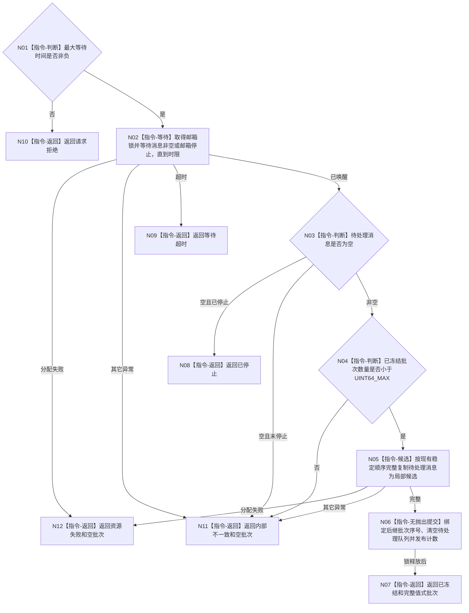

# BIZ-L3-002-01-01 等待并冻结下一批目标函数流程图 v0.1

更新时间：2026-08-15

## 依据

```text
8100、8200；BIZ-L2-002-01；当前海中鱼巣/线程/有界自我治理队列.ixx
旧鱼巢可吸收：等待后冻结一批再处理；排除线程直接推进业务事实
```

## 身份与边界

正式目标函数设计图。复用现行邮箱锁内等待、稳定顺序和停止唤醒能力，并补齐负等待拒绝、批次序号耗尽守卫和异常零变化；只冻结消息批次，不读取消息指向的领域事实。

## 函数合同

```text
根函数：有界自我治理邮箱::等待并冻结下一批
归属模块 / 文件 / 层级：自我治理邮箱 / 海中鱼巣/线程/有界自我治理队列.ixx / L3
现有或待新增：现有实现需由 `RUNTIME-GOVERNANCE-MAILBOX-BATCH-FREEZE v0.1`收紧
完整签名：自我治理冻结结果 有界自我治理邮箱::等待并冻结下一批(std::chrono::milliseconds 最大等待时间) noexcept
参数：最大等待时间按值传入；0合法，负值拒绝；邮箱对象和等待条件覆盖调用
返回结果：调用方拥有的值式冻结结果；含已冻结、等待超时、已停止、请求拒绝、资源失败或内部不一致；只有已冻结携带非零唯一批次序号和非空消息组
被调函数流程图：无
父图：BIZ-L2-002-01
```

## 流程图



## 节点合同

| 节点 | 类型 | 输入 | 输出 | 事实读写 | 验证 |
| --- | --- | --- | --- | --- | --- |
| N01—N03 | 判断 / 等待 | 最大等待时间、邮箱状态 | 唤醒分类 | 只读/等待队列状态 | 负值、0、超时、停止唤醒、伪唤醒 |
| N04—N06 | 判断 / 候选 / 提交 | 当前批次计数、待处理队列 | 唯一后继批次和值式消息组 | 候选期零变化；最后锁内无抛出清队列并更新计数 | 序号耗尽、顺序、容量、候选失败零变化 |
| N07—N12 | 返回 | 冻结结论 | 结构化结果 | 不写业务事实 | 六类结果互斥；仅成功携带批次 |

## 关键边界

邮箱已经按正式优先级稳定插入；冻结函数不得第二次排序。为保证异常前队列不被半移动，候选使用消息值式复制，只有完整候选形成后才在同一锁内清空原队列并推进批次计数。等待超时不代表一秒经过，也不触发安全值或服务值变化。
