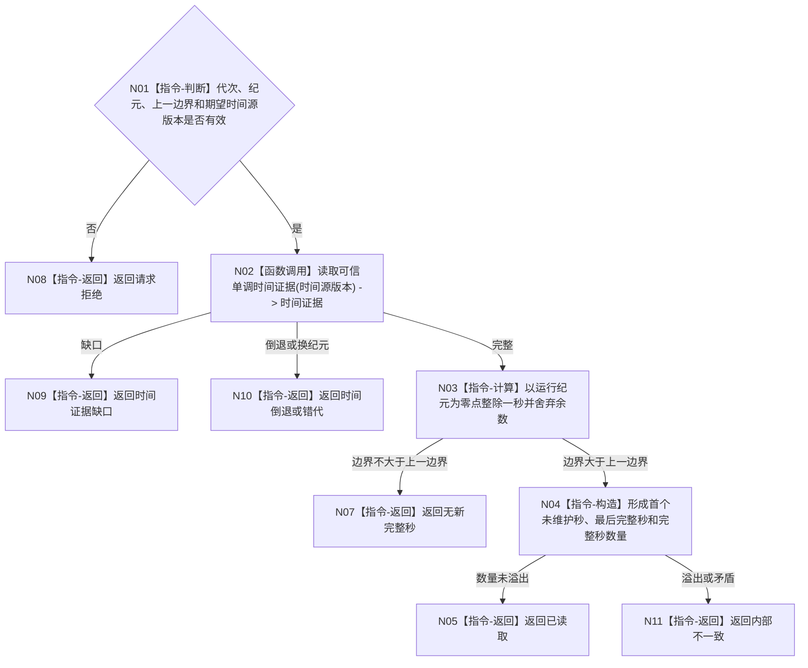

# BIZ-L3-002-01-02 读取当前完整秒边界目标函数流程图 v0.1

更新时间：2026-08-03

## 依据

```text
0050、6140、6160、6170、8100；BIZ-L2-002-01
```

## 身份与边界

正式目标函数设计图。把可信单调时间换算为当前运行纪元内已完整结束的秒区间；循环次数、等待次数和消息数都不参与时间量。

## 函数合同

```text
根函数：完整秒时钟服务::读取当前完整秒边界
归属模块 / 文件 / 层级：运行期时间证据 / 海中鱼巣/领域/服务.完整秒时钟.ixx / L3
现有或待新增：待新增；可复用现行单调时钟适配器
完整签名：完整秒边界读取结果 完整秒时钟服务::读取当前完整秒边界(const 完整秒边界读取请求& 请求) const
参数：请求为只读借用；含运行代次、运行纪元、上一完整秒边界和期望时间源版本；服务与时间源覆盖调用，调用方不得提供当前时间值
返回结果：调用方拥有的值式结果；含已读取、无新完整秒、时间证据缺口、时间倒退、错代或内部不一致，以及首尾完整秒和数量
被调函数流程图：BIZ-L4-002-01-02-01 单调时钟适配器::读取可信单调时间证据
父图：BIZ-L2-002-01
```

## 流程图



## 节点合同

| 节点 | 类型 | 输入 | 输出 | 事实读写 | 验证 |
| --- | --- | --- | --- | --- | --- |
| N01—N02 | 判断 / 调用 | 时间请求 | 可信时间证据 | 只读时间源 | 错代、倒退、源版本变化 |
| N03—N04 | 计算 / 构造 | 纪元与单调时间 | 完整秒区间 | 无 | 边界、批量等价、溢出 |
| N05—N11 | 返回 | 时间结论 | 结构化结果 | 不改安全/服务值 | 无新秒与缺口分离 |

## 关键边界

余数直接舍弃且最小业务步长由领域规范另行裁决；本函数只提供时间证据，不能自行衰减或回归任何值。
