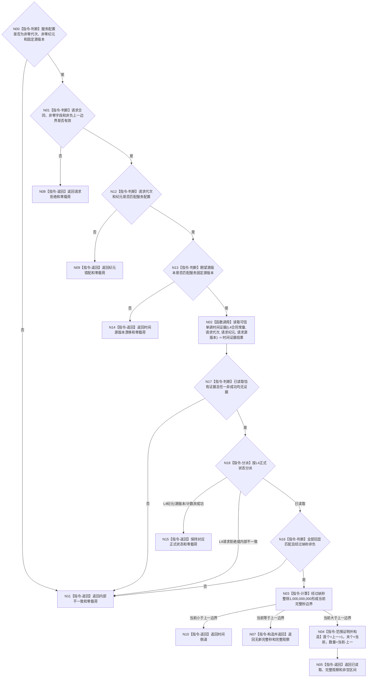

# BIZ-L3-002-01-02 读取当前完整秒边界目标函数流程图 v0.1

更新时间：2026-08-15

## 依据

```text
0050、6140、6160、6170、8100；BIZ-L2-002-01
```

## 身份与边界

正式目标函数设计图。把可信单调时间换算为当前运行纪元内已完整结束的秒区间；循环次数、等待次数和消息数都不参与时间量。

## 函数合同

```text
根函数：完整秒时钟服务::读取当前完整秒边界
归属模块 / 文件 / 层级：运行期时间证据 / 海中鱼巣/领域/服务.完整秒时钟.ixx / L3
现有或待新增：待新增；消费预冻结的 `RUNTIME-MONOTONIC-TIME-EVIDENCE-PROVIDER v0.1`
完整签名：完整秒边界读取结果 完整秒时钟服务::读取当前完整秒边界(const 完整秒边界读取请求& 请求) const noexcept
参数：请求为只读借用；含合同版本、运行代次、时间纪元身份、上一已消费完整秒边界和期望时间源版本；上一边界允许0且必须非负；调用方不得提供当前时间值
返回结果：调用方拥有的值式结果；已读取时含观察与非空区间，无新完整秒时只含观察；其它状态零观察零区间；状态含请求拒绝、纪元错配、时间源版本漂移、时间倒退、计数不可表示或内部不一致
被调函数流程图：BIZ-L4-002-01-02-01 单调时钟适配器::读取可信单调时间证据
父图：BIZ-L2-002-01
```

## 流程图



## 节点合同

| 节点 | 类型 | 输入 | 输出 | 事实读写 | 验证 |
| --- | --- | --- | --- | --- | --- |
| N00—N02 | 判断 / 调用 | 服务配置、完整秒请求 -> 使用L4合同常量形成的单调时间请求 | 时间证据结果 | 只读 L4 时间适配器 | 坏配置、坏请求、纪元和源版本逐项映射；调用前拒绝零L4调用 |
| N16—N18 | 判断 / 分派 | L4状态、optional、全部回显和经过纳秒 | 合法证据、正式非成功或内部不一致 | 无 | 已读取恰有证据；任一非成功零证据；非法配对和坏回显不进入秒边界计算 |
| N03/N04 | 计算 / 构造 | 非负经过纳秒、上一边界 | 当前观察和可选非空区间 | 无 | 0/1/多秒、倒退、受检差值 |
| N05—N15 | 返回 | 时间结论 | 结构化结果 | 不改安全/服务值 | 无新秒保留观察；全部非成功零载荷 |

## 关键边界

纳秒余数直接舍弃；边界0表示纪元起点后尚无完整秒。`无新完整秒`是成功观察但零区间，不是证据缺口。当前与上一均为非负I64，且只在当前大于上一后构造区间，所以首个边界与数量转换不会溢出；`计数不可表示`只保持L4的纳秒计数结果。本函数只提供时间证据，不能自行衰减、推进游标或回归任何值。
