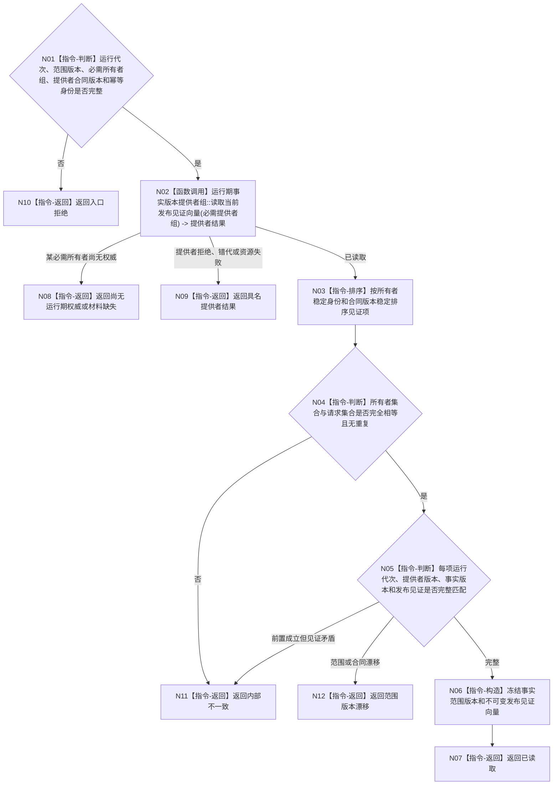

# BIZ-L3-002-01-03 读取当前已发布事实截止向量目标函数流程图 v0.1

> 历史冻结：本版的逐 owner 截止向量、独立发布见证、读取幂等身份和调用开始见证与 4015、4230 的同一 L1 全局事实代次冲突。当前合同由 v0.2“读取当前已发布共享事实截止”替代，不得施工或复用 DTO。

更新时间：2026-08-03

## 依据

```text
0050、4010、4030、4050、4190、8200；BIZ-L2-002-01—02
当前代码：节点直接结构查询和世界结构读取分别具有自己的事实代次；不存在可证明覆盖全部领域的全局标量代次
```

## 身份与边界

正式目标函数设计图。按事实范围登记读取各正式事实所有者的当前发布见证，形成稳定排序的事实截止向量；不把某个仓库代次冒充全项目原子代次。

## 函数合同

```text
根函数：运行期事实版本服务::读取当前已发布事实截止向量
归属模块 / 文件 / 层级：运行期事实版本组合 / 海中鱼巣/领域/组合.运行期事实版本.ixx / L3
现有或待新增：待新增；适配复用各所有者当前代次读取，新增范围登记、稳定排序和完整性复核
完整签名：已发布事实截止向量读取结果 运行期事实版本服务::读取当前已发布事实截止向量(const 已发布事实截止向量读取请求& 请求) const
参数：请求为只读借用；含运行代次、事实范围版本、必需事实所有者身份/提供者合同版本组、读取幂等身份和调用开始见证；服务与提供者组覆盖调用
返回结果：调用方拥有的不可变值式结果；含已读取、尚无运行期权威、材料缺失、范围版本漂移、提供者资源失败、错代或内部不一致，以及稳定排序的所有者发布见证向量和范围版本
被调函数流程图：BIZ-L4-002-01-03-01 运行期事实版本提供者组::读取当前发布见证向量
父图：BIZ-L2-002-01；复用于BIZ-L2-002-02读后复核
```

## 流程图



## 节点合同

| 节点 | 类型 | 参数 / 输入绑定 | 结果 / 输出绑定 | 事实读写 | 后继条件 | 验证 |
| --- | --- | --- | --- | --- | --- | --- |
| N01/N02 | 判断 / 函数调用 | 范围和提供者组 | 原始发布见证组 | 只读各所有者当前发布状态 | 全部返回或具名非成功 | 空范围、重复所有者、提供者失效 |
| N03—N05 | 指令 | 原始见证组 | 唯一稳定向量 | 无 | 集合相等且版本完整 | 遍历顺序变化、缺项、重复项、错代 |
| N06/N07 | 指令 | 已复核向量 | 不可变截止向量 | 无 | 构造完整 | 调用方拥有且不泄漏提供者引用 |
| N08—N12 | 指令-返回 | 失败类别和证据 | 结构化非成功 | 无 | 唯一分类 | 尚无权威、漂移、资源失败和内部不一致分账 |

## 关键边界

事实截止向量不是新的业务事实，也不要求不同领域共享一个全局计数器。跨领域一致快照必须在读取正文后再次读取同一范围向量，只有前后向量和各子快照来源版本完全一致才成立；否则返回版本漂移并在下一治理批次重试。
