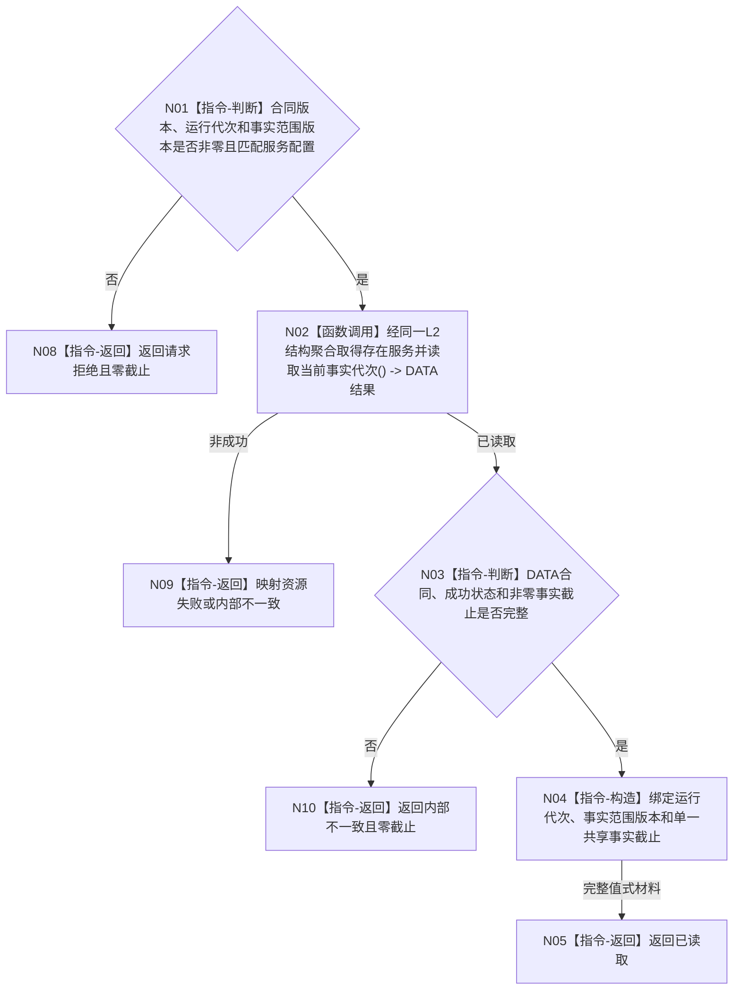

# BIZ-L3-002-01-03 读取当前已发布共享事实截止目标函数流程图 v0.2

更新时间：2026-08-15

## 依据

```text
0050、4015、4030、4230、8200；BIZ-L2-002-01—02
当前事实：普通应用六类世界结构服务使用同一 L1事实基座运行包；L1 每次成功写集只推进一个全局事实代次
```

## 身份与边界

正式目标函数设计图。读取普通应用当前同一 L1 运行包的非零共享事实截止，供本轮全部 L2 当前读取共同使用；不枚举 owner，不建立发布见证 token，不把运行代次、时间戳或 provider 版本冒充事实截止。

## 函数合同

```text
根函数：运行期事实版本服务::读取当前已发布共享事实截止
归属模块 / 文件 / 层级：运行期事实版本组合 / 海中鱼巣/领域/组合.运行期事实版本.ixx / BIZ-L3
现有或待新增：待新增 BIZ 消费包装；经同一 `L2结构聚合服务`取得 `const L2存在结构服务&` 并调用现有 `读取当前事实代次()`，不直达 L1
完整签名：共享事实截止读取结果 运行期事实版本服务::读取当前已发布共享事实截止(const 共享事实截止读取请求& 请求) const noexcept
参数：请求为只读借用；仅含合同版本、非零运行代次和非零事实范围版本；不含 owner 组、幂等身份、provider 引用或调用方自造见证
返回结果：调用方拥有的不可变值式结果；状态区分已读取、请求拒绝、资源失败或内部不一致；只在已读取时携带与请求绑定的单一非零事实截止
被调函数流程图：BIZ-L4-002-01-03-01 L2存在结构服务::读取当前事实代次 v0.2
父图：BIZ-L2-002-01；复用于 BIZ-L2-002-02 读后复核
```

## 流程图



## 节点合同

| 节点 | 类型 | 参数 / 输入绑定 | 结果 / 输出绑定 | 事实读写 | 后继条件 | 验证 |
| --- | --- | --- | --- | --- | --- | --- |
| N01 | 指令-判断 | BIZ 请求与构造配置 | 准入结论 | 无 | 完整或拒绝 | 零版本、错运行代次、错范围版本均零 DATA 调用 |
| N02 | 函数调用 | 同一 `L2结构聚合服务` | `L2结构结果头` | 只读当前 L1 已发布代次 | 已读取、资源失败或内部不一致 | 无幂等、无 owner 枚举、无 provider 引用 |
| N03/N04 | 判断 / 构造 | 端口结果、BIZ 请求 | 不可变共享截止材料 | 无 | 非零且字段闭合 | 零截止、错合同和坏成功形状为内部不一致 |
| N08—N10 | 指令-返回 | 失败分类 | 结构化非成功 | 无 | 零截止 | 不夹带旧值或部分载荷 |

## 关键边界

- 事实截止就是 4015 的 L1 全局原子发布代次；不存在第二个等值发布见证字段。
- 同一次组合读取固定为“读取前 G0 -> 全部 L2 当前读取使用同一 G0 非零守卫 -> 读取后 G1 -> 仅 G1==G0 成立”。
- owner 身份只约束写入来源，不形成独立事实时钟。当前正式公共桥为同实例 `L2存在结构服务::读取当前事实代次()`；该调用只返回共享 L1 截止，不读取或解释存在业务事实。
- 本函数全程只读、无缓存、无自动重试；调用方需要重试时重新开始完整组合读取。
