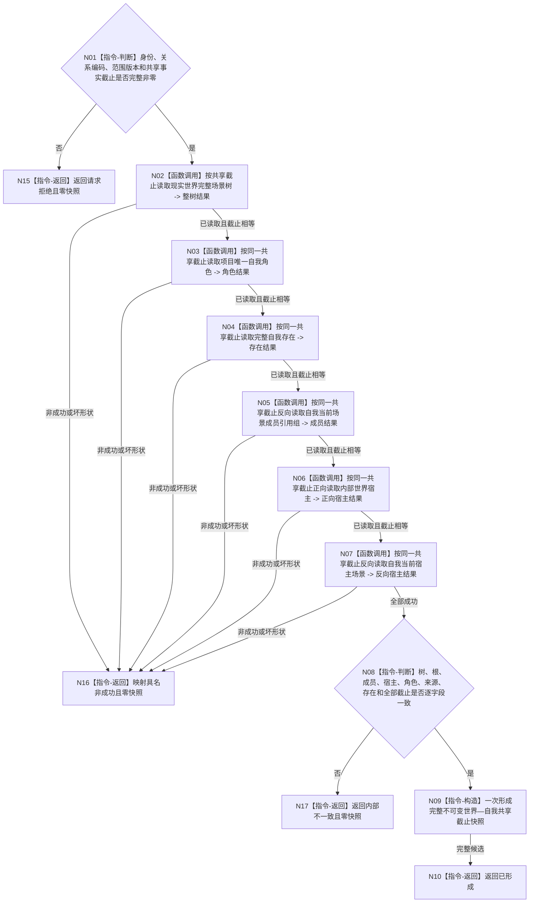

# BIZ-L3-002-02-01 读取共享截止世界与自我快照目标函数流程图 v0.3

更新时间：2026-08-15

## 依据

```text
0050、4015、4030、4190、4200、4230、6180、7130
父图：BIZ-L2-002-02
数据服务：DATA-EXT-01、DATA-EXT-02、DATA-EXT-07；共享截止由父级 BIZ-L3-002-01-03 v0.2 提供
```

## 身份与边界

正式目标函数设计图。按父级冻结的一个非零共享事实截止，经普通应用同一 `L2结构聚合服务`取得场景与存在服务，正式读取现实世界树、自我角色、完整存在、所在场景成员和内部世界宿主；全部结果必须回显同一截止并逐字段闭合。全程只读，零 DATA 写、零缓存补缺。

## 函数合同

```text
根函数：运行期只读查询组合器::读取共享截止世界与自我快照
归属模块 / 文件 / 层级：运行期只读查询 / 海中鱼巣/领域/组合.运行期只读查询.ixx / BIZ-L3
现有或待新增：待新增；替代 v0.2 的两个 owner 截止 DTO
完整签名：世界自我共享截止快照结果 运行期只读查询组合器::读取共享截止世界与自我快照(const 世界自我共享截止快照请求& 请求) const noexcept
参数：SELF-FORM 稳定身份与三项关系编码、运行代次、事实范围版本、现实世界树/根/所在/内部世界、自我角色/存在，以及一个非零共享事实截止
返回结果：只在已形成时携带完整值式快照和同一共享截止；请求拒绝、材料缺失、当前性漂移、提供者拒绝、资源失败或内部不一致均零快照
父图：BIZ-L2-002-02；读取后由父图再次调用 BIZ-L3-002-01-03 v0.2 取得 G1 并与本次 G0 相等
```

## 流程图



## 节点合同

| 节点 | 参数 / 输入绑定 | 结果 / 输出绑定 | 事实读写 | 验证 |
| --- | --- | --- | --- | --- |
| N02 | 现实世界树 + 同一非零截止 | 完整树、根、场景、父子、成员、宿主 | 只读 DATA-EXT-01 | 结果截止必须等于请求截止 |
| N03/N04 | 自我角色 / 自我存在 + 同一截止 | 角色关系、来源、完整活动存在 | 只读 DATA-EXT-02 | 角色、来源、存在逐字段闭合 |
| N05—N07 | 自我 / 内部世界 + 同一截止 | 成员恰一、宿主正反向 | 只读 DATA-EXT-01 | 与整树内嵌事实一致 |
| N08/N09 | 六项正式结果与 SELF-FORM 选择材料 | 完整值式快照 | 无 | 全部来源同一截止；一次构造 |

## 关键边界

- 七个世界结构 owner 仍然两两不同，但 owner 只约束写入来源；普通应用内它们共享一个 L1 原子事实代次。
- 任何读取返回截止不等于请求共享截止，统一映射当前性漂移；不得只重读一项后与旧结果拼装。
- 父级读取前后共享截止相等是跨步骤未发生任何 L1 发布的证明；不再使用逐 owner 向量或额外发布见证。
- SELF-FORM 选择字段只用于选择和互证，不能替代本次 DATA 正式读回。
