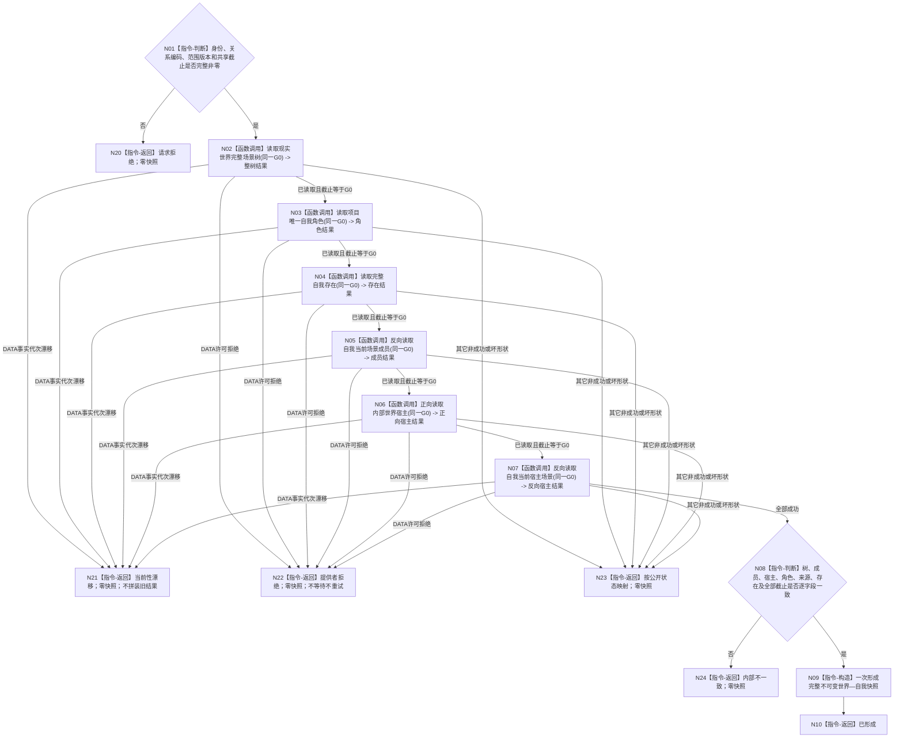

# BIZ-L3-002-02-01 读取共享截止世界与自我快照目标函数流程图 v0.4

更新时间：2026-08-17

## 依据

```text
0050、4015、4030、4190、4200、4230、6180、7130
WORLD-SELF-CURRENT-SNAPSHOT-CONSUME 详细设计 v0.3 / 计划 v0.3
数据服务：DATA-EXT-01、DATA-EXT-02、DATA-EXT-07；共享截止由父级 BIZ-L3-002-01-03 提供
```

## 身份与边界

正式目标函数设计图，替代 v0.3 图。按父级冻结的一个非零共享事实截止，经同一 `L2结构聚合服务`取得场景与存在服务，读取并互证世界—自我材料。全程只读、零缓存、零 DATA 写；非成功零快照。

## 函数合同

```text
根函数：运行期只读查询组合器::读取共享截止世界与自我快照
归属模块 / 文件 / 层级：海中鱼巣/领域/组合.运行期只读查询.ixx / BIZ-L3
现有或待新增：待新增；v0.3 替代 v0.2
完整签名：世界自我共享截止快照结果 运行期只读查询组合器::读取共享截止世界与自我快照(const 世界自我共享截止快照请求& 请求) const noexcept
参数：SELF-FORM 稳定身份、关系编码、运行代次、范围版本、世界 / 自我键和一个非零共享事实截止
返回结果：仅已形成携带完整快照；请求拒绝、材料缺失、当前性漂移、提供者拒绝、资源失败、内部不一致均零快照
```

## 流程图



## 节点合同

| 节点 | 参数 / 输入绑定 | 结果 / 输出绑定 | 事实读写 | 验证 |
| --- | --- | --- | --- | --- |
| N02 | 现实世界树 + 同一非零 G0 | 完整树及内嵌关系 | 只读 DATA-EXT-01 | 成功截止等于 G0 |
| N03/N04 | 自我角色 / 自我存在 + G0 | 角色关系、来源、完整活动存在 | 只读 DATA-EXT-02 | 逐字段、同截止闭合 |
| N05—N07 | 自我 / 内部世界 + G0 | 成员恰一、宿主正反向 | 只读 DATA-EXT-01 | 与整树事实一致 |
| N21 | DATA 明确漂移 | BIZ 当前性漂移 | 零快照 | 只能由公开 DATA 状态触发 |
| N22 | DATA `L2许可拒绝` | BIZ 提供者拒绝 | 零快照 | Gobs == G0 或无观察值不得称漂移 |
| N23/N24 | 其它非成功或坏形状 | 公开状态映射 / 内部不一致 | 零快照 | 不吞错、不重试 |
| N08/N09 | 六项结果与 SELF-FORM 选择材料 | 完整值式快照 | 无写入 | 一次构造、同一截止 |

## 关键边界

- 只有 DATA 明确返回事实代次漂移，或锁内实际观察到已发布 `G1 != G0`，才映射当前性漂移。
- `try_to_lock` 竞争保持 DATA `许可拒绝`；BIZ 将其映射提供者拒绝。`Gobs == G0`、零观察截止、未发布代次和日志文本都不能证明漂移。
- 所有非成功零快照；本函数不等待、不重试、不拼装部分结果，不把 DATA 内部不一致改写成并发漂移。
- `映射事实代次探测失败` 对 L1 许可拒绝的传播属于后续 DATA 风险观察，不在本图伪造修复。
- 父级 G0/G1 读回、SELF-FORM、普通应用装配、正式生产消费者、崩溃和跨进程恢复均不由本图证明。

## 验证

1. 本文件只有一个 Mermaid `flowchart TD` 根函数图。
2. 每个执行节点均为具名函数调用或本函数具体指令，所有返回路径有状态和载荷边界。
3. 运行 `git diff --check -- <本文件>`；不创建或同步 HTML。
