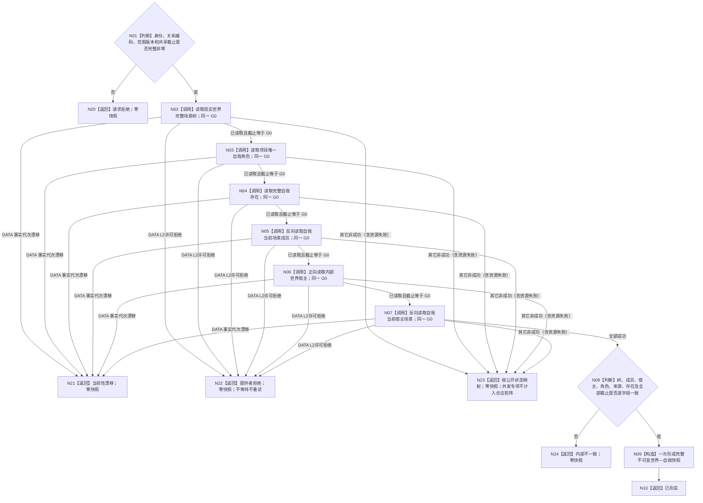

# BIZ-L3-002-02-01 读取共享截止世界与自我快照目标函数流程图 v0.5

更新时间：2026-08-17

## 依据

```text
0050、4015、4030、4190、4200、4230、6180、7130
WORLD-SELF-CURRENT-SNAPSHOT-CONSUME 详细设计 v0.4 / 计划 v0.4
DATA-EXT-01、DATA-EXT-02、DATA-EXT-07；独立前置 DATA-L2-L1-PERMISSION-REJECTION-PROPAGATION v0.1
```

## 函数合同

```text
根函数：运行期只读查询组合器::读取共享截止世界与自我快照
模块：海中鱼巣/领域/组合.运行期只读查询.ixx / BIZ-L3
签名：世界自我共享截止快照结果 运行期只读查询组合器::读取共享截止世界与自我快照(const 世界自我共享截止快照请求& 请求) const noexcept
输入：一个非零共享事实截止、SELF-FORM 稳定身份、关系编码、范围版本和世界 / 自我键
返回：仅已形成携带完整快照；所有非成功零快照
```

## 流程图



## 节点与门禁

| 节点 | 规则 |
| --- | --- |
| N02—N07 | 原样传递同一非零 G0；首个非成功立即收束，不拼装后续结果 |
| N21 | 只能由 DATA 明确漂移或已发布 `G1 != G0`触发；零快照 |
| N22 | L1 / DATA 许可拒绝映射提供者拒绝；`Gobs == G0`、零观察截止和日志不能称漂移 |
| N23 | 资源失败等其它非成功保持公开状态和零快照；若由锁竞争产生则是 DATA 前置失败，不是第四矩阵值 |
| N08—N10 | 全部成功且逐字段同截止才一次构造完整快照 |

独立 `DATA-L2-L1-PERMISSION-REJECTION-PROPAGATION v0.1` 未进入正式 main 前，本图和 WORLD-SELF v0.4 均保持待激活。全程零等待、零重试、零 BIZ 重分类、零 DATA 写。

## 验证

本文件只有一个 Mermaid 根函数图。创建侧仅验证图与 v0.4 设计 / 计划一致，不构建、不运行、不宣称 DATA 前置或正式接线完成。
