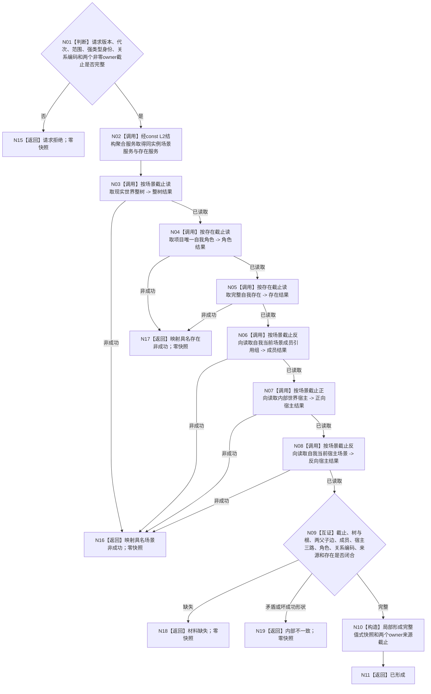

# BIZ-L3-002-02-01 读取冻结截止世界与自我快照目标函数流程图 v0.2

更新时间：2026-08-15

## 依据

```text
0050、4030、4190、4200、4230、6180、7130；BIZ-L2-002-02；BIZ-L3-002-01-03
DATA-EXT-01、DATA-EXT-02、DATA-EXT-07、DATA-EXT-17
```

## 身份与边界

当前正式目标函数设计图。按父级冻结的场景 owner 截止和存在 owner 截止，正式读取世界与自我值式事实；本函数不宣称存在跨 owner 全局标量代次。跨 owner 一致性必须由父级读取前 / 后发布见证向量与本结果两个来源截止逐项相等共同证明。

## 函数合同

```text
根函数：运行期只读查询组合器::读取冻结截止世界与自我快照
归属模块 / 文件 / BIZ层级：海中鱼巣.领域.组合.运行期只读查询 / 海中鱼巣/领域/组合.运行期只读查询.ixx / BIZ-L3
现有或待新增：待新增真实 BIZ 只读组合模块；只消费已发布 DATA-EXT-01/02/07 ABI
完整签名：世界自我冻结截止快照结果 运行期只读查询组合器::读取冻结截止世界与自我快照(const 世界自我冻结截止快照请求& 请求) const noexcept
参数：运行代次、范围版本、树/根/自我/所在/内部世界身份、三项关系编码、场景 owner 截止、存在 owner 截止
返回：已形成或具名非成功；仅已形成携带完整世界—自我快照和两个来源截止
父图：BIZ-L2-002-02
```

## 流程图



## 节点合同

| 节点 | 输入绑定 | 结果绑定 | 事实读写 | 关键验证 |
| --- | --- | --- | --- | --- |
| N02 | 同一 const 聚合服务 | 同实例场景 / 存在服务 | 无 | 零第二 provider、零 L1 |
| N03/N06—N08 | 场景截止与具名身份 | 整树、成员引用、宿主正反向 | 只读 DATA-EXT-01 | 每个截止恰等于场景截止 |
| N04—N05 | 存在截止、自我角色 / 存在 | 角色、来源、完整存在 | 只读 DATA-EXT-02 | 每个截止恰等于存在截止 |
| N09 | 全部成功值式事实 | 完整 / 缺失 / 矛盾 | 无 | 根->所在->内部世界；成员恰一；宿主三路相等；角色->存在一致 |
| N10—N11 | 完整候选 | 已形成结果 | 无 | 完整后一次构造；保留两个 owner 截止 |

## 关键边界

- 旧 v0.1 的 `节点直接存在服务::读取唯一自我结构()` 已退出，不得恢复或建立同义入口。
- 请求身份与关系编码来自上游正式值式材料，但正文必须再次经 DATA 正式读回。
- 两个 owner 截止不合并、不取最大值、不换成时间戳。父级前后发布见证向量未闭合时，本结果不能升级为跨 owner 一致快照。
- 任一失败零部分快照、零默认补造、零 DATA 写。
