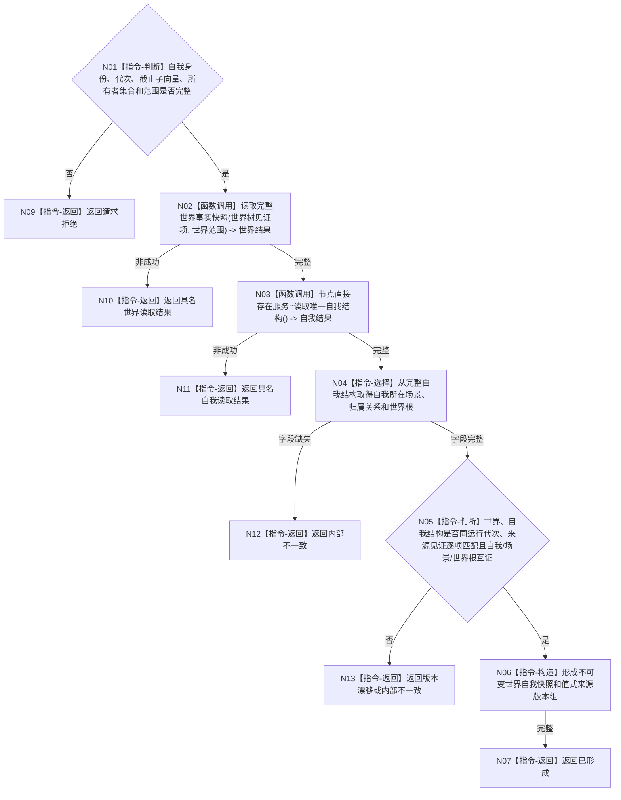

# BIZ-L3-002-02-01 读取同代次世界与自我快照目标函数流程图 v0.1

更新时间：2026-08-03

## 依据

```text
0050、4190、4200、6100—6130、8100；BIZ-L2-002-02
```

## 身份与边界

正式目标函数设计图。组合世界树完整快照、自我稳定存在、所在场景和自我结构版本；每项材料的所有者发布见证必须与请求中的世界/自我截止子向量逐项匹配。

## 函数合同

```text
根函数：运行期只读查询组合器::读取同代次世界与自我快照
归属模块 / 文件 / 层级：运行期只读查询 / 海中鱼巣/领域/组合.运行期只读查询.ixx / L3
现有或待新增：适配扩展；消费4200正式世界树读取服务，不直达L1
完整签名：世界自我同代次快照结果 运行期只读查询组合器::读取同代次世界与自我快照(const 世界自我同代次快照请求& 请求) const
参数：请求为只读借用；含自我稳定身份、运行代次、世界/自我事实截止子向量、世界范围版本和读取范围；子向量必须覆盖世界树和自我结构全部正式所有者，各提供者覆盖调用
返回结果：调用方拥有的不可变结果；含已形成、材料缺失、当前性漂移、错代、范围漂移或内部不一致，以及世界、自我、所在场景和逐所有者来源见证
被调函数流程图：复用 `流程图/20260803_世界树快照读取服务读取完整世界事实快照_函数流程图_v0.3.md`；BIZ-L4-002-02-01-01 节点直接存在服务::读取唯一自我结构
父图：BIZ-L2-002-02
```

## 流程图



## 节点合同

| 节点 | 类型 | 输入 | 输出 | 事实读写 | 验证 |
| --- | --- | --- | --- | --- | --- |
| N01—N04 | 判断 / 调用 / 选择 | 快照请求 | 完整世界快照、完整自我结构及其中的自我所在场景 | 只读正式服务；选择只读值式材料 | 缺失、退役、范围漂移；禁止再建场景读取入口 |
| N05—N06 | 判断 / 构造 | 子快照和截止子向量 | 同代次组合快照及来源见证 | 无 | 自我所在场景属于现实世界树，全部来源见证逐项匹配 |
| N07—N13 | 返回 | 组合结论 | 结构化结果 | 不补造默认事实 | 版本漂移与内部矛盾分离 |

## 关键边界

组合器不得从名称、缓存、SQL或旧普通父子关系猜测自我所在场景；自我所在场景只取自7130完整自我结构并与4200完整世界快照互证。缺一项即返回具名缺口，不建立第二个“读取自我当前所在场景”权威函数。
