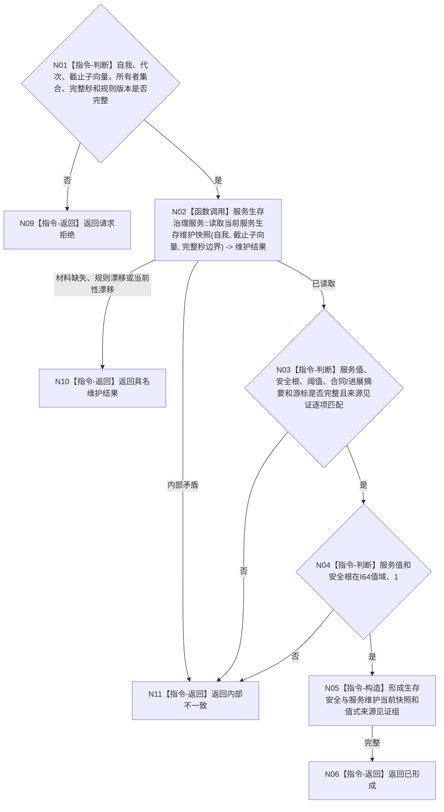

# BIZ-L3-002-02-02 读取生存安全与服务维护当前快照目标函数流程图 v0.1

更新时间：2026-08-03

## 依据

```text
0050、6120、6140—6170、8100；BIZ-L2-002-02
当前代码：分层安全维护和安全任务权限服务已经要求调用方显式给出维护族/来源选择；服务生存治理聚合入口尚待新增
```

## 身份与边界

正式目标函数设计图。函数只读取生存安全根、服务值、服务合同/准备/进展摘要和完整秒维护游标，不执行维护算法，也不隐式枚举6140分层安全维护族。6150的五级只用于任务执行权限汇总，不是固定五份安全值。

## 函数合同

```text
根函数：运行期只读查询组合器::读取生存安全与服务维护当前快照
归属模块 / 文件 / 层级：运行期只读查询 / 海中鱼巣/领域/组合.运行期只读查询.ixx / L3
现有或待新增：待新增；复用6170服务生存治理当前快照，不建立分层安全枚举入口
完整签名：生存服务当前快照结果 运行期只读查询组合器::读取生存安全与服务维护当前快照(const 生存服务当前快照请求& 请求) const
参数：请求为只读借用；含自我稳定身份、运行代次、生存安全/服务事实截止子向量、服务/生存安全/时间规则版本和完整秒边界；子向量必须覆盖服务值、生存安全根、合同、进展和维护游标全部正式所有者
返回结果：调用方拥有的不可变结果；含已形成、材料缺失、规则漂移、当前性漂移或内部不一致，以及服务值、生存安全根值与L/H、控制态、合同/准备/进展摘要、最长未满足来源、上一已结算完整秒、时间纪元和逐所有者来源见证
被调函数流程图：BIZ-L4-002-02-02-01 服务生存治理服务::读取当前服务生存维护快照
父图：BIZ-L2-002-02
```

## 流程图



## 节点合同

| 节点 | 类型 | 输入 | 输出 | 事实读写 | 验证 |
| --- | --- | --- | --- | --- | --- |
| N01/N02 | 判断 / 函数调用 | 自我、截止子向量、完整秒和规则版本 | 服务生存维护当前材料 | 只读6170正式服务 | 缺失、值域、游标、规则和来源见证 |
| N03/N04 | 指令-判断 | 当前材料和请求 | 完整性结论 | 无 | `A=0/1/>1`控制态、`1<L<H`、时间纪元和逐项见证 |
| N05/N06 | 指令-构造 / 返回 | 已复核材料 | 不可变组合快照 | 无 | 不泄漏服务内部引用 |
| N09—N11 | 指令-返回 | 失败分类 | 结构化非成功 | 无 | 合法缺失、漂移和内部矛盾分账 |

## 关键边界

- 6140安全维护族只能由后续维护或权限请求按显式、稳定、无重复的来源选择组读取；本函数不枚举“当前全部安全层”，也不固定为五层。
- 服务合同数量不改变衰减步长；最长未满足来源、有效活动和到期未满足事件按6160/6170形成正式摘要，队列长度、线程状态或日志心跳不能补造。
- 本函数不执行服务衰减、安全根回归、合同结算或任务权限计算；读取不会推进完整秒游标。
