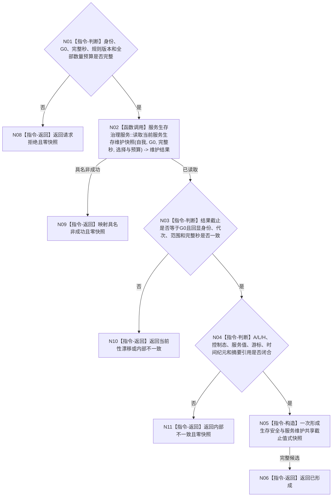

# BIZ-L3-002-02-02 读取生存安全与服务维护当前快照目标函数流程图 v0.2

更新时间：2026-08-15

## 依据

```text
0050、4015、4030、6120、6160、6170、8100
父图：BIZ-L2-002-02
数据服务：DATA-EXT-15、DATA-EXT-16
替代关系：v0.2 正式替代 v0.1 的逐所有者截止子向量和发布见证合同
```

## 身份与边界

正式目标函数设计图。函数使用父级冻结的同一个非零共享事实截止 `G0` 和本批完整秒边界，经具名 `服务生存治理服务`读取生存安全根、服务值、维护游标以及合同/准备/进展/到期事实；只在全部材料截止都等于 `G0`且业务不变量闭合时形成值式快照。函数不执行完整秒维护、合同结算、安全回归或任务权限裁决，也不枚举 6140 分层安全维护族。

## 函数合同

```text
根函数：运行期只读查询组合器::读取生存安全与服务维护当前快照
归属模块 / 文件 / 层级：运行期只读查询 / 海中鱼巣/领域/组合.运行期只读查询.ixx / BIZ-L3
现有或待新增：待新增；在 WORLD-SELF 组合器结果上适配扩展
完整签名：生存服务共享截止快照结果 运行期只读查询组合器::读取生存安全与服务维护当前快照(const 生存服务共享截止快照请求& 请求) const noexcept
参数：唯一自我、运行代次、事实范围版本、一个非零共享事实截止 G0、完整秒边界、安全根和服务值强类型选择、规则版本及合同/准备/进展/到期组数量预算
返回结果：已形成时携带同一 G0 下的安全根 A、L/H、派生控制态、服务值、维护游标、时间纪元、合同/准备/进展/到期摘要与最长未满足来源；其它状态零快照
被调函数流程图：BIZ-L4-002-02-02-01 v0.2 服务生存治理服务::读取当前服务生存维护快照
```

## 流程图



## 节点合同

| 节点 | 输入绑定 | 输出绑定 | 事实读写 | 验证 |
| --- | --- | --- | --- | --- |
| N02 | 自我、G0、完整秒、安全根/服务值选择、规则版本和各组预算 | 服务生存维护当前材料 | 只读 BIZ-L4 服务；其下只读 DATA-EXT-15/16 | 全部 DATA 结果使用同一 G0；不得读取“最新”补项 |
| N03/N04 | 维护结果与原请求 | 一致性结论 | 无 | `0<=A<=I64_MAX`、`1<L<H<=I64_MAX`、控制态只由 A 派生、游标不晚于当前完整秒、全部引用闭合 |
| N05/N06 | 已复核完整材料 | 不可变快照 | 无 | 局部完整候选一次构造；不泄漏服务内部引用 |
| N08—N11 | 失败分类 | 结构化非成功 | 无 | 请求、缺失、漂移、预算、资源和内部矛盾分账；全部零快照 |

## 关键边界

- 一个 L1 全局事实代次就是本轮唯一共享截止；owner、维护记录身份、时间戳和最大版本都不是第二一致性见证。
- DATA-EXT-15/16 只返回权威事实；控制态、有效服务活动、最长未满足来源和快照闭合由 BIZ 依据 6120/6160/6170 裁决。
- 空合同组、空准备组、空进展组或空到期事件组是合法事实形状，不等于整份快照材料缺失；服务值、安全根或维护游标缺失才是必需材料缺失。
- 本函数不推进游标、不写服务值/安全根/合同、不计算下一秒候选，不把线程、日志、缓存或 UI 当作事实。
