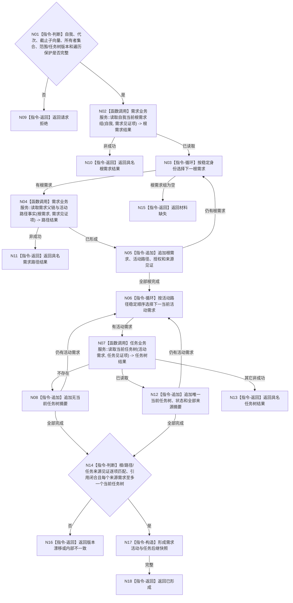

# BIZ-L3-002-02-03 读取需求活动与任务后继快照目标函数流程图 v0.1

更新时间：2026-08-03

## 依据

```text
0050、3100、3200、5090—5230、8100；BIZ-L2-002-02
旧鱼巢可吸收：需求活动集与任务后继回灌；排除线程直接改需求权重和任务状态
```

## 身份与边界

正式目标函数设计图。先读取当前自我的根需求组，再复用需求父链/活动路径和需求到唯一当前任务树的正式读取合同，形成需求活动与任务后继值式快照；需求和任务仍由各自服务解释。

## 函数合同

```text
根函数：运行期只读查询组合器::读取需求活动与任务后继快照
归属模块 / 文件 / 层级：运行期只读查询 / 海中鱼巣/领域/组合.运行期只读查询.ixx / L3
现有或待新增：适配扩展；复用需求/任务具名读取，新增同截止组合
完整签名：需求任务后继快照结果 运行期只读查询组合器::读取需求活动与任务后继快照(const 需求任务后继快照请求& 请求) const
参数：请求为只读借用；含自我稳定身份、运行代次、需求/任务事实截止子向量、需求范围版本、任务树合同版本、根数量和遍历深度保护；子向量必须覆盖需求和任务全部正式所有者
返回结果：调用方拥有的不可变结果；含已形成、材料缺失、范围漂移、任务树合同漂移或内部不一致，以及有序根需求组、逐根活动路径、当前任务树/不存在摘要、授权和逐所有者来源见证
被调函数流程图：BIZ-L4-002-02-03-01 需求业务服务::读取自我当前根需求组；复用BIZ-L3-002-04-02 需求业务服务::读取需求父链与活动路径事实；复用BIZ-L3-004-02-02 任务业务服务::读取当前任务树
父图：BIZ-L2-002-02
```

## 流程图



## 节点合同

| 节点 | 类型 | 输入 | 输出 | 事实读写 | 验证 |
| --- | --- | --- | --- | --- | --- |
| N01/N02 | 判断 / 函数调用 | 自我、需求见证项和范围 | 当前根需求组 | 只读需求正式服务 | 已读取或具名非成功 | 不按名称固定安全/服务根，不接受父关系未复核的缓存清单 |
| N03—N05 | 循环 / 函数调用 / 追加 | 根需求组 | 逐根活动路径与授权 | 只读需求事实 | 全部根完成或具名非成功 | 复用BIZ-L3-002-04-02，历史子项不冒充活动项 |
| N06—N13 | 循环 / 函数调用 / 追加 / 返回 | 当前活动需求组 | 当前任务树或不存在摘要 | 只读任务事实 | 全部完成或具名非成功 | 复用BIZ-L3-004-02-02，同一有效来源需求至多一个当前任务树 |
| N14—N18 | 判断 / 构造 / 返回 | 全部路径、任务摘要和截止子向量 | 需求活动与任务后继快照 | 无 | 引用闭合且来源见证逐项匹配 | 任务状态不冒充需求活动性，漂移与内部矛盾分离 |

## 关键边界

任务回执或线程状态不能直接改变需求活动性；快照只记录当前正式结论和后继引用。任务树不存在是合法后继，多个当前任务树或任务目标/来源异义是内部不一致。当前授权由需求路径和任务树正式材料共同承载，不建立第三套授权读取或合并值。
