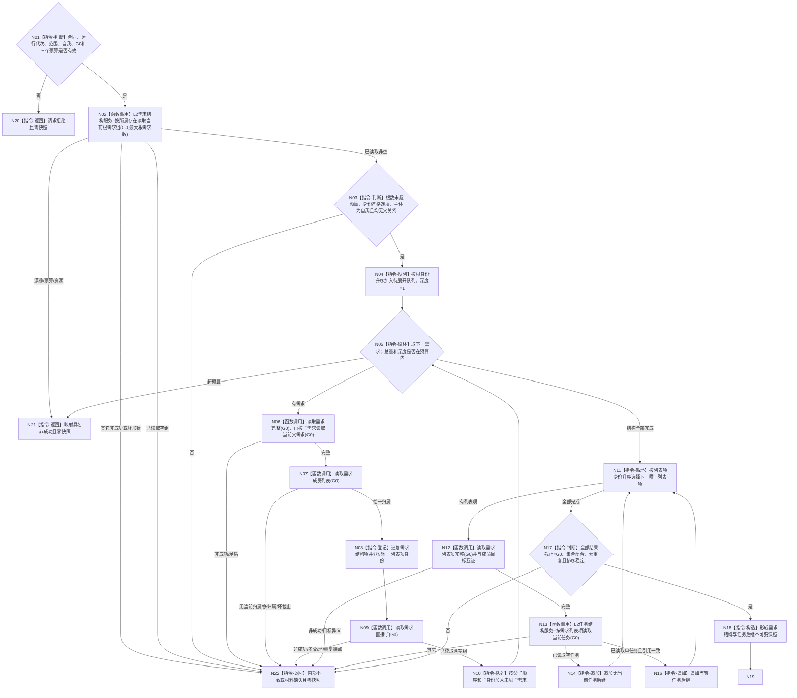

# BIZ-L3-002-02-03 读取需求结构与任务后继快照目标函数流程图 v0.2

更新时间：2026-08-20

## 依据

```text
0050 v2.1、3100、3200、4250、4260、5090、6120 v0.8、6130 v0.7、8100 v1.1、8300 v1.0；BIZ-L2-002-02 v0.2
```

## 身份与边界

本函数从 `L2需求结构服务`取得指定自我的当前根需求组，沿正式父子关系读取完整可达需求结构，逐需求读取唯一当前列表归属，再按唯一列表项从 `L2任务结构服务`读取 0 或 1 个当前任务。全部公开读取使用同一非零 `G0`，组合结果只承载结构和后继引用。

本函数不读取、推断或发布活动路径。父子拓扑、稳定排序、列表归属和“有任务”都不能证明需求活动、授权、权重、优先或满足。

## 函数合同

```text
根函数：运行期只读查询组合器::读取需求结构与任务后继快照
归属模块 / 文件 / 层级：海中鱼巣.领域.组合.运行期只读查询 / 海中鱼巣/领域/组合.运行期只读查询.ixx / BIZ-L3
现有或待新增：替换固定材料缺失骨架；删除旧活动型DTO和函数
完整签名：需求结构任务快照结果 运行期只读查询组合器::读取需求结构与任务后继快照(const 需求结构任务快照请求& 请求) const noexcept
请求：需求结构任务快照合同版本、运行代次、事实范围版本、唯一自我、G0、最大根需求数、最大需求节点数、最大需求结构深度
返回：已形成、请求拒绝、当前性漂移、数量预算不足、材料缺失、资源失败或内部不一致；任一非成功零快照
```

返回快照固定为：

```text
有序根需求事实组
+ 按需求稳定身份排序的当前需求结构项组
   - 完整L2需求事实
   - 根为空/非根恰一的当前父关系
   - 恰一当前列表成员关系
+ 按列表项稳定身份去重排序的任务后继项组
   - 完整L2需求列表项事实
   - optional<L2任务事实>当前任务
+ 事实截止代次=G0
```

## 流程图



## 状态映射

| 来源 | 本函数结果 |
| --- | --- |
| 请求字段或预算为零 | 请求拒绝 |
| 任一公开读取返回 `事实代次漂移`，或观察截止非零且不等于 G0 | 当前性漂移 |
| 根数、总需求数或结构深度超过预算 | 数量预算不足 |
| 根组为空、只含一项锚定根或缺任一锚点身份 | 材料缺失或内部不一致；零快照 |
| 列表项无当前任务 | 已形成；空任务 optional |
| 当前需求缺列表归属、非根缺父、同一需求多父、环、重复身份、列表目标异义、同列表项多个当前任务 | 内部不一致 |
| 入口所需自我或结构身份事实确实未找到/已退出 | 材料缺失；后继项在根组成功后消失则升级内部不一致 |
| 分配失败 | 资源失败 |

## 关键边界

- 不新增 `需求业务服务`转发壳；组合器直接消费已有具名 DATA-L2 公开读取。
- 根读取补齐的是 4250 的结构接口，不承载业务有效性、活动性、授权、权重或优先级。
- 任何失败都丢弃局部向量；不返回截断树、部分任务组或旧缓存。
- 本图替代 v0.1。旧逐 owner 截止、需求范围版本、任务树合同版本、活动路径读取和活动需求筛选退出；2026-08-28 起阶段21已保证双根锚点，运行期空根重新归入材料缺失 / 内部不一致，不得作为合法冷启动形状。
