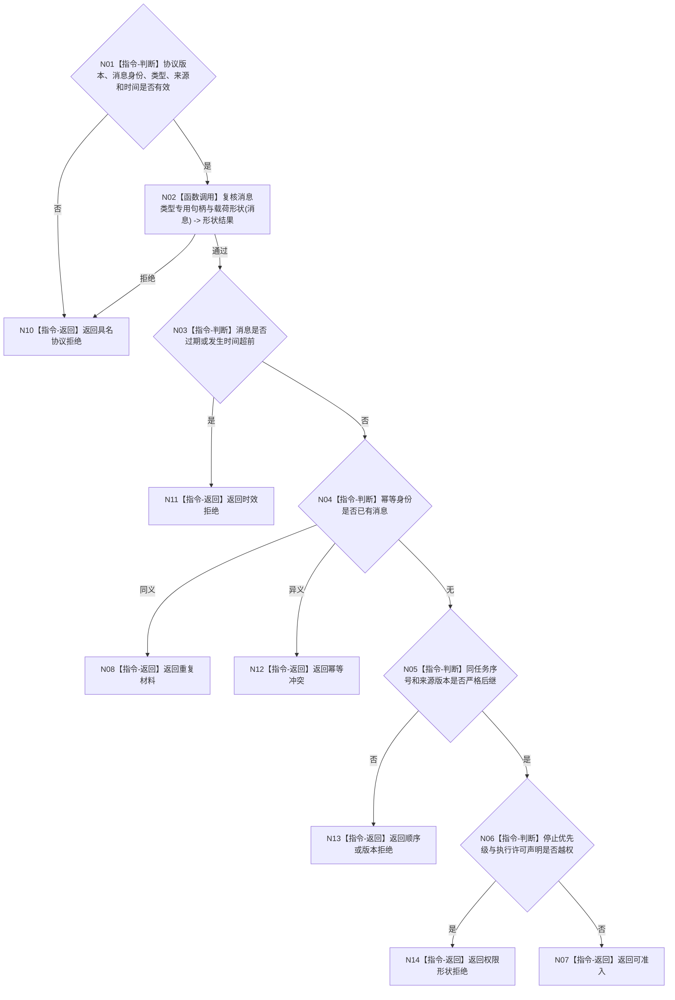

# BIZ-L3-002-03-01 复核自我治理消息目标函数流程图 v0.1

更新时间：2026-08-03

## 依据

```text
4050、8100、8200；BIZ-L2-002-03；当前海中鱼巣/线程/自我治理消息协议.ixx
```

## 身份与边界

正式目标函数设计图。复用现行协议函数，检查消息形状、来源、时效、顺序和幂等语义；不验证消息引用的业务事实是否真实。

## 函数合同

```text
根函数：复核自我治理消息
归属模块 / 文件 / 层级：自我治理消息协议 / 海中鱼巣/线程/自我治理消息协议.ixx / L3
现有或待新增：当前复用
完整签名：自我治理准入结果 复核自我治理消息(const 自我治理消息& 消息, const 自我治理准入上下文& 上下文)
参数：消息和上下文均为只读借用且仅在调用期间有效；消息必须使用当前协议版本，上下文含当前时间、可选既有消息、同任务顺序和批次边界
返回结果：调用方拥有的值式准入结果；含可准入、重复、具名协议拒绝或内部不一致，不返回消息内部可变引用
被调函数流程图：无独立被调项目函数；消息类型专用形状检查是本函数内的确定性纯值指令
父图：BIZ-L2-002-03
```

## 流程图



## 节点合同

| 节点 | 类型 | 输入 | 输出 | 事实读写 | 验证 |
| --- | --- | --- | --- | --- | --- |
| N01—N02 | 判断 / 调用 | 消息、上下文 | 基础与类型形状结果 | 无 | 未知类型、空句柄、槽位混同 |
| N03—N06 | 判断 | 时效、幂等、顺序、权限 | 准入分类 | 无 | 过期、同义/异义、倒序、冒权 |
| N07—N14 | 返回 | 分类结论 | 值式准入结果 | 不读取领域事实 | 拒绝码稳定 |

## 关键边界

协议通过只证明消息可以进入下一步事实复核；不得把消息声明、日志文本或线程来源当成任务结果、执行许可或机器事实。
