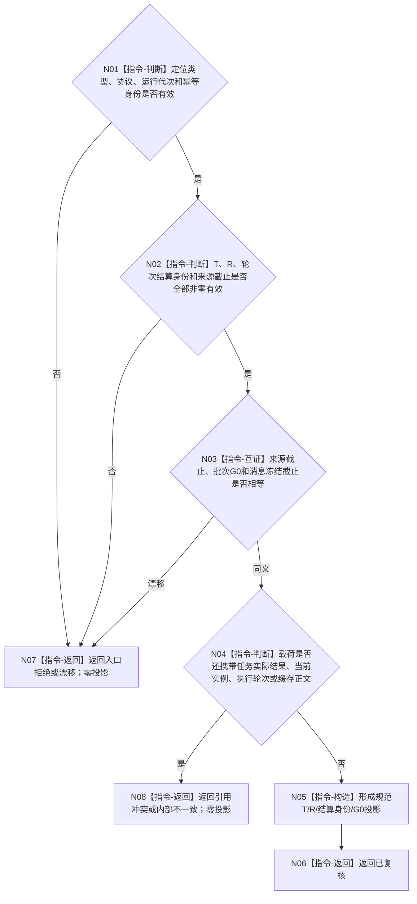

# BIZ-L3-002-04-01 复核任务轮次结算定位目标函数流程图 v0.3

更新时间：2026-08-27

## 依据与替代

```text
0050、3200 v1.0、5090 v0.7、8100 v0.7、8200 v0.7
BIZ-L2-002-04 v0.4、BIZ-L2-004-14 v0.2
```

本图完整替代 v0.2“按任务读取同G0当前实例方法”。self 后继不再从当前实例取得执行轮次，也不从任务实际结果反推轮次结算；本叶只纯值复核上行定位。

## 函数合同

```text
根函数：任务轮次结算定位复核器::复核任务轮次结算定位
归属模块 / 文件 / 目标分解深度：任务轮次结算定位协议 / 海中鱼巣/线程/协议.任务轮次结算定位.ixx / BIZ-L3
可见性：模块公开纯值函数；只复核不可变定位
现有或待新增：待新增；旧当前实例读取能力保留给其它合法消费者，但退出本父图
完整签名：任务轮次结算定位复核结果 任务轮次结算定位复核器::复核任务轮次结算定位(const 任务轮次结算定位复核请求& 请求) noexcept
参数：任务轮次结算定位、治理批次运行代次、G0和协议版本
返回结果：已复核、入口拒绝、当前性/版本漂移、引用冲突或内部不一致；成功携带T/R/结算身份/G0规范投影
被调函数流程图：无；纯值逐字段互证
```

## 流程图



## 关键边界

- 定位只携带读取键，不携带轮次结算正文；消息相等不能替代 owner 读回。
- 当前实例方法和按任务读取当前轮次能力可以独立存在，但不得用于本路径猜测定位缺失字段。
