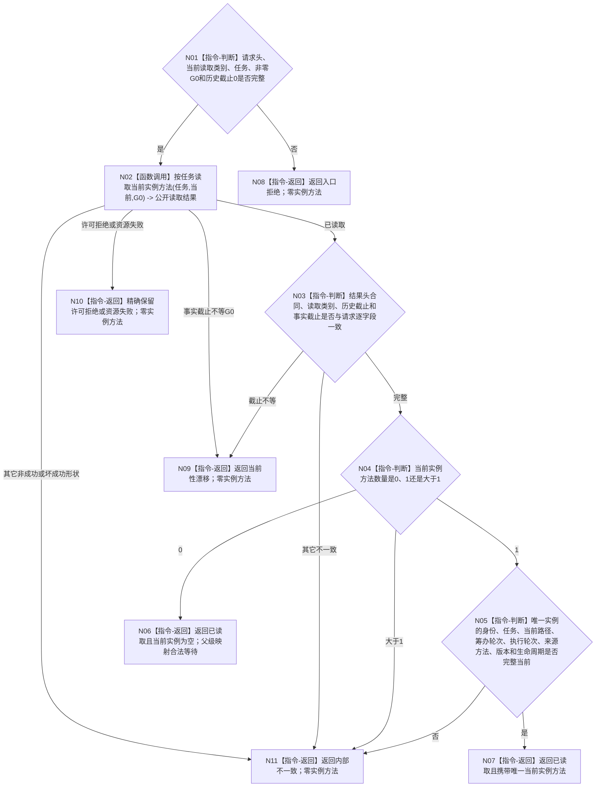

# BIZ-L3-002-04-01 按任务读取同G0当前实例方法目标函数流程图 v0.2

更新时间：2026-08-26

## 依据与替代

```text
0050、4260、5090、8100；BIZ-L2-002-04 v0.3
RUNTIME-GOVERNANCE-TASK-RESULT-IDENTITY-BINDING 详细设计 v0.1
```

本图替代旧 v0.1 的“任务结果与来源需求当前事实”混合读取。当前身份只负责取得同一 `G0` 下 0..1 个当前实例方法；不读取需求、任务结果、结算、世界事实或外设承接。

## 函数合同

```text
根函数：L2任务结构服务::按任务读取当前实例方法
归属模块 / 文件 / 目标分解深度：任务结构公开只读服务 / 海中鱼巣/领域/服务.L2任务结构.ixx / BIZ-L3
现有或待新增：现有公开 ABI；目标代码需按正式状态矩阵保持结构化结果
完整签名：L2按任务读取当前实例方法结果 L2任务结构服务::按任务读取当前实例方法(L2按任务读取当前实例方法请求 请求) const noexcept
参数：现行 L2 结构请求头、读取类别=当前、任务身份、历史截止=0；请求头期望事实代次固定等于父级 G0
返回结果：已读取时携带 0..1 个当前实例方法和事实截止；入口拒绝、许可拒绝、事实代次漂移、资源失败或内部不一致均不携带实例方法
被调函数流程图：无 BIZ-L4 子图；内部只使用任务 owner 的当前实例方法关系及完整实例方法投影
父图：BIZ-L2-002-04 v0.3
```

## 流程图



## 强制边界

- `执行轮次`只从唯一当前实例方法事实读取；来源任务序号、动作顺序、路径顺序、消息顺序和普通整数均不得替代。
- 0 项是完整结构读取，不是内部错误；父级将其解释为当前尚无可绑定执行的合法等待。
- 多项、坏端点、退出实例冒充当前或同 `G0` 坏形状属于内部不一致，不得选择第一项。
- 本叶零写入、零缓存、零自动重取新截止，不触发任务结果、需求核算、轮次收束或后继决议。
