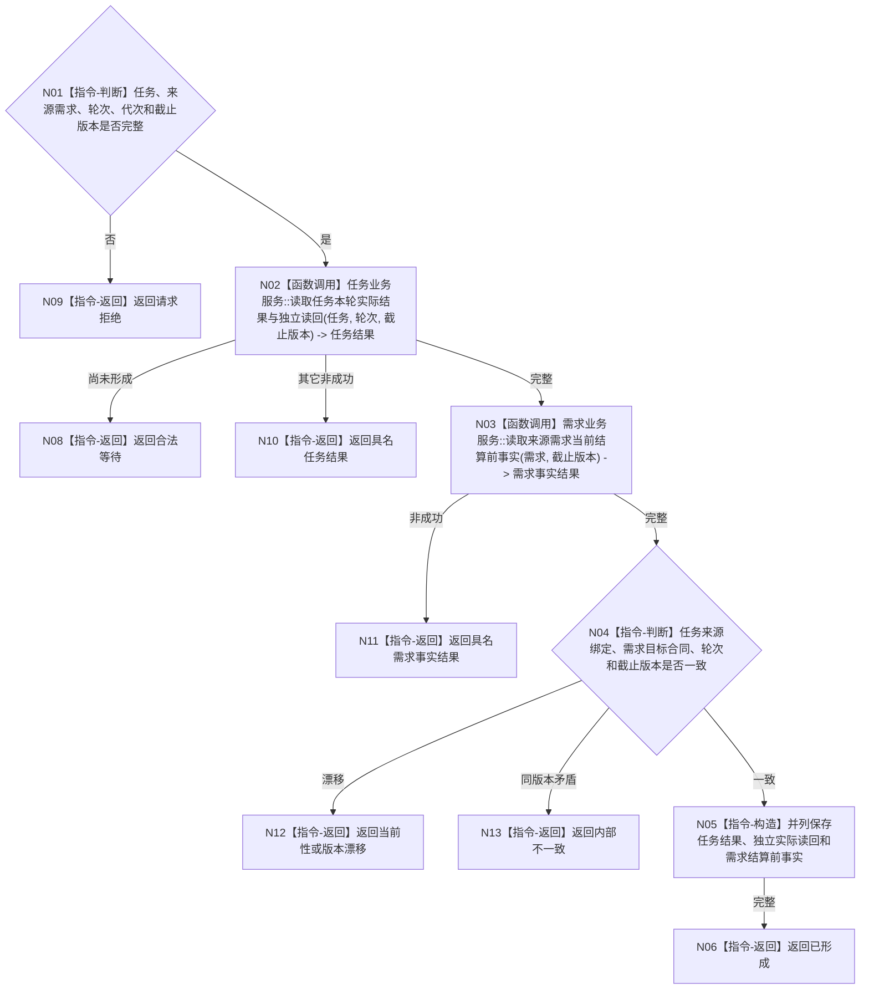

# BIZ-L3-002-04-01 读取任务结果与来源需求当前事实目标函数流程图 v0.1

更新时间：2026-08-04

## 依据

```text
0050、5090、5160、8100；BIZ-L2-002-04；确认稿第23、39项
```

## 身份与边界

正式目标函数设计图。按任务、轮次和截止版本读取正式任务结果与独立实际读回，同时读取来源需求的当前生命周期、目标合同和结算前事实；不读取既有需求满足结论，不从任务结果推导需求满足。

## 函数合同

```text
根函数：运行期只读查询组合器::读取任务结果与来源需求当前事实
归属模块 / 文件 / 层级：运行期只读查询 / 海中鱼巣/领域/组合.运行期只读查询.ixx / L3
现有或待新增：适配扩展；复用任务结果和需求当前事实具名读取
完整签名：任务结果需求当前事实读取结果 运行期只读查询组合器::读取任务结果与来源需求当前事实(const 任务结果需求当前事实读取请求& 请求) const
参数：请求为只读借用；含任务身份、来源需求身份、工作轮次、运行代次、事实截止版本和读取范围版本
返回结果：不可变值式结果；含已形成、合法等待、未找到、当前性漂移、版本漂移或内部不一致，以及正式任务结果、独立实际读回、来源需求当前生命周期、目标合同、结算前事实和来源版本
被调函数流程图：BIZ-L4-002-04-01-01 任务业务服务::读取任务本轮实际结果与独立读回；BIZ-L4-002-04-01-02 需求业务服务::读取来源需求当前结算前事实
父图：BIZ-L2-002-04
```

## 流程图



## 节点合同

| 节点 | 类型 | 输入 | 输出 | 事实读写 | 验证 |
| --- | --- | --- | --- | --- | --- |
| N01—N03 | 判断 / 调用 | 读取请求 | 正式任务结果和来源需求当前事实 | 只读各自所有者 | 回执不自证；不读取需求满足结论 |
| N04/N05 | 判断 / 构造 | 两组当前事实 | 值式并列材料 | 无 | 来源、目标、轮次、截止一致 |
| N06—N13 | 返回 | 读取结论 | 结构化结果 | 不写任务/需求 | 等待与失败分离 |

## 关键边界

任务完成不自动等于需求满足。本函数只为后继需求结算提供当前材料；T02 必须在新治理批次调用需求领域结算入口重新比较目标，结算成功并独立读回后才存在需求满足结论。

