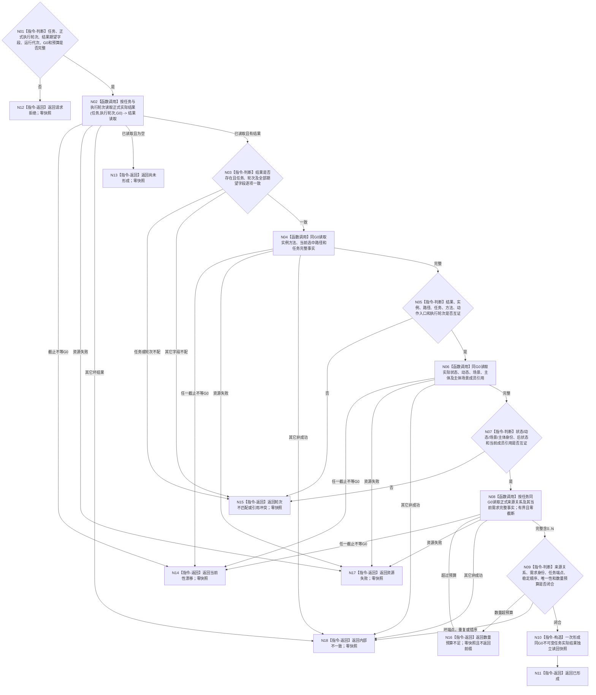

# BIZ-L3-002-04-02 按任务与执行轮次独立读回实际结果目标函数流程图 v0.3

更新时间：2026-08-26

## 依据与替代

```text
0050、4260、5090、8100；BIZ-L2-002-04 v0.3
RUNTIME-GOVERNANCE-TASK-ACTUAL-RESULT-PROVIDER 详细设计 v0.1
RUNTIME-GOVERNANCE-TASK-RESULT-IDENTITY-BINDING 详细设计 v0.1
```

本图替代旧 v0.2 的需求父链与活动路径读取。当前身份只消费由上一叶正式取得的执行轮次，目标组合器按任务与执行轮次形成同 `G0` 完整快照；不读取需求结算前事实，不遍历需求父链，不承接 6340 材料。已发布基线尚未提供满足本图的完整 T→D 来源关系读回组合；同名工作区候选和旧需求列表成员路径均不得当作已发布能力。

## 函数合同

```text
根函数：运行期只读查询组合器::读取任务本轮实际结果与独立读回
归属模块 / 文件 / 目标分解深度：运行期只读查询组合 / 海中鱼巣/领域/组合.运行期只读查询.ixx / BIZ-L3
现有或待新增：待新增 / 修订目标 ABI；精确提供者 ABI 必须服从正式 4260 后继合同，当前只冻结业务步骤；不得把旧需求列表成员、未发布工作区候选或结果分配当作002-04绑定前置
完整签名：任务实际结果独立读回结果 运行期只读查询组合器::读取任务本轮实际结果与独立读回(const 任务实际结果独立读回请求& 请求) const noexcept
参数：任务、上一叶读取的非零执行轮次、方法、动作入口、场景、主体、实际状态、动态证据、来源材料版本、运行代次、同一非零G0和有界读取预算
返回结果：已形成、尚未形成、请求拒绝、轮次不匹配、当前性漂移、数量预算不足、引用冲突、资源失败或内部不一致；只有已形成携带任务结果、实例方法、选中路径、任务及全部正式关联事实的同G0不可变快照
被调函数流程图：无当前 BIZ-L4 子图；复用任务、状态、动态、场景、存在及需求/来源关系各自公开只读服务
父图：BIZ-L2-002-04 v0.3
```

## 流程图



## 强制边界

- 父级传入的执行轮次必须原样来自 BIZ-L3-002-04-01 的正式当前实例方法，不从来源任务序号或消息顺序补造。
- 全部子读固定使用同一 `G0`；任何一笔截止不同立即零快照返回当前性漂移，不自动选择新截止重试。
- 来源关系只用于证明任务实际结果快照引用闭合；不得在本叶进行需求满足、结果分配、全部需求结算或轮次收束。
- 0..N 来源关系不能由旧需求列表成员、缓存或日志替代；数量预算不足不得返回截断前缀。
- 本叶零写入；已形成也只证明指定截止上的正式结果绑定完整，不证明任务或需求完成。
