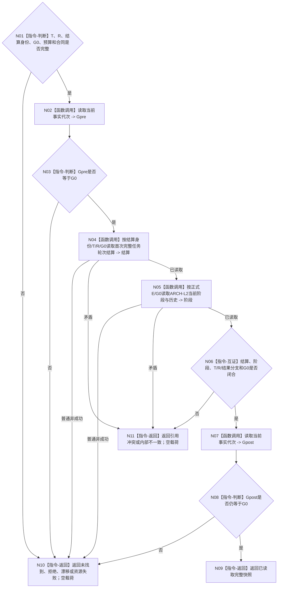

# BIZ-L3-002-04-02 按显式身份独立读回任务轮次结算目标函数流程图 v0.4

更新时间：2026-08-27

## 依据与替代

```text
0050、3200 v1.0、5090 v0.7、5210 v1.1、8100 v0.7、8200 v0.7
BIZ-L2-002-04 v0.4、BIZ-L3-002-04-01 v0.3
```

本图完整替代 v0.3“按任务与执行轮次独立读回实际结果”。T03 已在形成轮次结算前完成正式结果读回；self 只按显式结算身份读取任务轮次结算和轮次已收束阶段。

## 函数合同

```text
根函数：运行期只读查询组合器::按显式身份独立读回任务轮次结算
归属模块 / 文件 / 目标分解深度：运行期只读查询组合 / 海中鱼巣/领域/组合.运行期只读查询.ixx / BIZ-L3
现有或待新增：待适配；复用task owner按结算身份读取和ARCH-L2阶段读取
完整签名：任务轮次结算独立读回结果 运行期只读查询组合器::按显式身份独立读回任务轮次结算(const 任务轮次结算独立读回请求& 请求) const noexcept
参数：T、R、轮次结算身份、非零G0、读取预算和合同版本
返回结果：已读取、未找到、入口/许可拒绝、当前性/版本漂移、引用冲突、数量预算不足、资源失败或内部不一致；成功携带完整轮次结算、轮次已收束阶段和G0
被调函数流程图：task owner按结算身份读取；ARCH-L2任务阶段正式读取；当前事实代次读前/读后守卫
```

## 流程图



## 关键边界

- 成功必须证明指定轮次结算属于T/R、当前阶段为轮次已收束、旧阶段历史永久可读且全部截止等于G0。
- 不读取当前实例方法、动作完成消息、任务实际结果消息正文或需求列表成员；轮次结算内部引用只做强类型互证。
- 未找到是结构化非成功，不得改为按任务猜结算或退回旧实际结果路径。
