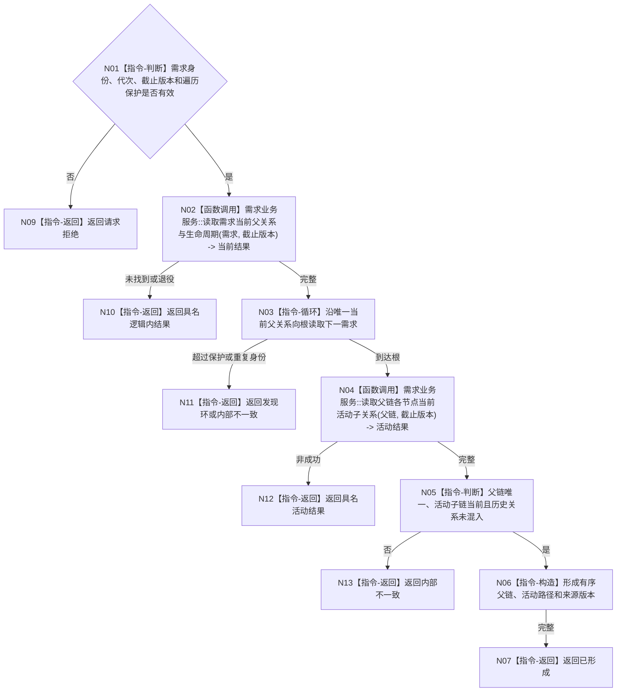

# BIZ-L3-002-04-02 读取需求父链与活动路径事实目标函数流程图 v0.1

更新时间：2026-08-03

## 依据

```text
0050、3100、5100—5160、8100；BIZ-L2-002-04
```

## 身份与边界

正式目标函数设计图。读取指定需求的当前父链、直接子需求、活动路径和历史隔离状态，不通过权重或列表位置推导关系。

## 函数合同

```text
根函数：需求业务服务::读取需求父链与活动路径事实
归属模块 / 文件 / 层级：需求领域 / 海中鱼巣/领域/服务.需求.ixx / L3
现有或待新增：适配扩展；复用需求关系和活动结论读取
完整签名：需求父链活动路径读取结果 需求业务服务::读取需求父链与活动路径事实(const 需求父链活动路径读取请求& 请求) const
参数：请求为只读借用；含需求稳定身份、运行代次、事实截止版本、需求范围版本和最大遍历保护；服务覆盖调用
返回结果：不可变值式结果；含已形成、未找到、已退役、范围漂移、发现环或内部不一致，以及有序父链、活动子链、路径版本和来源事实
被调函数流程图：BIZ-L4-002-04-02-01 需求业务服务::读取需求当前父关系与生命周期；BIZ-L4-002-04-02-02 需求业务服务::读取父链各节点当前活动子关系
父图：BIZ-L2-002-04
```

## 流程图



## 节点合同

| 节点 | 类型 | 输入 | 输出 | 事实读写 | 验证 |
| --- | --- | --- | --- | --- | --- |
| N01—N03 | 判断 / 调用 / 循环 | 读取请求 | 父链材料 | 只读需求关系 | 无父、唯一父、环、深度保护 |
| N04—N06 | 调用 / 判断 / 构造 | 父链 | 活动路径快照 | 只读活动关系/结论 | 历史隔离、同截止 |
| N07—N13 | 返回 | 读取结论 | 结构化结果 | 不改活动性 | 漂移与结构矛盾分离 |

## 关键边界

权重、显示顺序和缓存列表都不是父链或活动路径事实；历史子需求不得冒充当前活动子需求。
