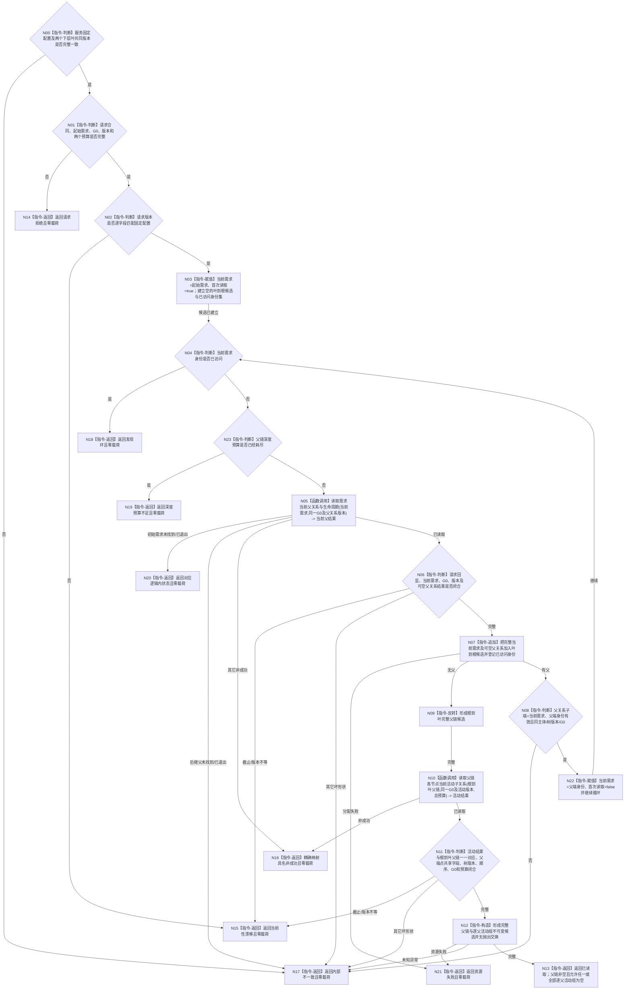

# BIZ-L3-002-04-02 读取需求父链与活动路径事实目标函数流程图 v0.2

更新时间：2026-08-16

## 依据

```text
0050、3100、5100、5110、5160、4015；BIZ-L2-002-04；BIZ-L4-002-04-02-01 v0.2；BIZ-L4-002-04-02-02 v0.2
```

## 身份与边界

正式目标函数替代图。函数在父级给出的同一非零共享事实截止 `G0` 下，从指定需求开始反复调用当前父关系叶，形成无重复的根到叶当前父链；随后把完整父链一次交给活动子关系叶，取得逐父当前活动子关系组。函数只组合两个已冻结 BIZ 叶，不直达 DATA / L1，不读取历史，不以权重、任务状态或列表位置推断父链或活动性。

## 函数合同

```text
根函数：需求业务服务::读取需求父链与活动路径事实
归属模块 / 文件 / 层级：需求业务服务 / 海中鱼巣/领域/服务.需求.ixx / BIZ-L3
现有或待新增：待新增；组合两个 BIZ-L4 v0.2 读取叶
完整签名：需求父链活动路径读取结果 需求业务服务::读取需求父链与活动路径事实(const 需求父链活动路径读取请求& 请求) const noexcept
参数：合同版本、运行代次、事实范围版本、需求范围版本、需求树规则版本、父关系规则版本、路径规则版本、活动规则版本、读取规则版本、起始需求、非零 G0、非零父链深度预算和非零当前子关系总数量预算；版本必须匹配服务固定配置
返回结果：已读取时携带根到叶完整当前父链、与父链同序的逐父当前活动子关系组、全部版本、G0和预算回显；初始需求未找到 / 已退出、深度预算不足、数量预算不足、发现环、漂移或其它非成功均零业务载荷
被调函数流程图：BIZ-L4-002-04-02-01 v0.2；BIZ-L4-002-04-02-02 v0.2
父图：BIZ-L2-002-04
```

## 流程图



## 节点合同

| 节点 | 类型 | 参数 / 输入绑定 | 结果 / 输出绑定 | 事实读写 | 后继条件 | 验证 |
| --- | --- | --- | --- | --- | --- | --- |
| N00—N03 | 判断 / 赋值 | 固定配置与请求 | 叶到根空候选 | 无写入 | 请求有效且版本匹配 | 坏配置、坏请求、版本不等均零下层调用 |
| N04—N08、N22—N23 | 循环 / 函数调用 / 判断 | 当前需求、G0、父关系版本、深度预算 | 叶到根完整当前父链材料 | 只读下层父关系叶 | 无父或继续向父端 | 先判重复身份再判深度预算；二者同次成立时唯一返回发现环；初始缺失与后继父缺失分账；无父不是未找到 |
| N09—N11 | 反转 / 函数调用 / 判断 | 根到叶父链、G0、活动版本、总预算 | 与父链同序的逐父活动组 | 只读下层活动关系叶 | 结果一一对应 | 逐父父端点与父链当前需求的身份、来源、主体、生命周期共享字段互证；全链树版本唯一；活动叶只按已发布结论选择 |
| N12—N22 | 构造 / 返回 | 完整候选或失败分类 | 不可变成功值或零载荷非成功 | 无写入 | 唯一映射 | 全部非成功零前缀结果；分配异常收敛资源失败 |

## 关键边界

- 父链只能由 BIZ-L4-002-04-02-01 在同一 G0 下逐项取得的可空唯一当前父关系形成；初始需求无父得到单项父链，后继父在同 G0 缺失 / 已退出属于内部不一致。
- 活动结果只能由 BIZ-L4-002-04-02-02 对完整根到叶父链的一次调用形成；父函数不直达 DATA，不重复解释活动结论，也不从权重、生命周期、任务或顺序补活动。
- 每轮必须先检查当前需求身份是否已经访问；命中即返回发现环。仅身份未重复时才检查深度预算，因此环与深度边界同次命中时不产生状态歧义。
- 深度预算只防止父链无界遍历；当前子关系总数量预算覆盖活动叶读取的全部当前直接子关系。两者不得互换，不返回截断父链或前缀活动组。
- 旧 v0.1 的含糊截止版本、历史隔离状态、活动子链单一路径、`const` 非 `noexcept` 签名和未冻结 DTO 全部退出。
