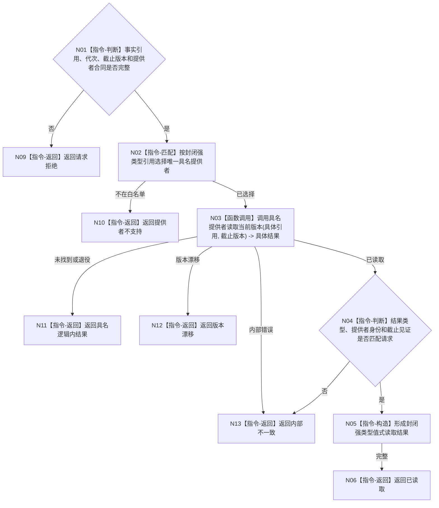

# BIZ-L3-002-04-03 读取具名领域事实当前版本目标函数流程图 v0.1

更新时间：2026-08-03

## 依据

```text
0050、4050、4190、8100；BIZ-L2-002-04
```

## 身份与边界

正式目标函数设计图。这是自我治理协议白名单内的封闭强类型读取路由，不是万能事实查询器；它只把具名引用交给其唯一领域所有者。

## 函数合同

```text
根函数：自我治理领域路由::读取具名领域事实当前版本
归属模块 / 文件 / 层级：自我治理领域路由 / 海中鱼巣/线程/自我治理领域路由.ixx / L3
现有或待新增：适配扩展；扩充封闭治理事实引用变体
完整签名：治理领域事实读取结果 自我治理领域路由::读取具名领域事实当前版本(const 治理领域事实读取请求& 请求) const
参数：请求为只读借用；含封闭强类型世界事实引用（存在、场景、特征、状态、动态或因果之一）、运行代次、逐所有者事实截止见证项、预期提供者身份和合同版本；提供者组覆盖调用
返回结果：调用方拥有的封闭强类型值式结果；含已读取、未找到、已退役、提供者不支持、版本漂移或内部不一致，并保留具体结果种类和来源版本
被调函数流程图：BIZ-L4-002-04-03-01 治理世界事实提供者组::读取白名单世界事实当前版本
父图：BIZ-L2-002-04
```

## 流程图



## 节点合同

| 节点 | 类型 | 输入 | 输出 | 事实读写 | 验证 |
| --- | --- | --- | --- | --- | --- |
| N01—N03 | 判断 / 匹配 / 调用 | 强类型请求 | 具体领域结果 | 只读唯一事实所有者 | 未登记类型、提供者错配 |
| N04—N05 | 判断 / 构造 | 具体结果 | 封闭变体结果 | 无 | 类型、身份、截止版本一致 |
| N06—N13 | 返回 | 读取结论 | 结构化结果 | 不直达L1/SQL/缓存 | 逻辑内结果与内部错误分离 |

## 关键边界

版本1白名单只含存在、场景、特征、状态、动态和因果当前事实。需求父链、任务结果、外设承接、安全/服务维护均走相邻专用分支，不得重复加入。禁止加入通用JSON、任意字节或万能句柄分支；新增事实类别必须先冻结具名提供者和强类型结果，再扩展白名单合同版本。
