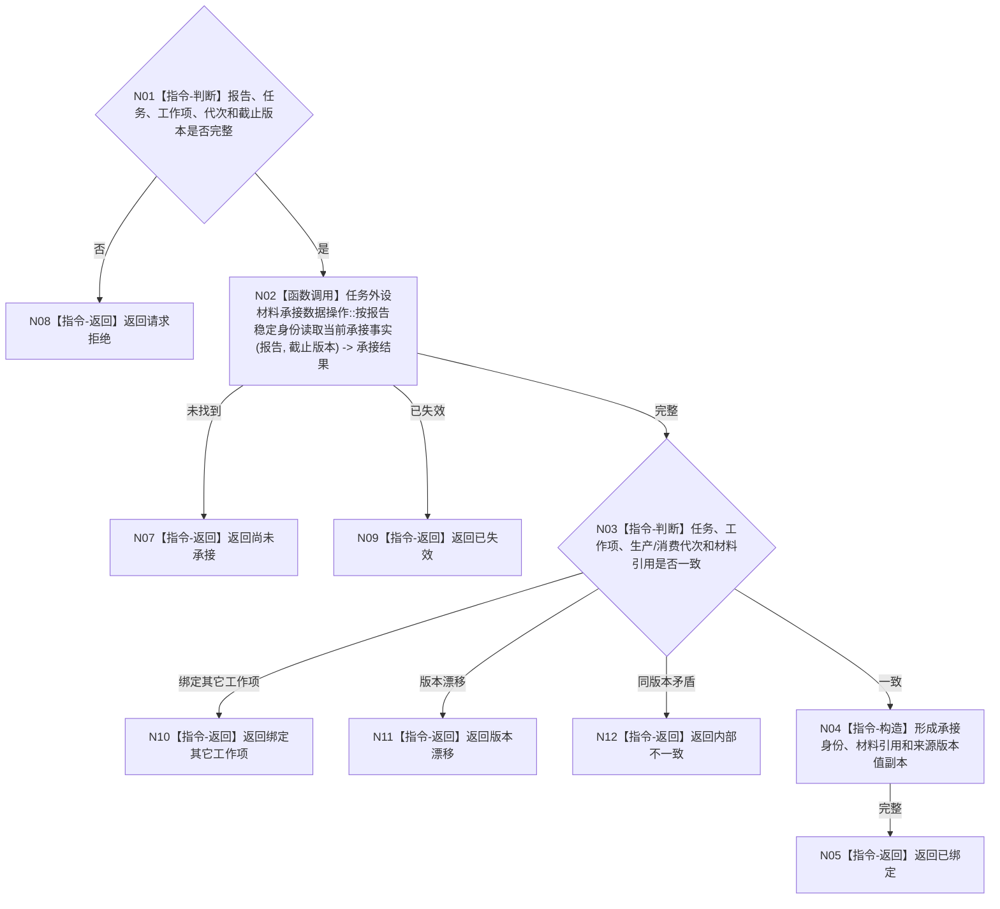

# BIZ-L3-002-04-04 读取6340已承接材料绑定目标函数流程图 v0.1

更新时间：2026-08-03

## 依据

```text
0050、6340、8100；BIZ-L2-002-04
```

## 身份与边界

正式目标函数设计图。只读取报告稳定身份的一次正式承接及其任务/工作项绑定，不读取物理报告队列作为事实。

## 函数合同

```text
根函数：任务外设材料承接服务::读取已承接材料绑定
归属模块 / 文件 / 层级：任务外设材料承接 / 海中鱼巣/领域/服务.任务外设材料承接.ixx / L3
现有或待新增：待新增；消费6340承接事实
完整签名：外设已承接材料绑定读取结果 任务外设材料承接服务::读取已承接材料绑定(const 外设已承接材料绑定读取请求& 请求) const
参数：请求为只读借用；含报告稳定身份、任务身份、工作项身份、运行代次、消费代次和事实截止版本
返回结果：不可变值式结果；含已绑定、尚未承接、绑定其它工作项、已失效、版本漂移或内部不一致，以及承接身份、材料引用和来源版本
被调函数流程图：BIZ-L4-002-04-04-01 任务外设材料承接数据操作::按报告稳定身份读取当前承接事实
父图：BIZ-L2-002-04
```

## 流程图



## 节点合同

| 节点 | 类型 | 输入 | 输出 | 事实读写 | 验证 |
| --- | --- | --- | --- | --- | --- |
| N01—N02 | 判断 / 调用 | 读取请求 | 承接事实 | 只读6340正式承接 | 未承接、失效、重复承接 |
| N03—N04 | 判断 / 构造 | 承接事实 | 值式绑定结果 | 无 | 任务、工作项、代次、引用一致 |
| N05—N12 | 返回 | 读取结论 | 结构化结果 | 不读取物理队列 | 绑定冲突归因 |

## 关键边界

报告和队列项仍只是材料；读取到承接绑定不等于已经形成世界事实、任务结果或因果结论。
