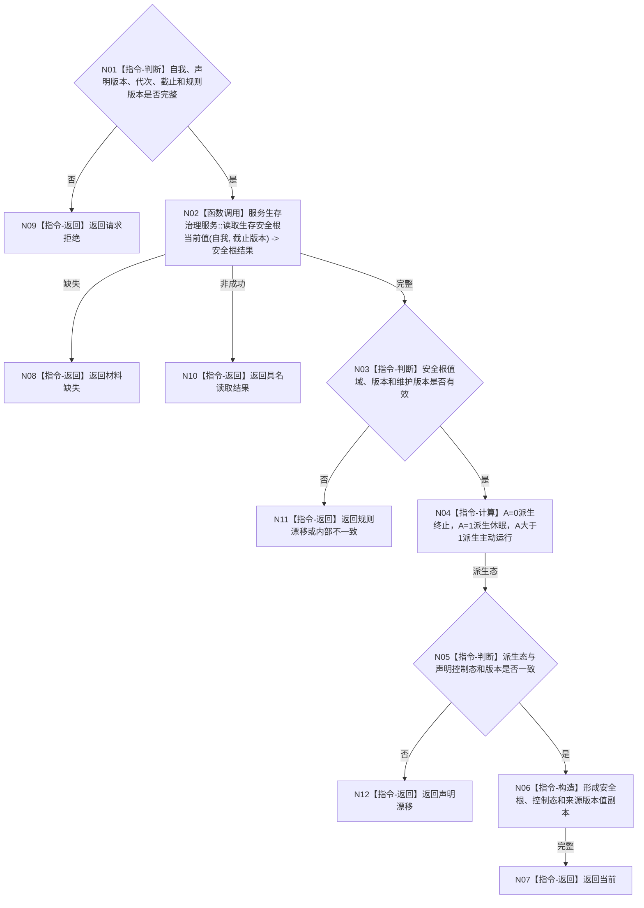

# BIZ-L3-002-05-01 复核生存控制态当前性目标函数流程图 v0.1

更新时间：2026-08-03

## 依据

```text
0050、6120、6170、8100；BIZ-L2-002-05
```

## 身份与边界

正式目标函数设计图。以已发布生存安全根值唯一派生终止、休眠或主动运行控制态，并复核维护与规则版本。

## 函数合同

```text
根函数：生存控制读取服务::复核生存控制态当前性
归属模块 / 文件 / 层级：生存控制读取 / 海中鱼巣/领域/服务.生存控制读取.ixx / L3
现有或待新增：待新增；复用6170生存安全根读取
完整签名：生存控制态当前性结果 生存控制读取服务::复核生存控制态当前性(const 生存控制态当前性请求& 请求) const
参数：请求为只读借用；含自我身份、声明控制态、声明安全根版本、服务维护版本、运行代次、事实截止版本和规则版本
返回结果：不可变值式结果；含当前、材料缺失、声明漂移、规则漂移或内部不一致，以及安全根值、唯一派生控制态和来源版本
被调函数流程图：BIZ-L4-002-05-01-01 服务生存治理服务::读取生存安全根当前值
父图：BIZ-L2-002-05
```

## 流程图



## 节点合同

| 节点 | 类型 | 输入 | 输出 | 事实读写 | 验证 |
| --- | --- | --- | --- | --- | --- |
| N01—N03 | 判断 / 调用 | 当前性请求 | 安全根当前值 | 只读6170事实 | A值域、维护/规则版本 |
| N04—N06 | 计算 / 判断 / 构造 | A和声明态 | 唯一派生态 | 无 | 0/1/>1全部边界 |
| N07—N12 | 返回 | 复核结论 | 结构化结果 | 不写安全/服务值 | 漂移与内部矛盾分离 |

## 关键边界

控制态不是第二份持久事实；线程状态、服务值、消息声明和任务标签都不能替代由A唯一派生的结果。
