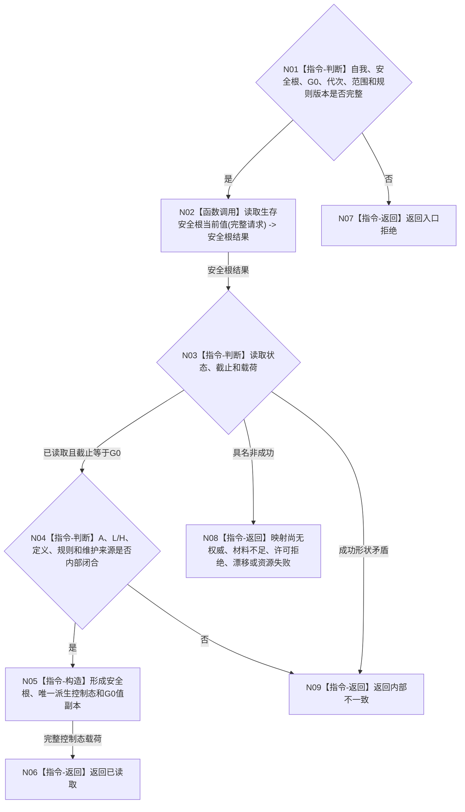

# BIZ-L3-002-05-01 读取同G0生存控制态目标函数流程图 v0.2

更新时间：2026-08-26

## 依据

```text
0050、6120、6170、8100；BIZ-L2-002-05 v0.2
替代关系：v0.2退出调用方“声明控制态 / 声明版本”复核模型
```

## 身份与边界

正式目标函数设计图。函数只按唯一自我、安全根身份和父级共享 `G0` 读取正式生存安全根事实，并返回由 `A=0/1/>1` 唯一派生的控制态。请求不携带声明控制态，消息、缓存、线程状态和旧冻结不得反向覆盖读回结果。

## 函数合同

```text
根函数：生存控制读取组合器::读取同G0生存控制态
归属模块 / 文件 / 目标分解深度：生存控制读取组合 / 海中鱼巣/领域/组合.生存控制读取.ixx / BIZ-L3
现有或待新增：待新增组合入口；复用BIZ-L4-002-05-01-01 v0.2
完整签名：生存控制态读取结果 生存控制读取组合器::读取同G0生存控制态(const 生存控制态读取请求& 请求) const noexcept
参数：`请求`，类型 `const 生存控制态读取请求&`，输入、只读借用且仅在调用期间有效；字段为唯一自我、运行代次、事实范围版本、安全根强类型身份、G0、安全根定义版本、生存安全回归规则版本和服务维护规则版本；任一身份、代次、G0或版本为零均非法
返回结果：`生存控制态读取结果`，按值交给调用方；已读取时携带完整安全根、A/L/H、维护来源、唯一派生控制态和截止G0；其它状态零载荷
被调函数流程图：BIZ-L4-002-05-01-01 v0.2 服务生存治理服务::读取生存安全根当前值
父图：BIZ-L2-002-05 v0.2
```

## 流程图



## 节点合同

| 节点 | 类型 | 参数 / 输入绑定 | 结果 / 输出绑定 | 事实读写 | 后继条件 | 验证 |
| --- | --- | --- | --- | --- | --- | --- |
| N01 | 指令-判断 | 完整请求 | 准入结论 | 无写入 | 合法或入口拒绝 | 身份、G0、代次和版本非零 |
| N02/N03 | 函数调用 / 判断 | 请求 -> 安全根读取请求 | 安全根结果 -> 当前事实 | 只经具名领域服务读取6170正式事实；无写入 | 截止等于G0或具名非成功 | 载荷与状态同形 |
| N04—N06 | 判断 / 构造 / 返回 | 当前安全根事实 | 唯一控制态读取结果 | 无写入 | 已读取 | A/L/H、定义、规则和维护来源闭合 |
| N07—N09 | 返回 | 非成功来源 | 结构化非成功 | 无写入 | 返回父图 | 非成功零载荷 |

## 关键边界

- 控制态不持久化；只由本次正式读回的A派生。
- 不以调用方声明值做“相等即当前”判断；正式同G0读回是唯一来源。
- 本函数不计算调度资格、自我授权、技术许可或安全硬否决。
